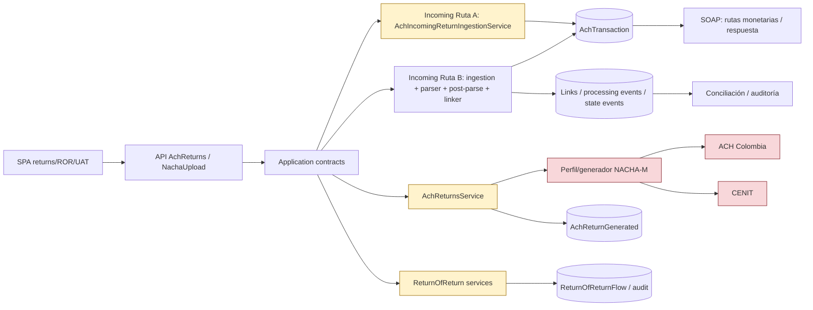
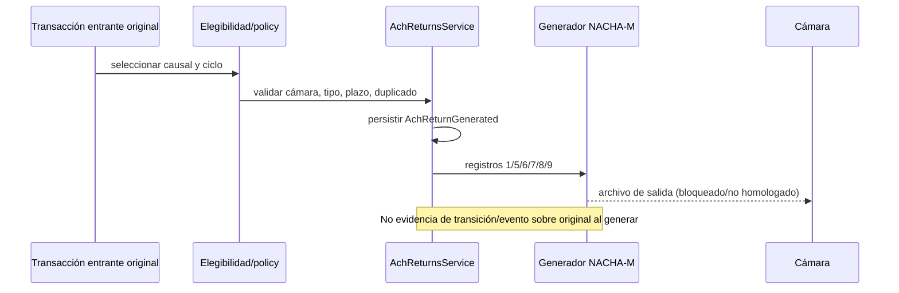
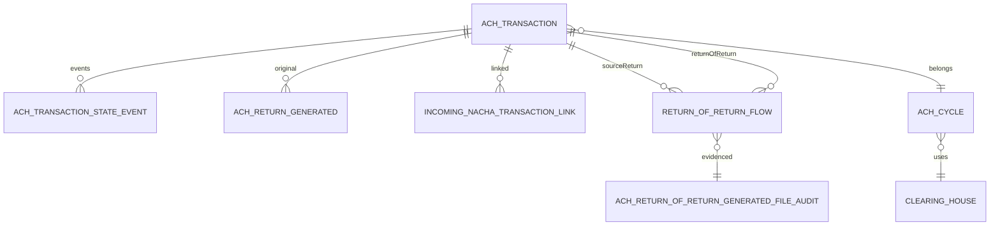
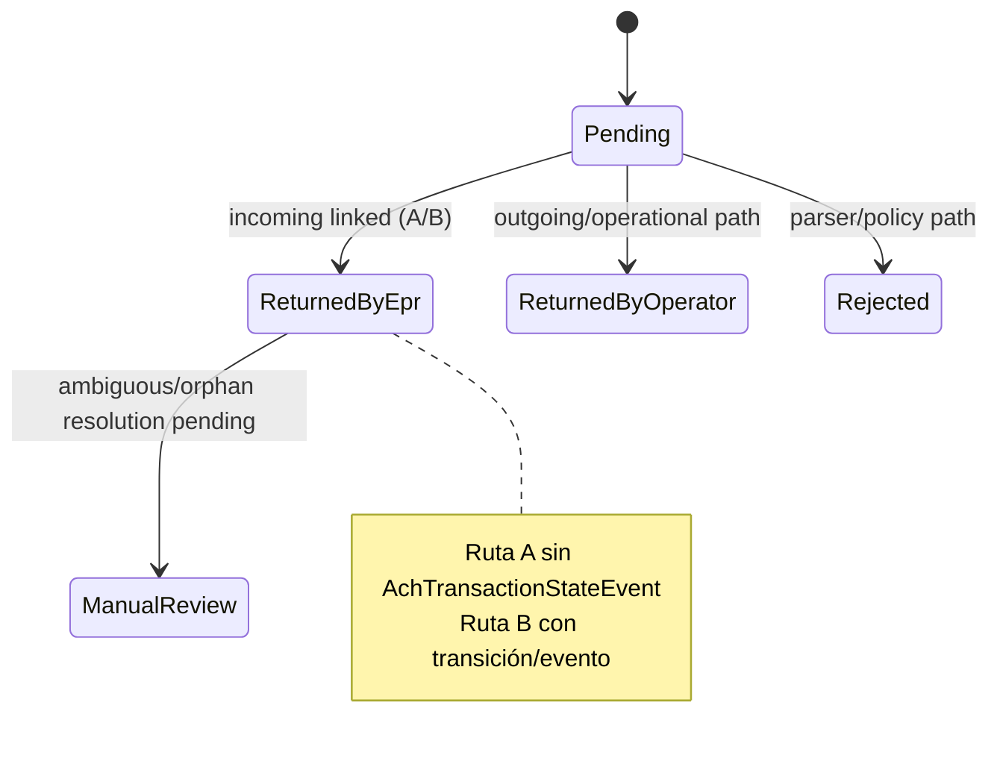
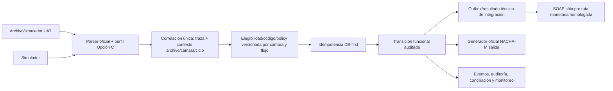
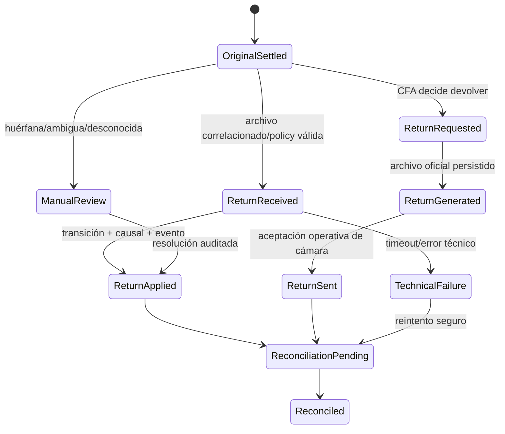

# Análisis integral de devoluciones ACHInterbank

> Fecha: 2026-08-07. Alcance: diagnóstico y diseño; sin cambios funcionales.  
> Decisión: **NO-GO general/productivo**. El análisis distingue capacidad técnica de homologación normativa.

## 1. Resumen ejecutivo

ACHInterbank tiene capacidad técnica parcial a avanzada para devoluciones: catálogo/política por cámara, recepción NACHA de retorno, dos rutas de aplicación entrante, generación saliente y un flujo Return of Return (ROR). No constituye un flujo único, homogéneo ni homologado para habilitación real: la Ruta A entrante aplica `ReturnedByEpr` sin evento de estado; la Ruta B sí conserva transición y evidencia. La salida persiste `AchReturnGenerated`, pero no cambia el estado de la transacción original ni crea evento. Persisten reglas históricas/hardcodeadas de ciclo, naming y DFI, y faltan evidencias firmables por cámara/causal/flujo.

**Retirar bloqueo de generación:** **NO**.  
**Simular devolución de otro banco en UAT:** **NO-GO** hasta que el simulador reutilice el flujo oficial de devolución/correlación y se cierre la homologación; el simulador actual puede generar archivos de entrada, pero no debe definir reglas nuevas.

## 2. Alcance analizado

Dominio `AchTransaction`, `ReturnOfReturnFlow`, estados y eventos; servicios `AchIncomingReturnIngestionService`, `IncomingNachaIngestionAppService`/post-proceso/linker, `AchReturnsService`, `AchReturnOfReturn*`, catálogo regulatorio y política de causales; parser/perfiles NACHA, ciclos, naming, auditoría, conciliación y límites SOAP. Se excluyeron módulos ajenos, cambios y ejecución de suite.

## 3. Evidencias y fuentes

| Fuente | Evidencia verificable | Uso |
|---|---|---|
| Código | `AchIncomingReturnIngestionService.IngestAsync` | Lee addenda 7/99, causal y traza original; valida catálogo/policy y detecta candidato 0/1/>1. |
| Código | `IncomingNachaPostParseProcessor` + `IncomingNachaTransactionLinker` + `AchStateTransitionService` | Ruta B de archivo, linking, evidencia y transición auditada. |
| Código | `AchReturnsService.GenerateReturnsFileAsync` | Elegibilidad/generación saliente y `AchReturnGenerated`. |
| Código | `AchReturnOfReturnEligibilityService.EvaluateAsync`; `AchReturnOfReturnFileGenerationService` | ROR, política y dos generadores (auditoría/NACHA). |
| Dominio | `AchTransaction`; `ReturnOfReturnFlow` | Campos de correlación, estado, causal, eventos y encadenamiento. |
| Pruebas | `AchIncomingReturn*`, `AchReturns*`, `AchReturnOfReturn*`, `AchCauseCodePolicyTests`, `AchReturnConcurrencyTests` | Cobertura focalizada de parsing, políticas, estado, duplicados y archivos. |
| Local | `docs/audits/incoming-return-e2e-orphan-matrix-current.md` | Rutas A/B, huérfanas, idempotencia y gaps vigentes. |
| Local | `docs/audits/cause-code-normative-matrix-ach-cenit-sta-current.md` | Rxx/DEVxx, Dxx/Ixxx y estado de homologación. |
| Local | `docs/dev/devoluciones-ach-auditoria-cenit-ach-colombia.md` | Matriz histórica de salida/entrada, ciclos, naming, DFI y contabilidad. |

Se utilizó Codebase Memory: `get_architecture`, `search_graph`, `get_code_snippet` y `search_code`. No se reindexó. No se consultaron fuentes externas: los documentos locales son suficientes para concluir **pendiente de homologación**, no para afirmar norma adicional.

## 4. Normativa encontrada

| Documento → versión/fecha | Regla evidenciada | Impacto |
|---|---|---|
| `cause-code-normative-matrix-ach-cenit-sta-current.md` → 2026-05-15 | Rxx/DEVxx son causales de devolución; Dxx/Ixxx son rechazo técnico/operacional. | No mezclar rechazo, respuesta diferencial y devolución. |
| Mismo documento | ACH Colombia: R07, R10, R29, R31, DEV14 técnicos; CENIT: R01,R02,R03,R04,R06,R08,R09,R12,R13,R14,R15,R16,R17,R20,R23 documentados. | Válidos técnicamente no equivalen a homologados por flujo. |
| `incoming-return-e2e-orphan-matrix-current.md` | Addenda 7/99 contiene causal/traza; archivo duplicado se detecta por hash+tamaño en Ruta B. | Correlación y evidencia deben conservar archivo, registro, causal y traza. |
| `devoluciones-ach-auditoria-cenit-ach-colombia.md` → 2026-05-12 | Política debe segmentarse por cámara, flujo, vigencia, tipo y plazo; el GO productivo exige aceptación de cámara. | El estado actual no autoriza retirar bloqueos. |

No se encontró manual oficial local firmado que cierre causal→cámara→flujo→plazo→archivo. Por tanto, toda regla fina de plazo, ciclo, Return of Return y naming externo queda **PENDIENTE DE HOMOLOGACIÓN**.

## 5. Arquitectura AS-IS



Ruta B es la ruta operacional más completa; Ruta A y salida son parciales por trazabilidad. Las cámaras y el generador siguen bloqueados para habilitación real/homologación.

## 6. Flujo de devolución recibida

```mermaid
sequenceDiagram
  participant CH as Cámara/externo
  participant U as NachaUpload / parser
  participant P as Post-proceso + linker
  participant T as AchTransaction
  participant A as Eventos/auditoría
  participant S as SOAP/conciliación
  CH->>U: Archivo NACHA-M retorno (7/99)
  U->>P: causal, originalTrace, archivo/hash/ciclo
  P->>T: correlación Exact / NotFound / Ambiguous
  alt Exact y policy permitida
    P->>T: transición ReturnedByEpr/Operator
    P->>A: link + processing event + state event (Ruta B)
    Note over P,A: Ruta A aplica estado directo sin state event
    P->>S: sólo si política monetaria homologada
  else huérfana/ambigua/duplicada/no permitida
    P->>A: evidencia y revisión manual; no afectar original
  end
```

`IngestAsync` busca por `TraceNumber` u `OriginalTraceRef`, toma dos candidatos para detectar ambigüedad y valida causal por cámara, tipo, fecha efectiva y fecha recibida. El comportamiento de SOAP para una devolución no está homologado: no se debe inferir `RegistrarRespuestaTransaccion` automáticamente.

## 7. Flujo de devolución originada



Existe generación técnica y control de duplicado, pero naming/DFI/plazo/ciclo por cámara y afectación funcional posterior no están cerrados.

## 8. Rechazo vs respuesta diferencial vs devolución

| Concepto | Evidencia actual | Tratamiento correcto |
|---|---|---|
| Rechazo | Dxx/Ixxx y validación de archivo/registro. | Error técnico/operacional; no es Rxx ni movimiento de devolución. |
| Devolución | Rxx/DEVxx, original trace, policy de retorno. | Evento funcional correlacionado contra original y causal persistida. |
| Respuesta diferencial | `DifferentialPrenotificationResponseProcessor`; prenotificaciones. | Notificación/resultado no monetario; no asumir devolución. |
| Prenotificación | `IsPrenotification` y processor dedicado. | No ejecutar `Proc_Contrapartidas` ni `Proc_Transacciones` por la respuesta diferencial. |
| Error técnico | parser, política, timeout/reintento. | Estado técnico/evidencia; no transición funcional automática. |

## 9. Modelo de dominio actual

`AchTransaction` concentra importe, tipo, DFI, `TraceNumber`, `OriginalTraceRef`, `ReturnReasonCode`, ciclo/lote, dirección/origen/ruta monetaria, `State` y `StateEvents`. `ReturnOfReturnFlow` vincula retorno origen y transacción ROR, causal, estado y opcionalmente ejecución CENIT. `AchReturnGenerated` conserva salida. Es insuficiente como único modelo: resultado técnico, evento funcional, archivo/registro/addenda y efecto contable no están uniformemente separados.



## 10. Estados actuales



El estado funcional está sobrecargado: no expresa por sí solo archivo, causal, decisión, resultado SOAP ni conciliación. Estados técnicos (duplicado, fallo parser, no resuelto) viven en resultados/eventos del pipeline, no de forma uniforme en la transacción.

## 11. Correlación con transacción original

Claves existentes: `TransactionExternalId` (canónico técnico), `TraceNumber`, `OriginalTraceRef`, ciclo, lote, instituciones, fecha y datos de archivo/link. La Ruta A correlaciona por traza y rechaza >1 candidato; Ruta B conserva `IncomingNachaTransactionLink.EvidenceJson` para Exact/NotFound/Ambiguous. Esto impide la aplicación cuando es ambigua, pero no garantiza una única afectación histórico/multiarchivo/multinodo: el documento de huérfanas identifica hardening DB-first pendiente.

## 12. Idempotencia y duplicados

Intraarchivo: `HashSet` de clave de duplicado en Ruta A. Archivo: hash+tamaño en Ruta B. Salida: existencia de `AchReturnGenerated` y `ReturnGenerationLockService`. ROR expone `IsUniquePerTransaction` desde policy. Falta una clave duradera por devolución aplicada (original+cámara+causal+traza/registro+versión normativa) y protección de huérfana multiarchivo/concurrencia. Por ello no puede demostrarse aún la garantía “una devolución válida → una sola afectación funcional”.

## 13. Integraciones SOAP

| Operación | Semántica vigente | Decisión para devoluciones |
|---|---|---|
| `Proc_Contrapartidas` | Débito de transacción originada por CFA. | Sólo tras política monetaria/correlación/estado homologados; no por parser o archivo duplicado. |
| `Proc_Transacciones` | Crédito de transacción originada externamente. | Sólo si la devolución requiere reverso monetario y la ruta clasificada lo autoriza. |
| `RegistrarRespuestaTransaccion` | Resultado diferencial no monetario. | No es sustituto de devolución ni debe llamarse automáticamente. |

El sistema tiene readiness, colas, persistencia de ejecución y conciliación para integración entrante, pero no hay matriz homologada devolución→operación SOAP→idempotencia→timeout/reintento. El timeout debe quedar como resultado técnico y reconciliar antes de redespacho, nunca duplicar movimiento.

## 14. Generación NACHA-M

`AchReturnsService.GenerateReturnsFileAsync` genera 1/5/6/7/8/9 y addenda 99; valida causal/policy y persiste salida. El análisis local documenta `MaxCyclesForReturn=4`, DFI/naming y algunos valores históricos hardcodeados. `NachaInboundSimulationService` genera sólo archivo UAT manual (`GeneratedOnly`, `AutoImported=false`); su bloqueo protege de usar simulación como regla de dominio o importación/dispatch automático. Los perfiles oficiales son `nacha-config`/Opción C; layouts/definitions legacy no son modelo objetivo. No hay evidencia de homologación de archivo de devolución por cámara, ciclo, consecutivo, nombre y aceptación externa.

## 15. Diferencias ACH Colombia vs CENIT

| Tema | ACH Colombia | CENIT | Evidencia | Impacto |
|---|---|---|---|---|
| Causales técnicas | R07,R10,R29,R31,DEV14 | R01,R02,R03,R04,R06,R08,R09,R12,R13,R14,R15,R16,R17,R20,R23 | matriz de causales | No intercambiar códigos. |
| Política/ciclo/plazo | **PENDIENTE DE HOMOLOGACIÓN** por flujo | **PENDIENTE DE HOMOLOGACIÓN** por flujo | matriz y auditoría | No usar plazo global. |
| Naming/DFI salida | evidencia de históricos hardcodeados ACH | diferente y no cerrado | auditoría devoluciones/naming | Bloquea transmisión. |
| Incoming | resuelto por cámara/ciclo parcialmente | resuelto por cámara/ciclo parcialmente | Ruta B | Requiere policy vigente. |
| ROR | aceptación externa pendiente | aceptación externa pendiente | auditoría ROR | NO-GO productivo. |

## 16. Return of Return

Clasificación: **PARCIAL** para capacidad real; técnicamente tiene componentes completos de evaluación, flujo, auditoría y archivo NACHA. `EvaluateAsync` exige retorno fuente de tipo `Return`, causal original/nueva, cámara única y `ValidateReturnOfReturnAsync`; el generador conserva auditoría. Falta homologación por cámara/ciclo/naming/aceptación externa y evidencia end-to-end de compensación, por lo que no es capacidad productiva.

## 17. Contabilidad y conciliación

Existe lectura/monitoreo y evidencia de conciliación en el ecosistema ACH, pero la auditoría local no identifica un módulo contable explícito de devoluciones separado. La salida no cambia estado/evento de original; la Ruta A no deja state event. El resultado es riesgo de descuadre y falsa trazabilidad. El modelo objetivo requiere registrar decisión funcional, operación monetaria, resultado SOAP y conciliación como hechos relacionados, no como un único `State`.

## 18. Simulador UAT

Estado recomendado: **visible pero bloqueado para “Simular devolución de otro banco”**. Puede conservar generación de archivo manual y descarga; no autoimportar ni invocar upload. Antes de habilitar requiere seleccionar original elegible, institución externa distinta de CFA, cámara/ciclo, causal oficial y ejecutar el mismo servicio de correlación/policy/idempotencia que Ruta B. El simulador no debe duplicar Rxx, plazos ni transición de estado.

## 19. Pruebas existentes

| Tipo | Evidencia |
|---|---|
| Ingesta/parsing | `AchIncomingReturnIngestionServiceTests` (causal, traza, policy, plazo, duplicado). |
| Aplicación/huérfanas | `AchIncomingReturnApplicationAndOrphanCharacterizationTests`, `IncomingNachaDuplicateFileAndOrphanIdempotencyTests`. |
| Salida | `AchReturnsFileByClearingHouseTests`, `AchOutboundReturnStateAndIdempotencyCharacterizationTests`, `AchReturnConcurrencyTests`. |
| Causales | `AchCauseCodePolicyTests`, seeder policies por cámara. |
| ROR | `AchReturnOfReturnEligibilityServiceTests`, `AchReturnOfReturnFileGenerationServiceTests`, golden/controller tests. |
| Conciliación/reportes | `AchReconciliationReadModelTests`, accounting export/UAT tests. |

No se ejecutaron pruebas: la evidencia estática y documental fue suficiente y el JOB prohíbe cambios. Faltan pruebas contractuales por cámara, duplicado multiarchivo/multinodo, SOAP por devolución, timeout/reconciliación y aceptación externa.

## 20. Brechas encontradas

> **JOB 2 (unificación inbound): CERRADA en la base `70926559a894e63815f8b79ccd09795075e99bda`.** La Ruta A (`AchIncomingReturnIngestionService`), la Ruta B (`IncomingNachaPostParseProcessor` + linker) y el parser convergen en `AchStateTransitionService`; no queda una asignación directa inbound de `AchTransaction.State` fuera de ese mecanismo. Las pruebas focalizadas verifican estado, causal, evento único y ausencia de duplicación funcional. La idempotencia DB-first/multinodo permanece en JOB 3.

| ID | Brecha | Severidad | Categoría | Evidencia | Riesgo | Acción recomendada |
|---|---|---|---|---|---|---|
| B1 | Dos rutas incoming con auditoría/semántica distinta; Ruta A cambia estado sin state event. | CRÍTICA | Persistencia | matriz incoming §§2,4,8; `IngestAsync` | falsa trazabilidad | Unificar aplicación en transición auditada. |
| B2 | Idempotencia no DB-first por registro/huérfana/multiarchivo/multinodo. | CRÍTICA | Idempotencia | matriz incoming §§7,10; rutas A/B | doble afectación | Clave funcional persistida y concurrencia transaccional. |
| B3 | Salida no actualiza original ni evento y mezcla reglas históricas hardcodeadas. | CRÍTICA | Funcional | auditoría devoluciones §3 | estado/contabilidad inconsistente | Definir lifecycle de salida y policy por cámara. |
| B4 | Homologación normativa incompleta por cámara, flujo, plazo, ROR y naming. | CRÍTICA | Normativa | matriz causales §§2,8,9 | archivo/reverso no conforme | Cierre documental firmado y tests contractuales. |
| B5 | Naming, DFI y ciclos de salida no totalmente gobernados por perfil/policy. | ALTA | NACHA | auditoría devoluciones §2 | rechazo externo | Resolver por `nacha-config`/policy vigente. |
| B6 | Huérfanas/ambiguas no tienen cierre manual E2E auditable. | ALTA | Correlación | matriz incoming §7 | casos perdidos o aplicación errónea | Lifecycle manual con actor/evidencia/reproceso. |
| B7 | No existe matriz devolución→SOAP→reintento→conciliación. | ALTA | Integración | servicios SOAP/readiness | doble movimiento o no reverso | Política de integración y reconciliation gate. |
| B8 | Contabilidad de devolución no está explícitamente separada. | ALTA | Conciliación | auditoría devoluciones §2 | descuadre | Política/ledger auditable separado. |
| B9 | Dxx/Ixxx, Rxx/DEVxx y respuestas diferenciales no están expuestos como taxonomía unificada. | MEDIA | Dominio | matriz causales; differential processor | confusión operativa | Contrato de eventos/resultados por tipo. |
| B10 | ROR tiene capacidad técnica sin aceptación externa cerrada. | MEDIA | Operación | auditoría ROR | falsa percepción de go-live | UAT por cámara y firma. |

## 21. Riesgos

Riesgos concretos: doble movimiento (B2/B7), correlación errónea (B2/B6), pérdida de causal o de auditoría (B1/B3), archivo inválido/rechazado (B4/B5), devolución fuera de plazo (B4), descuadre contable (B3/B8) y habilitación prematura de ROR/simulador (B4/B10).

## 22. Arquitectura TO-BE recomendada



Propuesta: una aplicación oficial de devolución que reutilice parser/perfil, policy, transición y evidencia de Ruta B; separar hechos funcionales/técnicos; parametrizar por `ClearingHouseId`, dirección, flujo y vigencia; y usar el simulador sólo como adaptador de entrada. No requiere microservicios, bus ni nueva capa.

## 23. Máquina de estados TO-BE



Estados funcionales (`ReturnReceived`, `ReturnApplied`, `ReturnRequested`) no reemplazan estados técnicos (`TechnicalFailure`, reintento) ni hechos de conciliación.

## 24. Plan de implementación por JOBs

| JOB | Objetivo | Dependencia | Riesgo | Componentes probables | Criterio/evidencia |
|---|---|---|---|---|---|
| 1 | Homologación normativa por cámara/flujo | firmas/manuales | B4 | catálogo/seeds/documentación | matriz firmada causal/plazo/ciclo/naming. |
| 2 | Unificar incoming y evento auditado | JOB 1 | B1 | Ruta A/B, transición, links | una aplicación por devolución y state event. |
| 3 | Idempotencia/correlación DB-first y huérfanas | JOB 2 | B2/B6 | links, índices/modelo, resolución | concurrencia y multiarchivo demostrados. |
| 4 | Lifecycle de devolución saliente | JOB 1 | B3/B5 | `AchReturnsService`, profiles, cycles | estado/evento/original y archivo por cámara. |
| 5 | Política SOAP y conciliación | JOB 2/4 | B7/B8 | orchestrators/readiness/reconciliation | matriz de operación, timeout y no duplicación. |
| 6 | ROR homologado por cámara | JOB 1/3/4 | B10 | ROR services/policies | UAT por cámara y aceptación de archivo. |
| 7 | Simulador UAT seguro | JOB 2/3/4 | B4 | simulator/API/UI | reutiliza dominio, descarga manual, sin autoimport. |
| 8 | Validación integral | todos | residual | tests/UAT/operación | contract tests, UAT y decisión GO firmada. |

## 25. Decisión GO / NO-GO

**GO / NO-GO general: NO-GO.**  
### ¿Es seguro retirar actualmente el bloqueo de generación de devoluciones?
**NO.** B1–B4 impiden demostrar correlación/idempotencia, lifecycle y homologación externa.  
### ¿Es seguro habilitar actualmente “Simular devolución de otro banco” en UAT?
**NO-GO.** Debe esperar JOBs 1–4 y reutilizar el dominio oficial; no basta el generador genérico de inbound.

## 26. Evidencias finales

La base técnica existe y permite avanzar por JOBs acotados, pero no prueba capacidad regulatoria/productiva. La prioridad es cerrar homologación y converger Ruta A/B antes de desbloquear generación, SOAP monetario o simulación de devoluciones. El siguiente JOB recomendado es **JOB 1 — Homologación normativa por cámara y flujo**.
