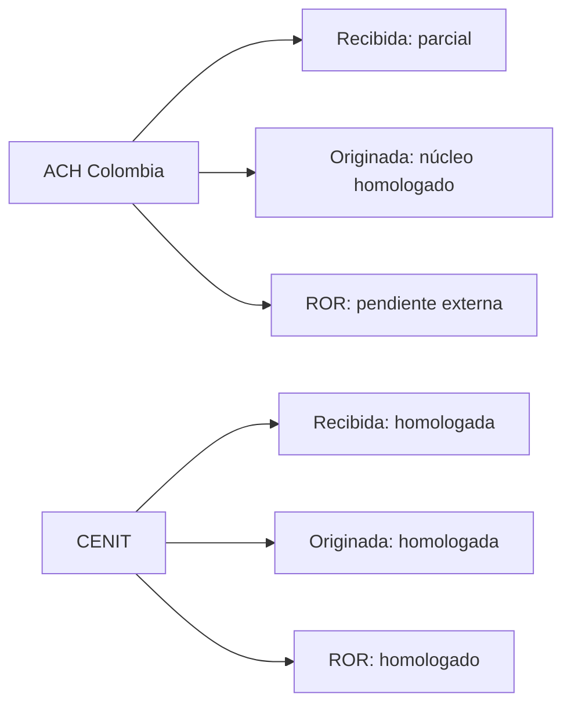

# Homologación normativa de devoluciones ACH por cámara y flujo

> Fecha de consulta: 2026-08-07. Alcance: investigación, homologación y diseño de reglas; sin cambios funcionales.
> Estado de B4: **PARCIALMENTE CERRADA**. La evidencia oficial es suficiente para reglas nucleares de ACH Colombia y CENIT; no lo es para homologar ROR en ACH Colombia ni el layout/correlación CENIT de retorno desde documentación pública/local disponible.

## 1. Resumen ejecutivo

La homologación debe ser por cámara y flujo, nunca por un catálogo Rxx común. ACH Colombia confirma la devolución originada por el participante receptor hacia el originador, una ventana operativa de cuatro ciclos y el formato/naming NACHA-M de devolución. CENIT confirma, además, ROR de crédito y débito: la origina el participante originador, una sola vez, bajo plazo/ciclo expresos.

No se halló base oficial para trasladar el ROR de CENIT a ACH Colombia ni para autorizar campos de addenda, `OriginalTrace`, DFI o naming de ROR CENIT a partir de matrices internas. Permanecen bloqueados conceptualmente hasta aceptación documental de cada cámara.

## 2. Alcance

Se cubren devolución recibida (CFA originó), devolución originada (CFA recibió), ROR, y la frontera frente a rechazo y respuesta diferencial. Se excluyen B1, B2, B3, B6-B8, SOAP, simulador, conciliación e implementación.

## 3. Fuentes utilizadas

| Id | Entidad / documento | Versión o fecha | Apartados usados | Uso |
|---|---|---:|---|---|
| ACH-1 | ACH Colombia, *Manual de Servicio ACH Transferencias Interbancarias para Entidad Participante* (copia local `ACH-Colombia-V32`, contenido V31) | agosto 2024 | 2.4.7, 2.10.4, 2.10.4.2, 2.11.5.1, 6.1.10.1, 6.6.1-6.6.2, 6.7.1, Anexos 3, 9 y 23 | Devoluciones, ciclos, naming y registros ACH Colombia |
| CEN-1 | Banco de la República, Circular DSP-152, Anexo 2, Manual Operativo CENIT (copia local) | 2025-02-27 | 2, 3.1-3.3, 4.2-4.8 | Causales, ciclos, plazos y ROR CENIT |
| CEN-2 | Banco de la República, DSP-152 Anexo A, Causales de devolución | 2023-11-28 | Tabla 1 | Causales y restricciones CENIT |
| CEN-3 | Banco de la República, DSP-152 Anexo B, Causales de rechazo STA | 2023-11-28 | tabla de D01-D06 | Límite rechazo/retorno |
| EXT-CEN | Banco de la República, [Manual operativo CENIT](https://www.banrep.gov.co/es/manual-operativo-sistema-compensacion-electronica-nacional-interbancaria-cenit) y [DSP-152 Anexo 2 PDF](https://www.banrep.gov.co/sites/default/files/reglamentacion/archivos/manual_dsp_cenit.pdf) | consulta 2026-08-07; PDF 2025-02-27 | 3 y 4.2-4.8 | Verificación externa primaria de CEN-1 |
| INT-1 | `docs/audits/cause-code-normative-matrix-ach-cenit-sta-current.md` | 2026-05-15 | matriz | Inventario ACHInterbank; no prueba normativa |
| INT-2 | `docs/audits/external-filename-normative-matrix-ach-cenit-sta-current.md`, `nacha-record-level-normative-matrix-ach-cenit-current.md` | vigente local | matrices | Contraste AS-IS; no prueba normativa |
| INT-3 | `docs/analysis/ANALISIS_INTEGRAL_DEVOLUCIONES_ACH.md` (base `427854c1…`) | 2026-08-07 | B4, B5, generación y plan | Punto de partida, no norma |

No se localizó una publicación pública oficial de ACH Colombia que sustituyera o confirmara, a fecha de consulta, la copia local. La diferencia entre el nombre de archivo `V32` y el contenido que se identifica como V31/agosto de 2024 exige confirmación de vigencia con ACH Colombia antes de habilitación.

## 4. Clasificación de las fuentes

| Fuente | Clasificación | Motivo |
|---|---|---|
| ACH-1 | OFICIAL | Manual atribuido a ACH Colombia y con copyright/versión; copia local. Vigencia externa pendiente de confirmación. |
| CEN-1, CEN-2, CEN-3 | OFICIAL | Circular/anexos Banco de la República. |
| EXT-CEN | OFICIAL | Publicación y PDF del Banco de la República. |
| INT-1, INT-2 | INTERNA | Matrices de auditoría; describen implementación e hipótesis. |
| INT-3 | INTERNA | Diagnóstico arquitectónico B4/B5. |
| Golden files, UAT y evidencias de simulación | EVIDENCIA UAT | No certifican regla de cámara. |
| Hardcodes, seeds y perfiles | NO NORMATIVA | No fueron usados como autoridad. |

## 5. ACH Colombia — devolución recibida

**PARCIALMENTE HOMOLOGADA.** Si CFA fue participante originador, recibe una devolución generada por el participante receptor, con causal estándar y detalle cuando sea posible (ACH-1, 2.10.4-2.10.4.1 y 2.11.5.1). El manual manda conservar datos de lote/detalle/control de la original salvo excepciones y exige addenda; también dispone una nueva secuencia para la devolución (6.6.1).

La recepción en ACHInterbank debe clasificarla como devolución, correlacionarla con el original y preservar la causal/evidencia. Es **pendiente** el mapeo oficial de `OriginalTraceRef`/subcampos de addenda al modelo actual, pues el manual revisado no denomina ese campo con dicho nombre.

## 6. ACH Colombia — devolución originada

**HOMOLOGADA para el núcleo operativo; PARCIALMENTE HOMOLOGADA para detalle de campos.** Si CFA fue participante receptor de una transacción que no puede aceptar, genera devolución hacia el participante originador (ACH-1, 2.10.4 para crédito; 2.11.5.1 para débito/prenotificación). La devolución usa código estándar y, cuando sea posible, detalle.

Para crédito por reclamación del usuario receptor, el límite es el primer ciclo del siguiente día hábil después de recibida la solicitud (2.10.4.2). Para la ventana por ciclo, ACH Colombia dispone máximo cuatro ciclos tras recibir la original para crédito y débito —monetario y prenotificación—; crédito tardío puede enviarse/compensarse bajo esquema de calidad, mientras débito tardío no se permite (2.4.7). No confundir este límite transaccional con los 60 días hábiles de solución de un caso DEV (2.7.2.2/Anexo 23).

## 7. CENIT — devolución recibida

**HOMOLOGADA.** Si CFA originó la entrada y recibe devolución, debe interpretarla según las causales del Anexo A y su tipo (PPD/CCD/CTX; crédito/débito y prenotificación). La devolución ordinaria es generada por el participante receptor y dirigida al originador (CEN-1, 4.2 y 4.5); CFA debe conservar evidencia de la original y aplicar reglas de correlación sin inferir campos técnicos no publicados.

Para entrada crédito, la devolución ordinaria debe hacerse en el ciclo inmediatamente siguiente y misma fecha valor; si deriva de rechazo del receptor puede ser posterior con fecha valor del día de devolución, con máximo 15 días calendario desde la entrada al receptor y trámite a más tardar el siguiente día hábil tras la notificación (CEN-1, 4.2). Para débito, la regla confirmada es ciclo inmediatamente siguiente y misma fecha valor (4.5); no se obtuvo en el apartado revisado un máximo adicional por días.

## 8. CENIT — devolución originada

**HOMOLOGADA.** Cuando CFA actúe como participante receptor, devuelve entradas monetarias o prenotificaciones solo si concurre causal del Anexo A. Debe respetar el ciclo, fecha valor y tipo de operación descritos en CEN-1 4.2, 4.5 y 4.8. Para prenotificación, el límite es la misma fecha valor y, como máximo, el último ciclo de devoluciones del día operacional (4.8).

La causal R06 exige envío en el ciclo de devoluciones más inmediato, está sujeta a disponibilidad de fondos si es crédito ya abonado, confirma aplicación al originador y solo permite el valor original: no hay devolución parcial (CEN-2, Tabla 1).

## 9. Códigos y causales

| Cámara | Categoría | Códigos / alcance relevante | Regla homologada | Estado |
|---|---|---|---|---|
| ACH Colombia | Devolución | R01, R02, R03, R04, R06-R10, R12-R17, R20, R23 y los demás aplicables según Anexo 9 | Anexo 9 define aplicabilidad por débito/crédito y prenotificación; el receptor reporta código estándar. | PARCIALMENTE HOMOLOGADA: falta transcripción controlada de tabla completa a catálogo por flujo. |
| ACH Colombia | Devolución por operador | D01-Dxx del Anexo 3 | Error formal generado por ACH Colombia; no equivale a devolución ordinaria iniciada por CFA. | HOMOLOGADA |
| ACH Colombia | Rechazo | Rechazo total/errores de archivo | El archivo inválido puede devolverse totalmente; no es Rxx. | HOMOLOGADA |
| CENIT | Devolución | R01, R02, R03, R04, R06-R10, R12-R17, R20, R23 y otros del Anexo A | La tabla determina aplicabilidad por servicio/tipo. R06 confirma importe original completo. | HOMOLOGADA para catálogo fuente; falta mapeo campo a campo ACHInterbank. |
| CENIT | Rechazo STA | D01-D06 | Rechazo de archivo/transferencia (destino, firma, formato, duplicado, conteo o distribución), distinto de devolución de compensación. | HOMOLOGADA |
| Ambas | Respuesta diferencial | Prenotificación/resultado no monetario | No se asimila a devolución salvo que la cámara la codifique expresamente como tal. | PARCIALMENTE HOMOLOGADA |

## 10. Plazos

| Cámara / flujo | Regla y fecha base | Estado |
|---|---|---|
| ACH Colombia, devolución ordinaria | Máximo cuatro ciclos desde la recepción de la original; crédito tardío bajo esquema de calidad, débito tardío no admisible. Base: recepción de la original. | HOMOLOGADA |
| ACH Colombia, devolución crédito por solicitud del receptor | Hasta primer ciclo del día hábil siguiente de recibir solicitud/reclamo posterior al crédito. | HOMOLOGADA |
| ACH Colombia, caso DEV | 60 días hábiles para solución/cierre del requerimiento; **no es** plazo de envío de la transacción de devolución. | HOMOLOGADA |
| CENIT, devolución crédito | Ciclo siguiente/misma fecha valor; si rechazo del receptor, máximo 15 días calendario desde entrada al receptor y trámite siguiente día hábil desde aviso. | HOMOLOGADA |
| CENIT, devolución débito | Ciclo siguiente/misma fecha valor. Máximo en días no demostrado en apartados revisados. | PARCIALMENTE HOMOLOGADA |
| CENIT, prenotificación | Misma fecha valor, hasta último ciclo de devoluciones del día. | HOMOLOGADA |
| CENIT, ROR | Segundo ciclo del siguiente día hábil desde fecha valor de devolución recibida; excepción de último ciclo del mismo día. | HOMOLOGADA |

## 11. Ciclos

ACH Colombia opera cinco ciclos y no acepta débito en ciclo 5; la regla de cuatro ciclos es normativa para devolución (ACH-1, 2.4.1 y 2.4.7). Por tanto, `MaxCyclesForReturn=4` queda **respaldada normativamente solo como ventana ACH Colombia**, no como constante global ni sustituto de la regla de crédito tardío.

CENIT opera cinco ciclos (CEN-1, 3.1). Sus tablas 3.2 distinguen devoluciones de entradas del ciclo anterior, ROR de devoluciones del día en curso y ROR de día anterior; el selector de ciclo no puede ser libre. La regla actual `MaxCyclesForReturn=4` para CENIT queda **hardcodeada sin evidencia suficiente**, porque la cámara prescribe ciclo siguiente, segundo ciclo/último ciclo según flujo, no una ventana genérica de cuatro.

## 12. Naming de archivos

**ACH Colombia — AS-IS → norma → brecha.** AS-IS documentado: salida `RET_{cycleId}_{timestamp}.RET` y valores derivados/hardcodeados. Norma (ACH-1, 6.1.10.1): `RRRRTTT.ZZZ.1`, donde ruta, tránsito y consecutivo diario se relacionan con el identificador de archivo; 001-026 corresponden A-Z y 027-036 a 0-9. Para devolución por operador, el archivo usa el mismo estándar con extensión `RET` (6.1.8). El manual revisado no demuestra que una devolución ordinaria originada por participante deba usar `.RET`; no se debe extrapolar la extensión de devolución por operador. Brecha: el naming AS-IS no está homologado contra flujo/tipo de devolución.

**CENIT — AS-IS → norma → brecha.** AS-IS: matrices internas reportan naming/perfiles no confirmados. No se encontró en DSP-152 Anexo 2/Anexo A/B una especificación pública de nombre externo para devolución de compensación. Brecha: `PENDIENTE DE HOMOLOGACIÓN EXTERNA` mediante Manual de Especificaciones Técnicas CENIT/STA vigente y aceptación de cámara; no usar naming ACH Colombia.

## 13. Registros NACHA-M relevantes

| Cámara | Regla demostrada | Interpretación ACHInterbank | Estado |
|---|---|---|---|
| ACH Colombia | Secuencia: encabezado archivo, encabezado lote, detalle, addenda, control lote, control archivo (ACH-1, 6.6.1). | Registros 1/5/6/7/8/9; addenda obligatoria. | HOMOLOGADA |
| ACH Colombia | La devolución es nueva y lleva secuencia nueva; conserva datos de lote/detalle/control de original salvo excepciones; no retorna addenda original; solo una devolución por transacción recibida. | Exigir nueva secuencia, preservación controlada, adenda nueva y clave de no duplicidad. | HOMOLOGADA |
| ACH Colombia | Header de devolución: destino inmediato ACH Colombia, origen inmediato participante; 106 caracteres y blocking factor 10 (6.6.2). | DFI/header deben venir de policy ACH Colombia, no de valores genéricos. | HOMOLOGADA |
| CENIT | DSP-152 remite la prenotificación al Manual de Especificaciones Técnicas, pero los documentos revisados no detallan layout de devolución/ROR. | No afirmar tipos de addenda, original trace, DFI, controles o naming. | PENDIENTE DE HOMOLOGACIÓN EXTERNA |

No se demuestra con las fuentes revisadas que `OriginalTrace` sea el nombre normativo de un campo de addenda para ambas cámaras. Se mantiene como requisito de correlación interno sujeto a validación de layout por cámara.

## 14. Return of Return

| Cámara | Regla | Estado |
|---|---|---|
| ACH Colombia | No se halló en ACH-1 una figura/ROR, causal, plazo, archivo o ciclo homologables. La mención a devoluciones de devoluciones en validación por operador no autoriza ROR de participante. | PENDIENTE DE HOMOLOGACIÓN EXTERNA |
| CENIT | Permitido para crédito y débito: originador → receptor, a más tardar segundo ciclo del siguiente día hábil desde fecha valor de devolución recibida; excepción último ciclo mismo día para devoluciones recibidas del segundo al penúltimo ciclo; una sola vez; solo causales del manual; vencido el plazo, acuerdo fuera del sistema (CEN-1, 4.3 y 4.6). | HOMOLOGADO |

La correlación ROR CENIT debe enlazar devolución recibida y nuevo ROR, conservar fecha valor/ciclo/causal y prevenir segunda repetición. El formato/naming/addenda ROR CENIT permanece pendiente porque CEN-1 no los especifica en los apartados disponibles.

## 15. Devolución parcial

Para una transacción CENIT con causal R06, la evidencia oficial exige el valor original y excluye devolución parcial (CEN-2, Tabla 1): **HOMOLOGADA para R06**. Para ACH Colombia, el manual confirma devoluciones parciales de **archivo** por operador (6.1.8), no una devolución monetaria parcial por entrada originada por participante: **PENDIENTE DE HOMOLOGACIÓN EXTERNA** para cualquier parcialidad por transacción. No se debe inferir desde el modelo de datos ni generalizar R06 a todas las causales CENIT.

## 16. Rechazo vs devolución vs respuesta diferencial

| Concepto | Delimitación normativa | Tratamiento |
|---|---|---|
| Devolución | Evento sobre una entrada previamente recibida, con causal de devolución y dirección receptor→originador; CENIT regula además ROR. | Flujo funcional correlacionado. |
| Rechazo | ACH Colombia: rechazo/error de archivo o devolución por operador; CENIT STA: D01-D06 para archivo, firma, formato, duplicado, conteo o distribución. | Resultado técnico/operativo; no convertir a Rxx. |
| Respuesta diferencial | Resultado de prenotificación/notificación sin evidencia de causal de devolución aplicable. | No devolución ni movimiento por defecto; requiere clasificación separada. |

## 17. Matriz normativa consolidada

| Cámara | Flujo | Tipo/código | Quién origina / destino | Plazo, fecha base y ciclo | Archivo / NACHA / correlación | Importe, duplicidad, ROR | Evidencia | Estado |
|---|---|---|---|---|---|---|---|---|
| ACH Colombia | Recibida | Rxx Anexo 9 según tipo | Receptor → originador (CFA) | Cuatro ciclos desde recepción; crédito por reclamo: primer ciclo día hábil siguiente a solicitud | NACHA-M 1/5/6/7/8/9; addenda obligatoria; preservación de original salvo excepciones; naming ordinario pendiente | Una devolución por transacción; parcial por entrada pendiente; ROR pendiente | ACH-1 2.4.7, 2.10.4, 6.6.1-2 | PARCIALMENTE HOMOLOGADA |
| ACH Colombia | Originada | Rxx Anexo 9 según tipo | CFA receptor → originador | Misma regla cuatro ciclos; restricciones crédito/débito | Igual; DFI de header definido por 6.6.2; naming ordinario pendiente | Una por entrada; parcial pendiente; ROR pendiente | ACH-1 2.4.7, 2.10.4, 2.11.5.1, 6.6 | PARCIALMENTE HOMOLOGADA |
| ACH Colombia | ROR | No demostrado | No demostrado | No demostrado | No demostrado | Mantener bloqueado | ACH-1 revisado | PENDIENTE DE HOMOLOGACIÓN EXTERNA |
| CENIT | Recibida | Rxx Anexo A | Receptor → originador (CFA) | Crédito: ciclo siguiente/misma fecha valor; excepciones 15 días; débito: ciclo siguiente | Layout/naming/DFI/addenda/original trace pendientes | R06: valor original, no parcial; ROR aplicable para devolución recibida | CEN-1 4.2/4.5; CEN-2 | PARCIALMENTE HOMOLOGADA |
| CENIT | Originada | Rxx Anexo A | CFA receptor → originador | Crédito/débito ciclo siguiente; prenotificación misma fecha valor/último ciclo | Layout/naming/DFI/addenda/original trace pendientes | R06 no parcial; no duplicidad exige control interno | CEN-1 4.2/4.5/4.8; CEN-2 | PARCIALMENTE HOMOLOGADA |
| CENIT | ROR | Causal de devolución aplicable | Originador → receptor | Segundo ciclo siguiente día hábil desde fecha valor; excepción último ciclo mismo día | Archivo/layout/naming pendientes | Una sola vez; vencido, fuera del sistema | CEN-1 4.3/4.6 | PARCIALMENTE HOMOLOGADA |

## 18. Reglas homologadas

1. ACH Colombia: devolución ordinaria la genera el participante receptor hacia originador y debe tener causal estándar; registros NACHA-M y addenda obligatoria.
2. ACH Colombia: ventana de cuatro ciclos desde recepción; crédito tardío bajo calidad y débito tardío inadmisible.
3. ACH Colombia: naming base `RRRRTTT.ZZZ.1`, consecutivo/identificador 001-036; `.RET` demostrada para devolución por operador.
4. CENIT: devolución crédito y débito en ciclo siguiente, con reglas de fecha valor y máximo de 15 días para crédito en el supuesto normado.
5. CENIT: ROR crédito/débito permitida una vez, por originador, con segundo ciclo del siguiente día hábil o excepción intradía.
6. CENIT R06: importe original completo, sin parcialidad.
7. Rechazo STA Dxx y devolución Rxx son categorías distintas.

## 19. Reglas pendientes de homologación

1. ACH Colombia: admisibilidad, causales, plazo, ciclo, layout y naming de ROR por participante.
2. CENIT: Manual de Especificaciones Técnicas vigente para campos de retorno/ROR: addenda, referencia/original trace, DFI, controles y nombre externo.
3. ACH Colombia: vigencia oficial de la copia local V31 frente al nombre de archivo V32 y layout exacto de `OriginalTrace`.
4. ACH Colombia: devolución parcial por transacción (distinta de devolución parcial de archivo por operador).
5. CENIT: máximo en días para devolución ordinaria de entrada débito, si existe fuera del texto revisado.
6. Catálogo campo a campo de Anexo 9 ACH Colombia y Anexo A CENIT hacia los códigos actuales, con vigencia/flujo/tipo.

## 20. Impacto futuro sobre ACHInterbank

| Consumidor futuro | Regla / situación |
|---|---|
| `AchReturnCodes` y política por cámara | Requiere ajuste: catálogo por cámara, tipo, flujo, vigencia y restricciones; no mezclar Rxx/Dxx/respuesta diferencial. |
| Elegibilidad y ciclos | Requiere ajuste: separar cuatro ciclos ACH Colombia de reglas CENIT por ciclo/fecha valor. |
| `nacha-config`, generación y parser | Falta soporte certificado: policy de registros/DFI/addenda/naming por flujo; no usar hardcodes como norma. |
| Naming | Requiere ajuste ACH Colombia; falta soporte/confirmación CENIT. |
| Correlación y duplicidad | Ya soportada parcialmente: debe consumir referencia oficial cuando se obtenga; una devolución ACH Colombia por entrada y ROR CENIT una sola vez. |
| ROR | Requiere decisión funcional para ACH Colombia; CENIT requiere completar formato técnico antes de habilitar. |
| Simulador y SOAP | No aplica en este JOB; solo deben consumir clasificación ya homologada en trabajo posterior. |

## 21. Brechas normativas remanentes

Las brechas que impiden cierre completo son: ROR ACH Colombia; especificación CENIT de archivo/layout de devolución y ROR; confirmación de vigencia/versión ACH Colombia; y homologación de campos de correlación, DFI y addenda contra manuales técnicos vigentes. Ninguna se cubre por analogía entre cámaras ni por NACHA estadounidense.

## 22. Decisión de cierre del JOB

**B4: PARCIALMENTE CERRADA.**

| Cámara | Devolución recibida | Devolución originada | ROR |
|---|---|---|---|
| ACH Colombia | PARCIAL | PARCIAL | PENDIENTE |
| CENIT | PARCIAL | PARCIAL | PARCIAL |

La clasificación CENIT es parcial, no plena, porque la operación/plazo/ROR están homologados pero falta la especificación técnica pública/local de archivo y correlación. Para cerrar B4 se requiere: (a) manual o aceptación formal vigente de ACH Colombia que regule ROR y confirme versión/layout de devolución; (b) Manual de Especificaciones Técnicas CENIT vigente o confirmación firmable de campos, naming y layout de devolución/ROR; y (c) aceptación de cámara que relacione esos documentos con la participación de CFA.

## 23. Evidencias

- Local oficial: `docs/normativa/pdf/ACH-Colombia-V32.pdf`, `CENIT-DSP-152-Anexo-2.pdf`, `CENIT-Anexo-A-Causales-Devolucion.pdf` y `CENIT-Anexo-B-Causales-Rechazo.pdf`; sus transcripciones Markdown fueron usadas para localizar apartados.
- Externa oficial: Banco de la República, Manual Operativo CENIT y DSP-152 Anexo 2, URLs en la sección 3, consultados el 2026-08-07.
- Interna: análisis base B4/B5 y matrices de auditoría enumeradas en sección 3; usadas únicamente para identificar AS-IS y brechas.
- Se buscaron publicaciones oficiales de ACH Colombia sobre manual, devolución y NACHA-M. No se obtuvo documento público oficial adicional con ROR/layout; se detuvo la búsqueda conforme al criterio del JOB.
