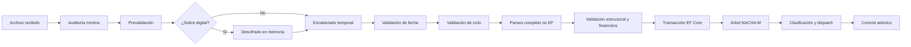
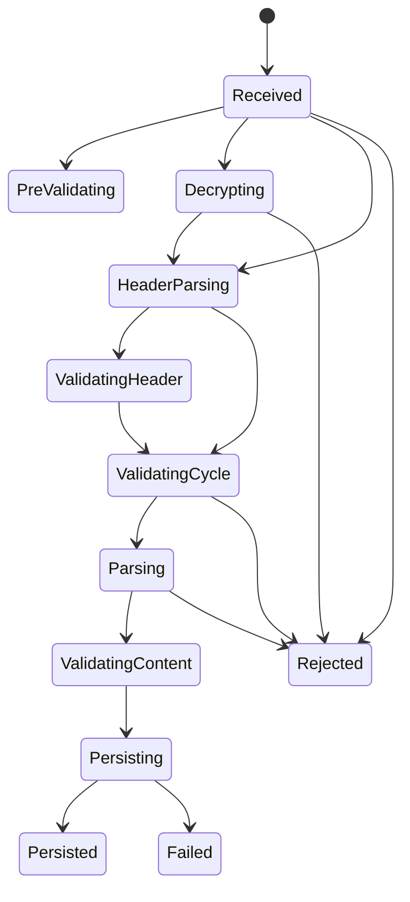
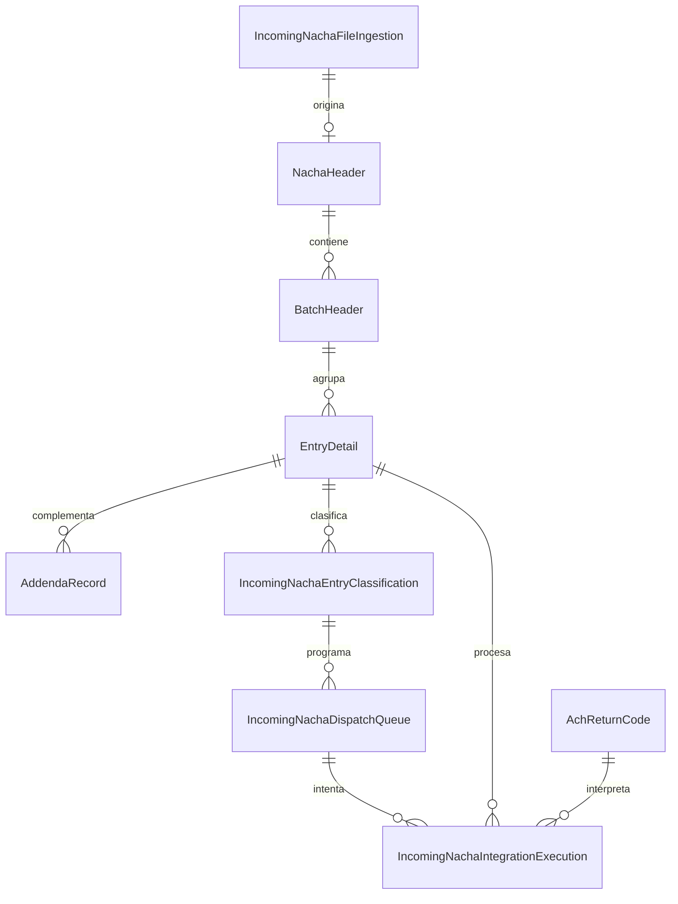

# Núcleo de trazabilidad NACHA-M entrante

## Alcance

Este documento describe el flujo backend que recibe archivos NACHA-M de ACH Colombia o CENIT. La implementación separa recepción, descifrado, lectura temporal, admisión operativa, parseo, validación, persistencia y procesamiento individual. La vista Angular operativa queda fuera de esta fase.

Productivo permanece **NO-GO**. La implementación no requiere ni ejecuta SOAP para validar la ingesta.

## Flujo de ingesta

`IncomingNachaFileIngestions` se crea antes de las validaciones para conservar la tentativa, el hash y la causal de rechazo. Ningún `NachaHeader`, lote, transacción, adenda o control se inserta hasta concluir el parseo y todas las validaciones.

El parser usa `NachaHeaderPreview` para la lectura mínima y los tipos `ParsedNacha*` para el árbol completo temporal. Estos tipos viven en Application, no tienen claves EF ni implementan auditoría persistente. `ParsedNachaEntityMapper` materializa las entidades sólo en la etapa de persistencia.

## Descifrado y seguridad

- El hash SHA-256 se calcula sobre el archivo original antes del descifrado.
- El sobre digital se resuelve por cámara y certificado configurado.
- El contenido claro permanece en memoria y se limpia con `CryptographicOperations.ZeroMemory` en `finally`.
- No se escribe contenido descifrado en almacenamiento permanente.
- Los eventos guardan hashes, identificadores técnicos y metadatos; no guardan cuentas, XML completo, llaves privadas ni secretos.
- Un fallo criptográfico conserva la ingesta y una causal sanitizada, pero no crea el árbol NACHA-M.

## Fecha operativa

`IncomingNachaAdmissionValidator` compara, cuando el formato lo aporta:

- fecha del nombre oficial (`ddddddd.ddd.aaaammdd.n[.OUT]`);
- fecha del encabezado temporal;
- fecha efectiva del primer lote;
- fecha del ciclo persistido;
- fecha operativa abierta para la cámara;
- día hábil, festivos y fechas especiales;
- zona horaria configurada en `ClearingHouseConfig`.

Un rechazo devuelve código estable, título, mensaje en español, valor esperado, valor encontrado y acción sugerida. Ejemplo: `HEADER_DATE_MISMATCH` conserva el código técnico, pero la interfaz recibe también las fechas en formato operativo comprensible.

## Ciclos

La admisión consulta `AchCycle` por cámara, fecha e identificador resuelto. No compara solamente números de ciclo. Se consideran:

- `OperationalStatus`: programado, abierto, cerrado o cancelado;
- `StartTime`, `CutoffTime` y `EndTime`;
- `ReceptionToleranceMinutes`;
- `AllowsExplicitReprocessing`;
- zona horaria, festivos y día hábil.

Un ciclo cerrado o cancelado rechaza el archivo antes del parser, salvo reprocesamiento explícito habilitado en ese ciclo.

## Estados y transiciones

`IncomingNachaStageTransitions` centraliza las transiciones de ingesta:

Los estados terminales no vuelven a estados activos. Dispatch mantiene su máquina de estados existente. Cada ejecución individual separa `ProcessingStatus` de `BusinessOutcome`.

## Persistencia y relaciones

La transacción relacional abarca:

1. árbol `NachaHeader` → `BatchHeader` → `EntryDetail` → `AddendaRecord`;
2. `BatchControl` y `FileControl`;
3. clasificación inicial;
4. vínculo con la transacción interna;
5. planificación de dispatch.

Un error produce rollback del árbol, clasificaciones y cola. Después del rollback se actualiza únicamente la auditoría mínima de ingesta y su resultado de procesamiento.

Relaciones explícitas:

## Auditoría temporal

`NachaHeader`, `BatchHeader`, `EntryDetail`, `AddendaRecord`, `BatchControl` y `FileControl` implementan la misma abstracción auditable que ingesta, clasificación, dispatch y ejecución.

`AchDbContext` usa `TimeProvider`:

- fija `CreatedAt` y `UpdatedAt` al insertar;
- restaura `CreatedAt` si un consumidor intenta modificarlo;
- cambia `UpdatedAt` sólo si EF detecta una modificación real distinta de los campos de auditoría.

Las migraciones copian la fecha de recepción conocida hacia el árbol. Para legado sin correlación, la fecha de migración significa “auditoría disponible desde”, no una fecha histórica inventada.

## Idempotencia y concurrencia

- Ingesta canónica única por hash SHA-256 y tamaño.
- Reprocesamiento vinculado a la ingesta canónica y bloqueado si ya existe persistencia o dispatch.
- Lote único por archivo y número.
- `EntryDetail` único por archivo y trace number.
- Adenda única por archivo, secuencia de entrada y secuencia de adenda.
- Dispatch único por `IdempotencyDispatchKey`.
- Intento individual de `Proc_Transacciones` único por `EntryDetailId + AttemptNumber`; el índice SQL Server está filtrado para permitir auditorías de otras operaciones SOAP que no pertenecen a una entrada.
- Una respuesta funcionalmente definitiva no se convierte en error técnico ni recibe reintento automático.

## Resultado técnico, funcional y causal ACH

`IncomingNachaIntegrationExecution` es el historial individual existente ampliado; no se creó una tabla redundante. Conserva:

- FK a dispatch y FK a `EntryDetail` obligatoria semánticamente para `Proc_Transacciones`; esta última es nullable para operaciones SOAP de otro alcance como `Proc_Contrapartidas`;
- número de intento y cámara;
- estado técnico (`Pending`, `Scheduled`, `Processing`, `Completed`, `RetryPending`, `TechnicalFailed`);
- resultado funcional (`PendingResponse`, `Successful`, `Rejected`, `Returned`, `NotProcessed`);
- FK opcional a `AchReturnCodes`;
- snapshot `ResultCode` y `ResultDescription`;
- operación SOAP, identificador externo, correlación y error técnico sanitizado.

`IncomingNachaAchResultResolver` busca por cámara, código, flujo, aplicabilidad, vigencia y estado activo. `R96` se parametriza por cámara como exitoso; `R16` y `R17` conservan la interpretación de su catálogo. No existe un `if (code == "R96")` universal. Timeout, red, certificado, SOAP fault o excepción dejan la FK ACH y `ResultCode` vacíos; el diagnóstico se guarda en los campos técnicos.

## Contratos para la vista operativa

El módulo existente `incoming-nacha-command-center` se amplía, sin crear un módulo paralelo:

- `GET /incoming-nacha-command-center/ingestions`: archivos paginados.
- `GET /incoming-nacha-command-center/ingestions/{id}`: resumen y validaciones.
- `GET /incoming-nacha-command-center/ingestions/{id}/batches`: lotes paginados y totales decimales.
- `GET /incoming-nacha-command-center/ingestions/{id}/transactions`: transacciones paginadas, filtrables y ordenables.
- `GET /incoming-nacha-command-center/ingestions/{id}/transactions/{entryId}/addendas`: adendas bajo demanda.
- `GET /incoming-nacha-command-center/queue/{id}`: dispatch e intentos individuales.

Las consultas usan `AsNoTracking`, paginación antes de materializar y consultas agrupadas para evitar N+1. Los DTO devuelven códigos internos estables junto con textos en español como “Pendiente de reintento”, “Error técnico”, “Exitoso” y “Devuelto”. Los importes son `decimal`, nunca strings formateados; Angular podrá aplicar `es-CO`.

## Migraciones

- PostgreSQL: `20260801140315_IncomingNachaTraceabilityCore`.
- SQL Server: `20260801140342_IncomingNachaTraceabilityCore`.

Ambas agregan auditoría, relaciones, índices, campos de admisión, estado persistido de ciclo y snapshot individual. Incluyen backfill proveedor-específico y alta idempotente de `R96` por cámara. Las migraciones históricas no se modifican.

## Pruebas

La suite `IncomingNachaTraceabilityCoreTests` cubre admisión válida, diferencia de fechas, ciclo cerrado, festivo, resolución de `R96`/`R16` por cámara, reloj auditable, inmutabilidad de `CreatedAt`, modelo temporal no EF y transiciones incoherentes.

## Evidencia de validación de esta fase

- `dotnet restore ACHInterbank.sln`: restauración correcta.
- `dotnet build ACHInterbank.sln -c Release --no-restore -m:1`: compilación correcta, 0 advertencias y 0 errores.
- Suite focalizada de núcleo y regresiones corregidas: 73 aprobadas, 0 fallidas.
- Suite completa sin las dos pruebas `ClearingHouseMultiDbTests`, que exigen infraestructura multi-base externa mediante variable de entorno: 2.057 aprobadas, 0 fallidas y 5 omitidas por sus propias condiciones.
- SQL Server local controlado: migración desde la versión anterior con fixture legado, verificación de backfill, FKs, precisión e índices, rollback y eliminación de la base temporal; todos los indicadores fueron correctos.
- PostgreSQL y SQL Server: scripts idempotentes generados y `has-pending-model-changes` sin diferencias para ambos proveedores.
- PostgreSQL real no se ejecutó porque no había una instancia PostgreSQL disponible en el ambiente; no se simuló ese resultado.
- No se ejecutaron llamadas SOAP durante esta fase.
