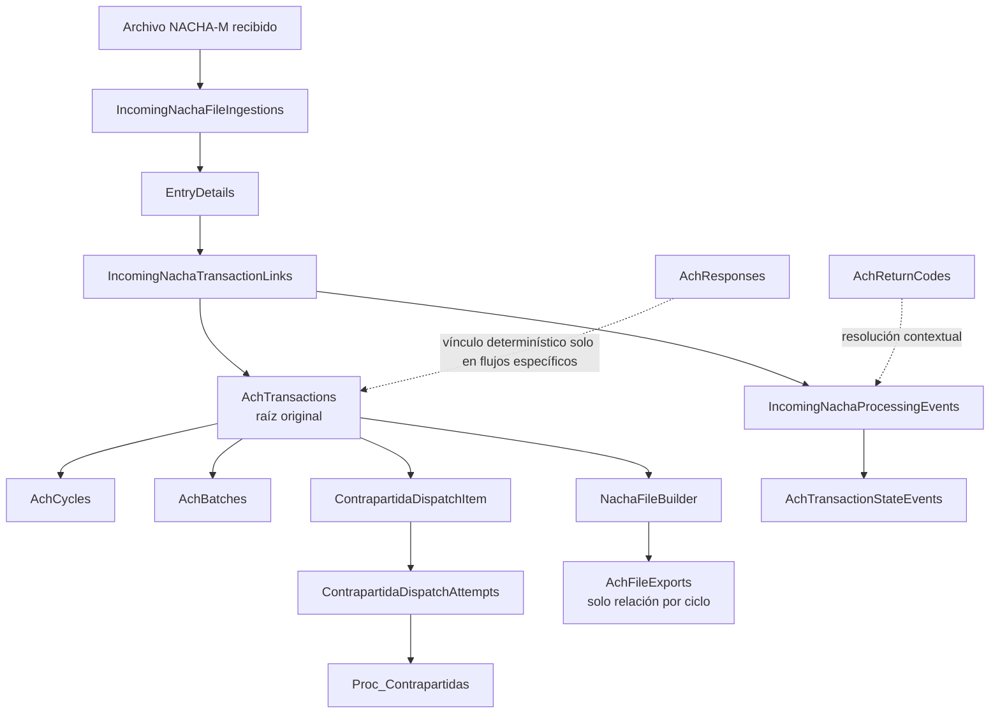

# FASE 0 — RESULTADO DEL ANÁLISIS VERIFICABLE

## 1. Veredicto

**APTO CON CONDICIONES**

La raíz correcta y obligatoria del futuro monitoreo es <code>AchTransactions</code>. El modelo actual permite construir una cuadrícula con una fila por transacción original y reconstruir una parte significativa de la trazabilidad posterior. Sin embargo, no permite presentar como completa o inequívoca toda la línea de tiempo sin cerrar antes brechas críticas de clasificación, correlación, historial, causal y envío NACHA-M.

Las condiciones que deben resolverse antes de implementar el módulo productivo son:

1. definir una clasificación estable e inmutable de transacción de salida;
2. corregir el encolamiento indiscriminado hacia <code>Proc_Contrapartidas</code>;
3. permitir representar una aceptación seguida de una devolución;
4. corregir la resolución de causales ACH Colombia para códigos <code>Rxx</code>;
5. persistir la pertenencia exacta entre transacción y archivo NACHA-M generado;
6. modelar envío, acuse o confirmación del archivo;
7. mantener consistencia ciclo–lote–cola cuando CENIT reasigna ciclos;
8. definir una correlación determinística de respuestas diferenciales genéricas.

No se implementó ninguna de estas correcciones en esta fase.

## 2. Resumen ejecutivo

### 2.1 Cómo funciona hoy el flujo

Una transacción creada desde el SPA se persiste en <code>AchTransactions</code>, se asigna obligatoriamente a un <code>AchCycle</code> y a un <code>AchBatch</code>, y recibe su estado inicial dentro de la misma unidad de persistencia. Las transacciones no prenotificación crean además un <code>ContrapartidaDispatchItem</code>. El trabajo de despacho selecciona únicamente débitos cuya institución origen tiene <code>IsDefaultSource = true</code>; las demás entradas encoladas terminan como incompatibles con la operación.

La generación NACHA-M de salida selecciona <code>AchTransactions</code> por ciclo y estados exportables, construye el archivo y registra un <code>AchFileExport</code>. No crea un <code>EntryDetail</code> de salida. El registro de exportación conserva datos del archivo y del ciclo, pero no la membresía transacción–archivo ni el envío o acuse de cámara.

Los <code>EntryDetails</code> aparecen en el flujo de entrada, al desagregar archivos NACHA-M recibidos. La correlación posterior con la transacción original se persiste en <code>IncomingNachaTransactionLinks</code> y puede producir eventos de procesamiento y eventos de estado.

### 2.2 Fuente de verdad

| Dimensión | Fuente de verdad actual | Observación |
| --- | --- | --- |
| Transacción original | <code>AchTransactions</code> | Raíz obligatoria del monitoreo. |
| Ciclo vigente | <code>AchTransactions.AchCycleId</code> | Obligatorio, pero el historial no está consolidado. |
| Lote vigente | <code>AchTransactions.AchBatchId</code> | Puede quedar desalineado tras reasignación CENIT. |
| Intentos de <code>Proc_Contrapartidas</code> | <code>ContrapartidaDispatchItems</code> y <code>ContrapartidaDispatchAttempts</code> | Relación explícita y auditable. |
| Archivo NACHA-M generado | <code>AchFileExports</code> por ciclo | No prueba pertenencia individual. |
| Detalle recibido | <code>EntryDetails</code> | Solo flujo de entrada/desagregación. |
| Correlación recibida–original | <code>IncomingNachaTransactionLinks</code> | Puede haber múltiples enlaces y ambigüedad. |
| Estado vigente | <code>AchTransactions.State</code> | Mezcla conceptos de proceso y resultado. |
| Historia de estados permitidos | <code>AchTransactionStateEvents</code> | No cubre transiciones rechazadas ni todos los hitos. |
| Causal NACHA-M | <code>AchReturnCodes</code> | Contextual por cámara, flujo y vigencia. |
| Resultado SOAP | Intento e ítem de despacho | No equivale automáticamente a resultado de cámara. |

### 2.3 Viabilidad de la trazabilidad

Es viable reconstruir:

- creación;
- ciclo y lote vigentes;
- estado vigente y eventos de estado persistidos;
- cola e intentos de <code>Proc_Contrapartidas</code>;
- enlaces posteriores con registros recibidos;
- eventos de procesamiento entrante;
- códigos de retorno cuando la resolución contextual es inequívoca;
- una vista operativa consolidada con advertencias explícitas.

No es posible reconstruir de manera confiable, con el modelo actual:

- el archivo exacto que contuvo cada transacción cuando existen regeneraciones;
- el envío y acuse efectivo del archivo;
- todo el historial de cambios de ciclo;
- una devolución posterior a una transacción ya aplicada o certificada;
- la relación genérica de toda <code>AchResponse</code> con una <code>AchTransaction</code>;
- la deduplicación semántica de una misma devolución recibida en archivos de bytes distintos.

### 2.4 Riesgo general

El riesgo es **alto** para presentar una línea de tiempo como completa o regulatoriamente concluyente; es **medio** para una primera consulta operativa claramente rotulada, basada en datos existentes y con los casos ambiguos marcados como “Requiere revisión”.

## 3. Hallazgos críticos

1. <code>AchTransactions</code> es la única raíz que garantiza una fila por transacción creada.
2. No existe una propiedad inmutable que exprese “salida”; hoy se infiere principalmente por la institución origen y <code>IsDefaultSource</code>.
3. <code>IsDefaultSource</code> es mutable y el modelo no impone unicidad histórica o vigente.
4. La creación encola todas las transacciones no prenotificación, aunque el despachador de <code>Proc_Contrapartidas</code> solo acepta débitos originados por CFA.
5. El formulario SPA inicia el tipo como crédito, lo que agrava la incompatibilidad con <code>Proc_Contrapartidas</code>.
6. La relación con el ciclo es directa y obligatoria; el ciclo futuro se representa con <code>ProcessingDate</code>.
7. La optimización de liquidez de CENIT puede cambiar <code>AchCycleId</code> sin mantener alineados lote y cola.
8. El despacho de <code>Proc_Contrapartidas</code> conserva ítem e intentos, con reintentos acotados e idempotencia de éxito.
9. La generación NACHA-M no crea <code>EntryDetails</code> de salida.
10. <code>AchFileExport</code> no conserva qué transacciones quedaron incluidas en cada versión del archivo.
11. <code>EntryDetails</code> representa registros tipo 6 recibidos y no tiene clave foránea directa a <code>AchTransactions</code>.
12. La correlación inversa usa varios identificadores no únicos; existe riesgo real de ambigüedad.
13. Una transacción aplicada o certificada no puede transicionar a devuelta con la máquina actual.
14. <code>R96</code> está configurado como exitoso en los contextos examinados, pero no debe tratarse como éxito global.
15. La clasificación de códigos <code>Rxx</code> como EPR entra en conflicto con códigos ACH Colombia.
16. El catálogo de devoluciones puede quedar incompleto por cámara durante el sembrado.
17. Los significados normativos de <code>D01</code> y <code>D04</code> discrepan entre documentación CENIT y seed.
18. La misma devolución en archivos binariamente distintos no tiene una clave semántica global de idempotencia.
19. La respuesta diferencial de prenotificación sí llega a la transacción original; la respuesta genérica no tiene el mismo enlace determinístico.
20. Las consultas existentes son insuficientes para una cuadrícula empresarial: algunas no paginan, exponen cuentas completas o atribuyen exportaciones por ciclo sin probar membresía.

## 4. Mapa técnico real del flujo

| Etapa | Capa | Archivo o clase | Método o responsabilidad | Entidad o tabla | Evidencia |
| --- | --- | --- | --- | --- | --- |
| Ruta de creación | SPA | <code>web/ach-interbank-ui/src/app/features/transactions/transactions-routing.module.ts</code> | Ruta hija <code>create</code> | — | Convención real bajo <code>/transactions/create</code>. |
| Formulario | SPA | <code>web/ach-interbank-ui/src/app/features/transactions/components/transaction-create/transaction-create.component.ts</code> | Construcción y envío del formulario | — | Tipo inicial de operación y contrato enviado. |
| Cliente HTTP | SPA | <code>web/ach-interbank-ui/src/app/features/transactions/services/transaction.service.ts</code> | <code>create</code> | — | Solicitud a <code>/api/transactions</code>. |
| API | API | <code>src/Cfa.ACHInterbank.Api/Controllers/TransactionsController.cs</code> | <code>Create</code> | — | Entrada HTTP del caso de uso. |
| Servicio de creación | Persistencia | <code>src/Cfa.ACHInterbank.Persistence/ACH/Services/Implementation/AchTransactionService.cs</code> | <code>CreateTransactionAsync</code> | <code>AchTransactions</code> | Orquesta validación, lote, persistencia y cola. |
| Resolución de lote/ciclo | Persistencia | <code>src/Cfa.ACHInterbank.Persistence/ACH/Services/Implementation/BatchResolver.cs</code> | Resolución de lote | <code>AchCycles</code>, <code>AchBatches</code> | Selección por cámara, fecha y ventana. |
| Persistencia | Persistencia | <code>src/Cfa.ACHInterbank.Persistence/ACH/Services/Implementation/TransactionPersister.cs</code> | Persistencia transaccional | <code>AchTransactions</code> | Crea raíz, addendas y elementos relacionados. |
| Entidad raíz | Dominio | <code>src/Cfa.ACHInterbank.Domain/Models/ACH/AchTransaction.cs:6</code> | Modelo transaccional | <code>AchTransactions</code> | Propiedades y navegaciones. |
| Configuración raíz | Persistencia | <code>src/Cfa.ACHInterbank.Persistence/Configuration/AchTransactionConfiguration.cs</code> | Configuración EF Core | <code>AchTransactions</code> | Claves, FKs, restricciones, índices y concurrencia. |
| Ciclo | Dominio | <code>src/Cfa.ACHInterbank.Domain/Models/ACH/AchCycle.cs</code> | Ciclo operativo | <code>AchCycles</code> | Cámara, fecha, ventana y estado. |
| Planificación | Persistencia | <code>src/Cfa.ACHInterbank.Persistence/ACH/Services/Implementation/AchCycleScheduler.cs</code> | Creación y apertura programada | <code>AchCycles</code> | Días hábiles y fechas especiales. |
| Cola de contrapartidas | Dominio | <code>src/Cfa.ACHInterbank.Domain/Models/ACH/ContrapartidaDispatchModels.cs</code> | Ítem, lote e intento | Tablas <code>ContrapartidaDispatch*</code> | Relación e historial de intentos. |
| Persistencia de cola | Persistencia | <code>src/Cfa.ACHInterbank.Persistence/ACH/Services/Implementation/ContrapartidaDispatchPersistenceService.cs</code> | Encolar y registrar intentos | Tablas <code>ContrapartidaDispatch*</code> | Idempotencia y actualización de resultado. |
| Trabajo SOAP | Persistencia | <code>src/Cfa.ACHInterbank.Persistence/ACH/Services/Implementation/ContrapartidaDispatchJobService.cs</code> | Selección y ejecución | Ítem e intentos | Débito monetario CFA, reintentos y estados. |
| Mapeo funcional | Persistencia | <code>src/Cfa.ACHInterbank.Persistence/Integrations/Services/ProcContrapartidasFunctionalMappingResolver.cs</code> | Resolver operación | — | Rechaza combinaciones incompatibles. |
| Generación NACHA-M | Persistencia | <code>src/Cfa.ACHInterbank.Persistence/ACH/Services/Implementation/NachaFileBuilder.cs</code> | Construir archivo | <code>AchTransactions</code> | Selección y renderizado por ciclo. |
| Auditoría de exportación | Persistencia | <code>src/Cfa.ACHInterbank.Persistence/ACH/Services/Implementation/AchFileExportAuditService.cs</code> | Registrar exportación | <code>AchFileExports</code> | Metadatos del archivo, no membresía individual. |
| Detalle entrante | Dominio | <code>src/Cfa.ACHInterbank.Domain/Models/ACH/EntryDetail.cs</code> | Registro tipo 6 | <code>EntryDetails</code> | Árbol NACHA-M recibido. |
| Ingesta recibida | Persistencia | <code>IncomingNachaFileIngestionService</code> | Hash, duplicado y desagregación | Tablas <code>IncomingNacha*</code> | Una ingesta por archivo canónico. |
| Correlación | Persistencia | <code>src/Cfa.ACHInterbank.Persistence/ACH/Services/Implementation/IncomingNachaTransactionLinker.cs</code> | Enlazar original | <code>IncomingNachaTransactionLinks</code> | Prioridades y candidatos. |
| Posprocesamiento | Persistencia | <code>src/Cfa.ACHInterbank.Persistence/ACH/Services/Implementation/IncomingNachaPostParseProcessor.cs</code> | Clasificar y transicionar | Links, eventos y raíz | Rechazos y devoluciones recibidas. |
| Transición | Persistencia | <code>src/Cfa.ACHInterbank.Persistence/ACH/Services/Implementation/AchStateTransitionService.cs</code> | Máquina de estados | Raíz y eventos | Transiciones permitidas e historial. |
| Códigos | Dominio | <code>src/Cfa.ACHInterbank.Domain/Models/ACH/AchReturnCode.cs</code> | Catálogo contextual | <code>AchReturnCodes</code> | Cámara, flujo, vigencia y clasificación. |
| Respuesta diferencial | Aplicación/Persistencia | <code>NotificarRespuestaAchUseCase</code> | Prenotificación y registro no monetario | <code>AchResponses</code>, links y eventos | Invoca <code>RegistrarRespuestaTransaccion</code> sin movimiento monetario. |
| Consulta existente | Persistencia | <code>AchTransactionTraceabilityService</code> | Trazabilidad parcial | Varias tablas | Parte de la raíz, pero no pagina y omite hitos. |
| Panel reutilizable | SPA | <code>web/ach-interbank-ui/src/app/features/nacha-operational/pages/nacha-operational-dashboard.component.ts</code> | Tabla Material y filtros | — | Referencia de paginación y estados de UI. |
| Detalle reutilizable | SPA | <code>web/ach-interbank-ui/src/app/features/nacha-operational/pages/nacha-operational-file-detail.component.ts</code> | Detalle y línea temporal | — | Patrón visual reutilizable con adaptación. |

Pruebas relevantes: <code>TransactionsControllerTests.cs</code>, <code>AchTransactionNachaTests.cs</code>, <code>AchCycleSchedulerTests.cs</code>, <code>ContrapartidaDispatchPersistenceServiceTests.cs</code>, <code>ContrapartidaDispatchJobServiceTests.cs</code>, <code>NachaFileBuilderUnitTests.cs</code>, <code>IncomingNachaTransactionLinkerTests.cs</code>, <code>IncomingNachaPostParseProcessorTests.cs</code>, <code>RegulatoryCatalogSeederReturnCodesByClearingHouseTests.cs</code> y <code>nacha-operational-dashboard.spec.ts</code>.

## 5. Diagrama de trazabilidad actual

La línea discontinua entre <code>AchFileExports</code> y la transacción es intencional: el modelo solo prueba exportación del ciclo, no membresía individual.

## 6. Entidad raíz y reconocimiento de salida

### 6.1 Modelo real de <code>AchTransaction</code>

La entidad conserva:

- clave primaria <code>Id</code>;
- importe <code>Amount</code>;
- identificador funcional <code>TransactionExternalId</code>;
- referencia heredada <code>Reference</code>;
- tipo de transacción;
- códigos de transacción y servicio;
- número de traza y referencia de traza original;
- fecha efectiva;
- estado y metadatos de cambio;
- cuentas e instituciones origen y destino;
- claves obligatorias a ciclo y lote;
- addendas;
- eventos de estado;
- elemento opcional de despacho.

No se identificó:

- moneda explícita;
- dirección inmutable “entrada/salida”;
- usuario creador confiable en todos los caminos;
- referencia directa al archivo NACHA-M exportado;
- token <code>rowversion</code>; la concurrencia se apoya en el estado.

### 6.2 Tabla, claves y relaciones

<code>AchTransactionConfiguration</code> mapea la entidad a <code>AchTransactions</code>, con clave primaria <code>Id</code>, FKs a instituciones, cuentas, ciclo y lote, colecciones de addendas/eventos y relación uno a cero o uno con el ítem de despacho. La relación al ciclo y al lote es obligatoria.

### 6.3 Cómo se reconoce una transacción de salida

No existe una propiedad explícita e inmutable. La inferencia operacional encontrada es:

1. la transacción existe en <code>AchTransactions</code>;
2. su institución origen está marcada <code>IsDefaultSource = true</code>;
3. para <code>Proc_Contrapartidas</code>, además debe ser débito monetario;
4. prenotificaciones siguen reglas separadas.

<code>FinancialInstitution.IsDefaultSource</code> sí participa en la decisión y es hoy la fuente de clasificación práctica, pero no es suficiente como fuente histórica porque puede cambiar y no tiene una restricción que garantice una única institución predeterminada vigente.

### 6.4 Originada por CFA frente a originada externamente

| Caso | Criterio actual | Flujo monetario |
| --- | --- | --- |
| Originada por CFA | Institución origen con <code>IsDefaultSource = true</code> | Débito por <code>Proc_Contrapartidas</code>. |
| Originada por otra entidad | Institución origen externa | Crédito por <code>Proc_Transacciones</code> en procesamiento entrante. |
| Respuesta/notificación diferencial | Clasificación de respuesta | <code>RegistrarRespuestaTransaccion</code>, no monetario. |

La clasificación debe congelarse en la futura solución; no debe recalcularse históricamente usando el valor actual de <code>IsDefaultSource</code>.

## 7. Flujo de creación

### 7.1 Ruta confirmada

La ruta real es <code>/transactions/create</code>. El contrato HTTP es <code>POST /api/transactions</code>.

### 7.2 Recorrido completo

1. <code>transaction-create.component.ts</code> construye el formulario y llama el servicio Angular.
2. El servicio HTTP envía el contrato a <code>TransactionsController.Create</code>.
3. El controlador delega en <code>IAchTransactionService</code>.
4. <code>AchTransactionService</code> valida y solicita la resolución de lote/ciclo.
5. <code>BatchResolver</code> selecciona o crea el contexto operativo permitido.
6. <code>TransactionPersister</code> crea <code>AchTransaction</code>, addendas y relaciones dentro de la unidad de trabajo.
7. Para toda transacción no prenotificación se crea actualmente un <code>ContrapartidaDispatchItem</code>.
8. La API devuelve la entidad creada al SPA.

### 7.3 Hallazgos de creación

- La asignación inicial de ciclo es inmediata y obligatoria.
- La cámara se deriva del contexto de lote/ciclo seleccionado.
- El estado inicial se persiste con la raíz.
- La operación es atómica a nivel de contexto de persistencia.
- La auditoría de usuario no es uniforme; el campo de creación no constituye una identidad operativa suficientemente fuerte.
- El SPA inicia el tipo como crédito.
- El encolamiento no distingue, al crear, todas las reglas que después exige <code>Proc_Contrapartidas</code>.
- La respuesta devuelve más información de la necesaria para un contrato estable; conviene un DTO futuro.

### 7.4 Consecuencia funcional

Una transacción crédito creada por CFA puede quedar encolada y ser rechazada posteriormente como <code>INTEGRATION_OPERATION_MISMATCH</code>. Esto es un error técnico de clasificación/encolamiento, no un rechazo de la cámara.

## 8. Análisis de ciclos

### 8.1 Relación y representación

<code>AchTransaction.AchCycleId</code> es una FK directa y obligatoria. El ciclo futuro se representa por la fecha de procesamiento del <code>AchCycle</code>; no existe una entidad intermedia de asignación histórica.

### 8.2 Selección

La selección considera:

- cámara compensadora;
- fecha de procesamiento;
- ventanas horarias;
- días hábiles;
- festivos y fechas especiales;
- política <code>OnlyBusinessDays</code>;
- reglas particulares por cámara.

El enrutamiento evita fines de semana y festivos. El planificador también considera fechas especiales. CENIT permite encaminar fuera de ventana hacia un ciclo futuro; ACH Colombia rechaza escenarios de futuro no abierto en las rutas examinadas. El algoritmo de enrutamiento no usa de manera uniforme <code>OperationalStatus</code>.

### 8.3 Respuestas explícitas

| Pregunta | Respuesta verificada |
| --- | --- |
| ¿Toda transacción de salida queda asignada a un ciclo desde su creación? | Sí en el flujo normal: la FK es obligatoria y el servicio resuelve ciclo/lote antes de persistir. |
| ¿La relación se almacena directamente o mediante entidad intermedia? | Directamente en <code>AchTransactions.AchCycleId</code>. |
| ¿Puede cambiar de ciclo? | Sí, al menos en la optimización de liquidez CENIT. |
| ¿Cómo se conserva el historial si cambia? | No existe una bitácora canónica de asignaciones; queda evidencia fragmentada en decisiones, cola y eventos JSON. |
| ¿Cómo se representa un ciclo futuro? | Mediante <code>AchCycle.ProcessingDate</code> futura y la FK vigente. |
| ¿Qué ocurre fuera del horario operativo? | CENIT puede resolver un ciclo futuro; ACH Colombia puede rechazar si no existe ciclo futuro abierto permitido. |
| ¿Qué ocurre en festivos o fines de semana? | Se busca el siguiente día hábil conforme a calendario y <code>OnlyBusinessDays</code>; hay tratamiento de fechas especiales. |

### 8.4 Reasignación CENIT

El servicio de optimización de liquidez modifica <code>AchTransaction.AchCycleId</code>, pero no se encontró actualización atómica correspondiente de:

- <code>AchTransaction.AchBatchId</code>;
- <code>AchBatch.AchCycleId</code>;
- ciclo registrado en el ítem de despacho.

Esto puede producir una transacción que, según diferentes tablas, pertenece simultáneamente a ciclos distintos.

## 9. Análisis de <code>Proc_Contrapartidas</code>

### 9.1 Propósito confirmado

<code>Proc_Contrapartidas</code> procesa movimientos débito monetarios originados por CFA. No debe confundirse con <code>Proc_Transacciones</code>, que procesa créditos de transacciones originadas externamente, ni con <code>RegistrarRespuestaTransaccion</code>, que es no monetario.

### 9.2 Modelo de persistencia

La cardinalidad verificada es:

- <code>AchTransaction</code> 1 → 0..1 <code>ContrapartidaDispatchItem</code>;
- <code>ContrapartidaDispatchItem</code> 1 → 0..N <code>ContrapartidaDispatchAttempt</code>.

La configuración impone unicidad del ítem por transacción y del número de intento dentro del ítem.

### 9.3 Selección y ejecución

El trabajo:

1. lee ítems pendientes o reintentables;
2. carga la transacción;
3. valida que sea débito y que la institución origen sea la predeterminada;
4. resuelve el mapping funcional;
5. prepara parámetros tipados;
6. persiste el intento antes o durante la ejecución controlada;
7. ejecuta según modo configurado;
8. interpreta respuesta;
9. persiste resultado, tiempos y error;
10. programa reintento cuando corresponde.

La configuración soporta modos de ejecución controlados. El máximo observado es cinco intentos, con espera exponencial limitada a treinta minutos.

### 9.4 Idempotencia y reintentos

- Un ítem exitoso o funcionalmente definitivo no se vuelve a despachar.
- Cada intento tiene número propio y marcas de tiempo.
- El último intento se determina por número/fecha, no por orden accidental.
- El intento exitoso se identifica por estado y resultado persistido.
- Los errores técnicos reintentables se distinguen de incompatibilidades funcionales.

### 9.5 Datos para la futura línea de tiempo

Información operativa:

- “Preparada para débito”;
- “Enviada al servicio interno”;
- “Procesada por el servicio interno”;
- “No fue posible procesarla”;
- número de intentos;
- hora del último intento;
- próxima reejecución, si existe.

Información técnica restringida:

- identificadores de ítem e intento;
- código interno normalizado;
- duración;
- excepción sanitizada;
- versión de mapping;
- modo de ejecución;
- identificadores de correlación.

Nunca debe enviarse al SPA el XML completo de solicitud o respuesta ni cuentas completas.

### 9.6 Vacío principal

El resultado de integración queda persistido en ítem e intentos, pero no existe una dimensión canónica e independiente de “resultado de negocio de la cámara”. Un éxito SOAP no debe presentarse automáticamente como aceptación de la cámara.

## 10. Generación NACHA-M de salida

### 10.1 Selección y construcción

<code>NachaFileBuilder</code> selecciona transacciones por ciclo y estados exportables. Los estados observados incluyen <code>Pending</code>, <code>AppliedTacitly</code> y <code>Certified</code>. La construcción table-driven genera:

- encabezado de archivo;
- encabezados de lote;
- detalles tipo 6;
- addendas tipo 7;
- controles de lote;
- control de archivo;
- consecutivos y nomenclatura según cámara/perfil.

### 10.2 Relación con <code>EntryDetails</code>

Una <code>AchTransaction</code> no se convierte en <code>EntryDetail</code> durante la salida. El builder renderiza directamente desde la transacción y sus addendas. <code>EntryDetail</code> pertenece al modelo desagregado de archivos recibidos.

### 10.3 Auditoría de exportación

<code>AchFileExport</code> conserva, entre otros datos:

- ciclo;
- cámara;
- nombre de archivo;
- cantidad de registros;
- indicador de cifrado;
- fecha/hora.

No conserva:

- hash o versión funcional del archivo;
- estado de envío;
- acuse de la cámara;
- lista de lotes incluidos;
- lista de transacciones incluidas;
- relación de reemplazo o regeneración.

### 10.4 Regeneración, doble envío e idempotencia

Existe sincronización en proceso y comprobación previa de exportación, pero no se encontró una restricción única de base de datos que impida carreras de generación. Tampoco existe una entidad persistida de transmisión/acuse que permita afirmar que un archivo se envió exactamente una vez.

Una misma transacción puede quedar asociada de manera inferida a más de una exportación del ciclo si se regenera. La consulta actual que toma la última exportación del ciclo para cada transacción puede atribuir un archivo en el cual esa transacción nunca estuvo.

### 10.5 Diferencias por cámara

Las diferencias de nomenclatura, perfiles, ventanas, catálogos y reglas se encuentran repartidas entre configuración, perfiles table-driven, resolutores y servicios por cámara. No es correcto aplicar a ACH Colombia las reglas de CENIT ni viceversa.

## 11. Análisis de <code>EntryDetails</code>

### 11.1 Qué representa

<code>EntryDetail</code> representa un registro NACHA-M tipo 6 desagregado de un archivo recibido. Su configuración lo relaciona con lote, archivo y addendas. No tiene FK directa a <code>AchTransaction</code>.

### 11.2 Usos verificados

| Uso | Presencia | Observación |
| --- | --- | --- |
| Registro NACHA-M de entrada | Sí | Uso principal del árbol recibido. |
| Respuesta individual | Sí, según clasificación | Se enlaza después del parseo. |
| Devolución individual | Sí, con addenda/código aplicable | La semántica depende de cámara y tipo. |
| Rechazo | Sí | Puede ser de archivo, lote o entrada; no todos usan el mismo modelo. |
| Prenotificación | Sí | Tiene flujo específico y respuesta diferencial. |
| Registro inicial de salida | No | La salida se genera desde <code>AchTransactions</code>. |

### 11.3 Momento y forma de relación

La relación aparece después de la ingesta y desagregación mediante <code>IncomingNachaTransactionLink</code>. El enlace conserva referencias a la ingesta, al <code>EntryDetail</code> y, cuando se resuelve, a la <code>AchTransaction</code>.

### 11.4 Correlación inversa

El linker intenta, en orden funcional, criterios como:

1. referencia de traza original;
2. número de traza;
3. identificador externo;
4. clave compuesta de datos disponibles.

Se observó un uso de <code>RecipIdNumber</code> como si fuera <code>TransactionExternalId</code>, sin garantía de equivalencia de dominio. Los identificadores y trazas relevantes no tienen una garantía global de unicidad. La correlación compuesta puede devolver múltiples candidatos y debe marcarse ambigua.

### 11.5 Multiplicidad, huérfanos y duplicados

- Puede haber múltiples <code>EntryDetails</code> y múltiples links para una transacción.
- Puede existir una entrada sin transacción correlacionada.
- La respuesta puede persistirse antes de una asociación final.
- Un archivo idéntico se bloquea por hash/tamaño canónico.
- El mismo evento semántico en archivos distintos no queda globalmente deduplicado.
- La historia recibida se conserva en ingesta, árbol, links, clasificaciones y eventos.

### 11.6 Respuestas a las preguntas críticas

| Pregunta | Respuesta |
| --- | --- |
| ¿Las salidas se almacenan inicialmente en <code>EntryDetails</code>? | No. |
| ¿Cuándo aparece la relación? | Después de recibir, desagregar, clasificar y correlacionar un archivo. |
| ¿Qué representa una respuesta? | Un detalle recibido clasificado y enlazado, o una <code>AchResponse</code> en flujos de respuesta. |
| ¿Qué representa una devolución? | Un detalle/addenda recibido cuya semántica y código se resuelven como devolución. |
| ¿Cómo se distingue de un rechazo inicial? | Por etapa del flujo, clasificación, código, evento previo y cámara; el enum raíz no basta. |
| ¿Cómo se enlaza con la original? | Mediante <code>IncomingNachaTransactionLinks</code>, no FK en <code>EntryDetails</code>. |
| ¿La relación es siempre determinística? | No; trazas e identificadores pueden ser ambiguos. |
| ¿Puede haber varios detalles? | Sí. |
| ¿Cómo se manejan huérfanos? | Se preservan sin FK resuelta y requieren revisión. |
| ¿Qué ocurre ante duplicados? | El archivo idéntico se rechaza; duplicados semánticos entre archivos diferentes no están plenamente cubiertos. |

## 12. Matriz de relaciones

| Entidad origen | Relación | Entidad destino | Cardinalidad | Clave utilizada | Obligatoria | Momento del flujo | Evidencia |
| --- | --- | --- | --- | --- | --- | --- | --- |
| <code>AchTransaction</code> | pertenece a | <code>AchCycle</code> | N:1 | <code>AchCycleId</code> | Sí | Creación/reasignación | Entidad y configuración EF. |
| <code>AchTransaction</code> | pertenece a | <code>AchBatch</code> | N:1 | <code>AchBatchId</code> | Sí | Creación | Entidad y configuración EF. |
| <code>AchTransaction</code> | tiene | <code>AchTransactionAddenda</code> | 1:N | <code>AchTransactionId</code> | No | Creación | Navegación/configuración. |
| <code>AchTransaction</code> | registra | <code>AchTransactionStateEvent</code> | 1:N | <code>AchTransactionId</code> | No | Transiciones | Servicio de estados. |
| <code>AchTransaction</code> | origina | <code>ContrapartidaDispatchItem</code> | 1:0..1 | <code>AchTransactionId</code> único | No | Creación no prenota | Configuración de despacho. |
| <code>ContrapartidaDispatchItem</code> | tiene | <code>ContrapartidaDispatchAttempt</code> | 1:N | <code>DispatchItemId</code> + número | No | Ejecución/reintento | Configuración y servicio. |
| <code>AchCycle</code> | tiene exportaciones | <code>AchFileExport</code> | 1:N | <code>AchCycleId</code> | No | Generación | Auditoría de exportación. |
| <code>AchTransaction</code> | se infiere incluida en | <code>AchFileExport</code> | N:M inferida | Ciclo y tiempo | No | Generación | No existe FK ni join table. |
| <code>IncomingNachaFileIngestion</code> | contiene | archivo/lote/<code>EntryDetail</code> | 1:N | FKs del árbol | Sí tras parseo | Recepción | Modelo IncomingNacha. |
| <code>EntryDetail</code> | recibe | addendas | 1:N | <code>EntryDetailId</code> | No | Parseo | Configuración EF. |
| <code>EntryDetail</code> | se correlaciona mediante | <code>IncomingNachaTransactionLink</code> | 1:N | <code>EntryDetailId</code> | No | Posparseo | Linker. |
| <code>IncomingNachaTransactionLink</code> | apunta a | <code>AchTransaction</code> | N:0..1 | <code>AchTransactionId</code> | No | Correlación | Entidad/configuración. |
| <code>IncomingNachaTransactionLink</code> | produce | <code>IncomingNachaProcessingEvent</code> | 1:N | <code>IncomingNachaTransactionLinkId</code> | No | Clasificación/dispatch | Posprocesador. |
| Código textual recibido | resuelve | <code>AchReturnCode</code> | N:0..1 contextual | Cámara + código + flujo + vigencia | No | Clasificación | Resolver/catálogo. |
| <code>AchResponse</code> | puede corresponder a | <code>AchTransaction</code> | N:0..1 indirecta | Identificadores según caso | No | Respuesta diferencial | Sin FK genérica. |

## 13. Matriz de estados

### 13.1 Estados técnicos observados

| Estado técnico | Entidad que lo conserva | Evento que lo genera | Significado funcional | Estado visible propuesto | Puede cambiar | Conserva historial |
| --- | --- | --- | --- | --- | --- | --- |
| <code>Pending</code> | <code>AchTransaction</code> | Creación | Aún en proceso | Creada / pendiente de procesamiento | Sí | Parcial |
| <code>AppliedTacitly</code> | <code>AchTransaction</code> | Aplicación | Procesamiento aplicado | Procesada | Sí | Sí si transición permitida |
| <code>Certified</code> | <code>AchTransaction</code> | Certificación | Confirmación técnica/funcional | Confirmada | Limitado | Sí |
| <code>ReturnedByOperator</code> | <code>AchTransaction</code> | Devolución ACH | Devuelta por operador | Devuelta por ACH Colombia | Sí | Sí |
| <code>ReturnedByEpr</code> | <code>AchTransaction</code> | Devolución EPR | Devuelta por EPR | Devuelta por CENIT/EPR | Sí | Sí |
| Estado pendiente de ítem | <code>ContrapartidaDispatchItem</code> | Encolamiento | Espera integración | Pendiente de procesamiento interno | Sí | Intentos separados |
| Estado exitoso de ítem | Ítem/intento | Respuesta SOAP | Débito interno procesado | Débito procesado | No se redispara | Sí |
| Estado fallido/reintentable | Ítem/intento | Error técnico | Integración no completada | No fue posible procesarla; se reintentará | Sí | Sí |
| Estado incompatible | Ítem/intento | Resolver funcional | Operación mal encolada | Requiere revisión técnica | No automático | Sí |
| Link ambiguo | <code>IncomingNachaTransactionLink</code> | Correlación | Más de un candidato | Requiere revisión | Sí | Sí |
| Link huérfano | Link/evento | Sin candidato | No se encontró original | Sin asociación | Sí | Sí |

### 13.2 Dimensiones que no deben mezclarse

| Dimensión | Valores visibles preliminares | Fuentes |
| --- | --- | --- |
| Estado del proceso | Creada, asignada a ciclo, preparada, débito procesado, incluida en archivo, con error técnico | Raíz, ciclo, lote, cola, intentos, exportaciones con cautela |
| Resultado de negocio | Pendiente de respuesta, aceptada, rechazada, indeterminado | Respuestas, códigos, clasificación y eventos |
| Situación posterior | Sin devolución conocida, devuelta, con novedad, requiere revisión | Links, addendas, códigos y eventos posteriores |

### 13.3 Colisiones

El enum de estado raíz mezcla avance de proceso, certificación y devolución. No distingue:

- éxito técnico de integración frente a aceptación de cámara;
- rechazo inicial frente a devolución posterior;
- estado vigente frente a situación histórica;
- novedad operativa frente a error técnico.

La UI no debe mostrar el enum sin traducción y sin cálculo contextual.

## 14. Matriz de correlación

| Flujo | Identificador de origen | Identificador de destino | Persistencia | Único | Riesgo de ambigüedad | Evidencia |
| --- | --- | --- | --- | --- | --- | --- |
| Creación SPA/API | ID generado | <code>AchTransaction.Id</code> | <code>AchTransactions</code> | Sí | Bajo | PK. |
| Identificador funcional | <code>TransactionExternalId</code> | Campo homónimo | <code>AchTransactions</code> | No demostrado | Medio/alto | Sin restricción global. |
| Traza saliente | <code>TraceNumber</code> | Traza recibida/original | Raíz y <code>EntryDetail</code> | No global | Medio | Linker. |
| Devolución | <code>OriginalTraceRef</code> | <code>TraceNumber</code> original | Link | No global | Medio | Primer criterio del linker. |
| Alternativa de devolución | <code>RecipIdNumber</code> | <code>TransactionExternalId</code> | Link | No | Alto | Equivalencia de dominio no probada. |
| Compuesto | Instituciones, cuenta, valor, fecha | Candidato original | Link | No | Alto | Puede producir varios candidatos. |
| Contrapartidas | <code>AchTransaction.Id</code> | <code>DispatchItem.AchTransactionId</code> | Ítem | Sí por índice | Bajo | FK única. |
| Intentos | Ítem + número | Intento | Intentos | Sí por ítem | Bajo | Índice único. |
| Archivo de salida | Ciclo | Exportación | <code>AchFileExports</code> | No individual | Alto | No hay membresía. |
| Respuesta prenota | Entrada + link final | Transacción original | Link/evento/trace | Condicional | Medio | Flujo específico. |
| Respuesta genérica | Identificador Axon/externo | Transacción | <code>AchResponses</code> | No demostrado | Alto | No FK directa. |

La correlación inversa no es determinística en todos los casos. Cuando devuelve cero o múltiples candidatos, el monitoreo debe conservar el evento como huérfano o ambiguo y no modificar el resultado consolidado.

## 15. Análisis de códigos y causales

### 15.1 Modelo

<code>AchReturnCode</code> usa como contexto:

- cámara compensadora;
- código;
- flujo;
- fecha de vigencia;
- descripción;
- clasificación funcional;
- indicador de éxito o devolución según el modelo.

La clave lógica es contextual; el mismo texto de código no debe resolverse sin cámara, flujo y fecha.

### 15.2 Matriz de códigos y catálogos

| Cámara/contexto | Código | Significado observado | Uso | Persistencia | Relación |
| --- | --- | --- | --- | --- | --- |
| ACH Colombia | <code>R96</code> | Éxito en el contexto configurado | Resultado funcional aplicable | Código textual/catálogo | Resolución por cámara y flujo |
| CENIT | <code>R96</code> | Éxito en el contexto configurado | Resultado funcional aplicable | Código textual/catálogo | Resolución por cámara y flujo |
| ACH Colombia | <code>Rxx</code> | Puede representar códigos ACH | Rechazo/devolución según catálogo | Catálogo por cámara | Riesgo: resolver los clasifica como EPR por prefijo |
| CENIT/EPR | <code>Rxx</code> | Código de devolución EPR según contexto | Devolución | Catálogo por cámara/flujo | Debe usar cámara, no solo prefijo |
| CENIT archivo | <code>D01</code> | Documentación: destinatario incorrecto | Rechazo de archivo | Catálogo de rechazo de archivo | Seed discrepa |
| CENIT archivo | <code>D04</code> | Documentación: archivo duplicado | Rechazo de archivo | Catálogo de rechazo de archivo | Seed discrepa |
| Integración SOAP | Código normalizado | Resultado del servicio interno | Intento de integración | Tablas de intento y <code>IntegrationResponseCodes</code> | No es <code>AchReturnCode</code> |
| Respuesta diferencial | Código homologado | Estado de notificación | <code>AchResponse</code> | <code>AchResponseStatusMappings</code> | Catálogo separado |

### 15.3 <code>R96</code>

<code>R96</code> está configurado como exitoso en los contextos de ambas cámaras revisados. Esa evidencia no autoriza una regla global <code>code == "R96"</code>. La resolución debe recibir cámara, flujo y fecha de vigencia; un código desconocido o ambiguo debe quedar como indeterminado.

### 15.4 Persistencia de causal

No existe FK directa de <code>AchTransaction</code> ni de <code>EntryDetail</code> a <code>AchReturnCode</code>. Se conserva principalmente el código textual en eventos o datos recibidos y se resuelve contra el catálogo. Esto permite vigencia contextual, pero puede perder la interpretación histórica si el contexto no queda congelado.

### 15.5 Defectos del catálogo

- El sembrador distribuye el conjunto base de devoluciones a una cámara según <code>RegulatorySource</code>, en lugar de clonar el conjunto completo requerido para cada cámara.
- La detección de operador por texto de fuente y de EPR por prefijo <code>R</code> permite clasificaciones contradictorias para ACH Colombia.
- Las pruebas usan mocks que no reproducen completamente la combinación real del seed.
- <code>AchFileRejectionCodes</code> no tiene cámara ni vigencia, aunque los significados normativos pueden variar.

### 15.6 Descripción humanizada

La descripción visible debe:

1. resolverse desde el catálogo contextual;
2. usar texto español funcional;
3. conservar el código como dato secundario;
4. indicar “Código no homologado” cuando no exista resolución;
5. no codificarse en el SPA;
6. no confundir rechazo, devolución y error técnico.

## 16. Análisis de devoluciones

### 16.1 Flujo moderno verificado

1. Se recibe un archivo.
2. La ingesta calcula identidad canónica y detecta archivo duplicado.
3. Se descifra/valida según configuración.
4. Se desagrega archivo, lote, detalle y addenda.
5. Se clasifica cada entrada.
6. <code>IncomingNachaTransactionLinker</code> busca la transacción original.
7. Se resuelve código y cámara.
8. <code>IncomingNachaPostParseProcessor</code> crea eventos y solicita la transición.
9. <code>AchStateTransitionService</code> aplica únicamente transiciones permitidas y crea <code>AchTransactionStateEvent</code>.
10. El procesamiento posterior puede encolar integración o notificación conforme al tipo.

### 16.2 Rechazo frente a devolución

| Situación | Definición operativa | Fuente |
| --- | --- | --- |
| Rechazo previo | Resultado negativo antes de aceptación | Respuesta/código/evento sin aceptación previa |
| Devolución posterior | Novedad después de aceptación o procesamiento | Evento recibido posterior correlacionado |
| Rechazo total de archivo | El archivo completo no es aceptado | Catálogo/evento de archivo |
| Rechazo de lote | El lote no es aceptado | Cabecera/control/evento de lote |
| Rechazo individual | Una entrada es rechazada | <code>EntryDetail</code>, código y link |
| Devolución individual | Una transacción previamente procesada retorna | Entrada/addenda, código y vínculo original |
| Respuesta diferencial | Notificación no monetaria | <code>RegistrarRespuestaTransaccion</code> |
| Error técnico | Fallo de parseo, persistencia o integración | Intento/log/evento técnico |
| Novedad operativa | Ambigüedad, huérfano o dato inconsistente | Link/evento de revisión |

### 16.3 Respuestas explícitas

| Pregunta | Respuesta verificada |
| --- | --- |
| ¿Una aceptada puede cambiar posteriormente a devuelta? | Funcionalmente sí; la máquina actual no permite <code>AppliedTacitly</code> o <code>Certified</code> → devolución. |
| ¿Se sobrescribe el estado anterior o se conserva historia? | Las transiciones permitidas actualizan raíz y crean evento; la transición no permitida no conserva el hito como estado aplicado. |
| ¿Cuál es la fuente de verdad de devolución? | El registro recibido, su addenda/código, el link y el evento persistido; el estado raíz por sí solo no basta. |
| ¿Cómo se identifica la original? | Traza original, traza, identificadores externos y criterio compuesto. |
| ¿Puede haber más de una novedad posterior? | Sí; el modelo de links/eventos lo permite. |
| ¿Cómo se visualizan huérfanos? | En una bandeja o indicador “Sin asociación / Requiere revisión”, nunca como evento de una transacción no probada. |
| ¿Qué pasa si llega el mismo archivo dos veces? | La ingesta canónica detecta el duplicado. |
| ¿Qué pasa si llega la misma devolución en archivos distintos? | No existe idempotencia semántica global demostrada. |
| ¿Qué relación existe con <code>AchReturnCodes</code>? | Resolución contextual por cámara, flujo y vigencia; sin FK directa. |
| ¿Qué necesita la línea de tiempo? | Recepción, archivo/lote, código y descripción, correlación, estado previo, resultado, fuente, fecha, duplicidad y advertencias. |

### 16.4 Camino legado

Se encontró <code>AchIncomingReturnIngestionService</code> registrado, sin llamador productivo identificado. Ese camino fuerza estados de devolución y contiene una deuda explícita de deduplicación persistente. Coexiste con el flujo moderno de posparseo y no debe usarse para completar silenciosamente la trazabilidad.

## 17. Respuestas diferenciales

### 17.1 Prenotificaciones

El flujo de prenotificación pendiente:

1. recibe y persiste la respuesta;
2. resuelve el <code>EntryDetail</code> y el link final;
3. identifica la transacción original;
4. homologa código/estado;
5. crea evento;
6. persiste trazabilidad de mapping campo a campo;
7. invoca <code>RegistrarRespuestaTransaccion</code>.

<code>RegistrarRespuestaTransaccion</code> no ejecuta débitos ni créditos y no invoca los flujos <code>Proc_*</code>.

### 17.2 Respuestas genéricas

El flujo genérico de <code>AchResponse</code> conserva identificación Axon, código, descripción, estado, reintentos e idempotencia de respuesta. Sin embargo, no tiene FK directa y universal a <code>AchTransaction</code>. No todas esas respuestas pueden incorporarse determinísticamente a la línea de tiempo de una salida.

### 17.3 Regla para el monitoreo

Solo se incluirá una respuesta diferencial cuando:

- exista vínculo explícito o correlación única;
- el flujo corresponda a la transacción consultada;
- la cámara y el tipo sean compatibles;
- el evento no sea únicamente de otro proceso.

Una respuesta huérfana o ambigua debe quedar en supervisión técnica, no adjuntarse por aproximación.

## 18. Validación de escenarios

| Escenario | Resultado contra el código | Fuente principal | Riesgo |
| --- | --- | --- | --- |
| 1. Creada y asignada a ciclo futuro | Soportado, especialmente CENIT | Resolver de ciclo/lote | Medio por diferencias de cámara |
| 2. Todavía no procesada | Representable por raíz y cola | <code>AchTransaction</code>, ítem | Bajo |
| 3. Despacho exitoso de <code>Proc_Contrapartidas</code> | Persistido por ítem/intento | Servicio de despacho | Bajo |
| 4. Error de <code>Proc_Contrapartidas</code> | Persistido con error sanitizable | Intento | Bajo |
| 5. Reintento de integración | Soportado hasta máximo configurado | Intentos/job | Bajo |
| 6. Incluida en archivo | Solo inferible por ciclo | <code>AchFileExport</code> | Alto |
| 7. Enviada sin respuesta | No demostrable: falta envío/acuse | — | Alto |
| 8. Respuesta exitosa | Representable si correlación/código inequívocos | Link/evento/catálogo | Medio |
| 9. Rechazo | Representable con contexto | Respuesta/entrada/código | Medio |
| 10. Devolución posterior | Datos recibidos posibles, transición raíz incompleta | Posprocesador/estados | Crítico |
| 11. Respuesta duplicada | Hay idempotencia de respuesta/archivo según flujo | Hash/clave de respuesta | Medio |
| 12. Devolución duplicada | Archivo idéntico sí; semántica entre archivos no | Ingesta | Alto |
| 13. Respuesta huérfana | Se preserva sin vínculo | Link/evento | Medio |
| 14. Sin relación posterior | Natural y representable | Raíz sin links | Bajo |
| 15. ACH Colombia | Soportada con brechas de catálogo/clasificación | Cámara/códigos | Alto |
| 16. CENIT | Soportada con brecha de reasignación | Ciclos/códigos | Alto |

## 19. Rendimiento, consultas e índices

### Consultas actuales

- <code>AchTransactionRepository</code> y listados asociados usan <code>AsNoTracking</code> en varias lecturas, pero no constituyen todavía el modelo especializado solicitado.
- <code>AchTransactionTraceabilityService</code> parte de <code>AchTransactions</code>, pero no pagina, materializa más datos de los necesarios y no cubre todos los eventos.
- El listado actual de transacciones no pagina en servidor y expone datos de cuentas.
- <code>TransactionIntegrationResultService</code> concatena resultados de <code>Proc_Contrapartidas</code> con procesamiento entrante de <code>Proc_Transacciones</code>; puede mezclar semánticas que deben permanecer separadas.
- La atribución del último archivo por ciclo puede multiplicar o adjudicar incorrectamente la exportación.

### Consulta recomendada para cuadrícula

La cuadrícula debe:

1. comenzar en <code>AchTransactions.AsNoTracking()</code>;
2. aplicar autorización y filtros antes de materializar;
3. proyectar escalares;
4. usar subconsultas ordenadas de forma determinística para último intento/evento;
5. evitar <code>Include</code> de colecciones;
6. paginar y ordenar en base de datos;
7. usar <code>Id</code> como desempate estable;
8. no cargar XML, addendas completas, cuentas completas ni archivos.

La consulta de detalle debe ser separada y consultar cada fuente necesaria con proyecciones acotadas.

### Índices actuales relevantes

Existen índices para varias FKs, para el ítem único por transacción, para los intentos, para relaciones de ingesta y para estructuras operativas. No se encontró evidencia suficiente de índices orientados a búsquedas frecuentes por identificador externo, traza, referencia original y fecha de creación combinada con origen.

### Índices candidatos no implementados

| Tabla | Columnas clave y orden | Inclusiones candidatas | Filtro | Consulta beneficiada | Riesgo de escritura | SQL Server | PostgreSQL |
| --- | --- | --- | --- | --- | --- | --- | --- |
| <code>AchTransactions</code> | <code>SourceInstitutionId, CreatedAt DESC, Id DESC</code> | Ciclo, destino, tipo, importe, estado, fecha de estado, ID externo | Ninguno inicialmente | Lista principal de salidas por fecha | Medio | Compatible | Compatible |
| <code>AchTransactions</code> | <code>AchCycleId, CreatedAt DESC, Id DESC</code> | Destino, importe, estado, ID externo | Ninguno | Filtro por ciclo | Medio | Compatible | Compatible |
| <code>AchTransactions</code> | <code>TransactionExternalId, Id</code> | Fecha, origen, destino, estado | Según selectividad futura | Búsqueda por identificador | Bajo/medio | Compatible | Compatible |
| <code>AchTransactions</code> | <code>TraceNumber, Id</code> | ID externo, fecha, estado | Posible <code>TraceNumber IS NOT NULL</code> | Correlación/lista | Bajo/medio | Índice filtrado | Índice parcial |
| <code>AchTransactions</code> | <code>OriginalTraceRef, Id</code> | Traza, fecha, estado | Posible no nulo | Correlación de devolución | Bajo/medio | Índice filtrado | Índice parcial |
| <code>AchTransactionStateEvents</code> | <code>AchTransactionId, CreatedAt, Id</code> | Estado previo/nuevo, código | Ninguno | Línea de tiempo | Bajo | Compatible | Compatible |
| <code>IncomingNachaTransactionLinks</code> | <code>AchTransactionId, LinkedAtUtc, Id</code> | Ingesta, detalle, addenda, tipo, vínculo final | <code>AchTransactionId IS NOT NULL</code> | Últimos eventos y detalle | Medio | Índice filtrado | Índice parcial |
| <code>IncomingNachaProcessingEvents</code> | <code>AchTransactionId, OccurredAtUtc, Id</code> | Tipo, código, estado | <code>AchTransactionId IS NOT NULL</code> | Línea de tiempo | Medio | Índice filtrado | Índice parcial |

Las inclusiones son preliminares y deben validarse con SQL generado, cardinalidad real y planes de ejecución. SQL Server y PostgreSQL difieren en sintaxis de filtros parciales, colación, semántica de nulos, traducción de fechas y algunas agrupaciones de EF Core.

### Límites operativos preliminares

- rango de fechas obligatorio o predeterminado;
- máximo de página controlado;
- paginación estable;
- catálogos pequeños cacheables con invalidación por vigencia;
- detalle bajo demanda;
- tiempos y planes medidos en ambos motores;
- ninguna agregación completa en memoria.

## 20. Arquitectura y patrones

### 20.1 Organización real

La solución separa:

- dominio en <code>Cfa.ACHInterbank.Domain</code>;
- contratos y casos de uso en <code>Cfa.ACHInterbank.Application</code>;
- EF Core e integraciones en <code>Cfa.ACHInterbank.Persistence</code>;
- composición y HTTP en <code>Cfa.ACHInterbank.Api</code>;
- SPA Angular en <code>web/ach-interbank-ui</code>;
- pruebas en <code>tests/Cfa.ACHInterbank.Tests</code>.

Hay contratos de aplicación, implementaciones de persistencia, adaptadores SOAP, Quartz, políticas, resolutores, estrategias NACHA-M, auditoría y eventos persistidos. No existe un único event store transaccional.

### 20.2 Evaluación del módulo candidato

Es viable un módulo:

    Application/
    └── OutgoingTransactionMonitoring/
        ├── Queries/
        ├── DTOs/
        ├── Specifications/
        ├── Mappers/
        └── Policies/

La ubicación debe respetar la convención concreta del proyecto. <code>Specifications</code> solo debe existir si los filtros reutilizables justifican esa abstracción.

### 20.3 Patrones evaluados

| Patrón | Problema concreto | Ubicación | Beneficio | Costo | Alternativa simple | Decisión |
| --- | --- | --- | --- | --- | --- | --- |
| CQRS de lectura | Consulta compuesta sin contaminar escritura | Application/Persistence | Contrato estable y optimizable | Nueva superficie | Servicio de consulta único | Recomendado como separación de lectura, sin infraestructura adicional |
| Projection EF Core | Evitar árboles y N+1 | Persistencia | SQL acotado y paginable | Expresiones complejas | Includes | Recomendado |
| Policy de estado | Tres dimensiones y precedencia | Application | Algoritmo determinístico y testeable | Reglas adicionales | Condicionales en mapper | Recomendado |
| Strategy por cámara | Diferencias reales de ciclos/códigos | Application/Persistence | Aísla divergencias comprobadas | Más tipos | Condicional explícito | Recomendado solo donde la divergencia exista |
| Adapter de eventos | Normalizar fuentes heterogéneas | Persistencia | Línea de tiempo homogénea | Mapeadores | Ensamblaje directo | Recomendado para detalle |
| Specification | Componer filtros | Application | Reutilización | Abstracción | Expresiones locales | Opcional |
| Factory | Crear variantes | — | Ninguno demostrado | Complejidad | Constructor/DI | No recomendada por ahora |
| State | Máquina formal | Dominio | Útil si se rediseña estado | Migración conceptual | Policy de lectura | No para Fase 1 |
| Repository genérico | Abstraer EF | — | No agrega valor | Oculta capacidades EF | DbContext/read service | No recomendado |

### 20.4 Entidad futura de eventos

No se recomienda crear inmediatamente <code>AchTransactionTraceEvent</code>. Primero deben aprovecharse:

- eventos de estado;
- ítems e intentos;
- links y eventos entrantes;
- auditorías existentes.

Solo se justificará una entidad inmutable futura para eventos que hoy no se conservan:

- membresía transacción–archivo;
- envío;
- acuse;
- reasignación de ciclo;
- decisiones de correlación no recuperables.

Debe poblarse hacia adelante, con clave idempotente y referencia a la fuente, sin inventar históricos. La auditoría actual no reemplaza esos eventos porque no conserva todas las relaciones ni todos los hitos con semántica transaccional.

## 21. Análisis SPA

### 21.1 Tecnologías

El SPA usa Angular Material 21 y todavía contiene AG Grid 32 en módulos de transacciones.

### 21.2 Componentes reutilizables

| Componente/patrón | Reutilización | Condición |
| --- | --- | --- |
| <code>nacha-operational-dashboard</code> | Alta | Adaptar contrato, filtros y columnas |
| <code>nacha-operational-file-detail</code> | Media/alta | Reusar patrón de tarjetas y línea temporal |
| Paginadores Material | Alta | Paginación real del servidor |
| Formularios reactivos | Alta | Filtros tipados y accesibles |
| Estados vacío/carga/error | Alta | Mensajes específicos del monitoreo |
| Selectores de cámara/ciclo/institución | Media | Confirmar contrato y permisos |
| Chips/etiquetas de estado | Media | Traducir desde catálogo/policy |
| Interceptores HTTP/autorización | Alta | Mantener manejo central |
| AG Grid de transacciones actual | Baja | Paginación cliente, cuentas visibles y problemas de foco |

### 21.3 Elementos que no deben heredarse

- exposición de cuentas completas;
- estados enum en inglés;
- paginación únicamente en memoria;
- desactivación de foco o navegación de teclado;
- mezcla de campos técnicos y operativos;
- mensajes con excepciones o códigos HTTP;
- dependencia de ocultar botones como control de seguridad.

### 21.4 Ruta y navegación

La ruta candidata <code>/transactions/outgoing-monitoring</code> es coherente con el módulo existente <code>transactions</code>. El nombre visible debe ser “Monitoreo de transacciones de salida” y el menú “Transacciones de salida”.

### 21.5 Diseño adaptable y accesible

- Escritorio: tabla Material con columnas operativas.
- Tableta: columnas prioritarias y detalle lateral o navegación.
- Móvil: tarjetas/resumen por transacción, no tabla horizontal ilegible.
- Etiquetas con texto e icono, nunca solo color.
- Foco visible, orden lógico, navegación por teclado y nombres accesibles.
- Contraste conforme al tema Material.
- Esqueleto de carga, estado vacío y reintento controlado.

### 21.6 Textos visibles

Usar “Pendiente de respuesta”, “Procesada y posteriormente devuelta”, “Requiere revisión” y “No fue posible consultar la trazabilidad. Intenta nuevamente.” No exponer nombres de tablas, servicios, estados técnicos ni spanglish.

## 22. Permisos, navegación y seguridad

### 22.1 Arquitectura actual

El SPA cuenta con guardas y servicios de permisos; la API aplica políticas y conserva compatibilidad con permisos heredados. La navegación es dinámica y dispone de auditoría de navegación.

### 22.2 Permisos candidatos

| Permiso | Alcance | Roles candidatos |
| --- | --- | --- |
| <code>OutgoingTransactions.Monitor.Read</code> | Cuadrícula y detalle operativo | Administrador, Operador ACH |
| <code>OutgoingTransactions.Monitor.TechnicalDetail.Read</code> | Intentos, correlaciones e IDs técnicos | Administrador y soporte autorizado |

Los roles son candidatos; no se modificaron seeds ni asignaciones.

### 22.3 Controles de backend

- autorización obligatoria en cada endpoint;
- validación de rango, página, orden y filtros;
- protección frente a enumeración de IDs;
- filtrado de datos por alcance institucional si aplica;
- DTOs separados para vista operativa y técnica;
- enmascaramiento antes de serializar;
- auditoría de consultas sensibles;
- mensajes de error sanitizados.

### 22.4 Datos que no deben salir en la cuadrícula

- cuentas completas;
- nombres o identificaciones personales no necesarias;
- XML SOAP;
- payload NACHA-M;
- certificados, firmas o sobres;
- secretos/configuración;
- excepciones completas;
- IDs internos que no tengan utilidad operativa.

El detalle técnico debe cargarse bajo demanda y con permiso adicional. El SPA es un control complementario, nunca la barrera de autorización.

## 23. Brechas encontradas

| Identificador | Categoría | Hallazgo | Evidencia | Impacto | Severidad | Recomendación | Fase |
| --- | --- | --- | --- | --- | --- | --- | --- |
| MON-SAL-001 | Vacío de datos | No existe dirección/origen inmutable en <code>AchTransaction</code>. | Entidad/configuración | Clasificación histórica inestable | Alta | Definir fuente estable de salida | 1A |
| MON-SAL-002 | Vacío de datos | <code>IsDefaultSource</code> no garantiza unicidad ni historia. | Modelo de institución/seeds | Recalificación errónea | Alta | Regla e historial explícitos | 1A |
| MON-SAL-003 | Defecto funcional | Toda no prenota crea ítem de contrapartidas. | Servicio/persister | Créditos incompatibles en cola | Crítica | Encolar solo operaciones elegibles | 1A |
| MON-SAL-004 | UX/dominio | El SPA inicia el tipo como crédito. | Componente de creación | Aumenta incompatibilidades | Alta | Revisar default y texto funcional | 1A |
| MON-SAL-005 | Vacío de correlación | No existe membresía transacción–archivo exportado. | <code>AchFileExport</code> | Archivo individual no demostrable | Crítica | Persistir membresía/versionado | 1B |
| MON-SAL-006 | Vacío de historial | No hay envío ni acuse de archivo. | Modelo de exportación | “Enviada” no verificable | Crítica | Modelar transmisión/acuse | 1B |
| MON-SAL-007 | Defecto funcional | Aplicada/certificada no puede pasar a devuelta. | <code>AchStateTransitionService</code> | Pierde devolución posterior | Crítica | Corregir modelo/transiciones e historia | 1A |
| MON-SAL-008 | Vacío de causal | <code>Rxx</code> puede clasificarse EPR aun en ACH Colombia. | Resolver de códigos | Causal/cámara incorrecta | Alta | Resolver primero por cámara y flujo | 1A |
| MON-SAL-009 | Vacío de causal | Seed de devoluciones puede quedar incompleto por cámara. | Seeder/pruebas | Código legítimo no resuelto | Alta | Catálogo completo por cámara | 1A |
| MON-SAL-010 | Discrepancia normativa | <code>D01</code>/<code>D04</code> difieren entre anexo y seed. | Documento CENIT/seed | Rechazo de archivo mal descrito | Alta | Validación normativa y corrección posterior | 1A |
| MON-SAL-011 | Consistencia | Reasignación CENIT no alinea lote/cola. | Optimización de liquidez | Selección y trazabilidad contradictorias | Crítica | Actualización atómica y evento | 1A |
| MON-SAL-012 | Vacío de correlación | <code>RecipIdNumber</code> se usa como ID externo. | Linker | Falsos positivos | Alta | Eliminar o demostrar mapping | 1A |
| MON-SAL-013 | Rendimiento/correlación | Trazas e ID externo sin unicidad/índices específicos demostrados. | Configuración/migraciones | Ambigüedad y búsquedas costosas | Alta | Perfil de datos y diseño de índices | 1B |
| MON-SAL-014 | Idempotencia | Misma devolución en archivos diferentes no se deduplica semánticamente. | Ingesta por hash | Doble evento/estado | Alta | Clave semántica por cámara | 1B |
| MON-SAL-015 | Vacío de historial | Historia de cambio de ciclo fragmentada. | Ciclo/decisiones/eventos | Línea temporal incompleta | Alta | Evento canónico de reasignación | 1B |
| MON-SAL-016 | Vacío de estado | Enum raíz mezcla proceso, resultado y devolución. | Estados/transiciones | UI ambigua | Alta | Policy de lectura en tres dimensiones | 1A |
| MON-SAL-017 | Vacío de auditoría | Auditoría explícita de consultas sensibles no está demostrada. | Autorización/navegación | Acceso sin trazabilidad suficiente | Media/alta | Diseñar auditoría de consulta | 1B |
| MON-SAL-018 | Seguridad | Listado actual expone cuentas. | DTO/SPA actual | Divulgación innecesaria | Alta | DTO enmascarado | 1A |
| MON-SAL-019 | Seguridad | Se persisten XML de integración completos. | Intentos/auditoría | Riesgo de exposición | Alta | Nunca proyectarlos; retención/cifrado | 1B |
| MON-SAL-020 | Rendimiento | Consultas existentes no paginan adecuadamente. | Servicios/listados | Degradación a volumen | Alta | Consulta especializada paginada | 1B |
| MON-SAL-021 | Rendimiento | Faltan índices inversos candidatos. | Configuración/snapshot | Correlación lenta | Media/alta | Medir y crear solo con evidencia | 1B |
| MON-SAL-022 | UX/accesibilidad | Grid actual suprime foco/navegación. | Configuración AG Grid | Barrera de teclado | Alta | No reutilizar esa configuración | 1C |
| MON-SAL-023 | Vacío de datos | No se identificó moneda en la raíz. | Entidad | Importe potencialmente ambiguo | Media | Confirmar moneda única o modelarla | 1A |
| MON-SAL-024 | Vacío de correlación | <code>AchResponse</code> genérica no tiene FK a transacción. | Entidad/configuración | Respuesta fuera de línea temporal | Alta | Definir correlación persistida | 1B |
| MON-SAL-025 | Deuda técnica | Coexisten dos caminos de devolución. | Servicios/DI | Comportamiento divergente | Alta | Canonizar y retirar camino legado después de pruebas | 1A |
| MON-SAL-026 | Vacío de pruebas | Faltan pruebas críticas de aceptación→devolución, seeds reales y duplicado semántico. | Suite revisada | Regresiones no detectadas | Crítica | Añadir matriz multi-DB y por cámara | 1A |

## 24. Discrepancias documentación–código

| Tema | Documentación | Código | Versión aparentemente vigente | Riesgo | Resolución posterior |
| --- | --- | --- | --- | --- | --- |
| Política SOAP local | Secciones contradictorias de <code>AGENTS.md</code> | No se ejecutó SOAP en esta fase | La política activa superior prevalece, pero no era necesaria | Bajo para análisis | Consolidar instrucciones |
| Códigos CENIT <code>D01/D04</code> | Anexo: destinatario incorrecto/duplicado | Seed: duplicado/secuencia o conteo | No debe elegirse sin homologación | Alto | Validación normativa formal |
| Alcance de exportación | Documentos sugieren trazabilidad operacional | Modelo solo registra exportación por ciclo | Código es evidencia del comportamiento real | Alto | Persistir membresía y transmisión |
| Devolución posterior | Requisito funcional exige conservar aceptación previa | Transiciones no admiten aplicada/certificada→devuelta | Requisito funcional no está implementado | Crítico | Rediseño de estado/evento |
| Fuente predeterminada única | Documentos UAT afirman una única institución | Es una condición de datos, no una restricción del modelo | Vigente solo para el ambiente documentado | Alto | Restricción/regla estable |
| Camino de devolución | Documentación moderna describe posparseo | Existe servicio legado registrado | Posparseo parece el camino vigente | Alto | Confirmar llamadas y retirar duplicación |

## 25. Preguntas resueltas

### 25.1 Raíz, dirección y creación

| Pregunta | Respuesta |
| --- | --- |
| ¿Cuál es la raíz? | <code>AchTransactions</code>. |
| ¿Cómo se identifica una salida? | Hoy se infiere por institución origen predeterminada y reglas de tipo; no hay propiedad explícita. |
| ¿Cómo se diferencia CFA de origen externo? | Principalmente por <code>FinancialInstitution.IsDefaultSource</code>. |
| ¿Ese indicador participa? | Sí, directamente en selección y validación. |
| ¿Cuál es la ruta real? | <code>/transactions/create</code>. |
| ¿Cuál es el endpoint? | <code>POST /api/transactions</code>. |
| ¿Qué se crea? | Transacción, relaciones de lote/ciclo, addendas y, si no es prenota, ítem de despacho. |
| ¿Hay transacción de base de datos? | El flujo usa una unidad de persistencia para la creación relacionada. |
| ¿Cuál es el estado inicial? | El estado pendiente definido en la raíz. |
| ¿Qué devuelve al SPA? | La transacción creada; se recomienda DTO futuro. |

### 25.2 Ciclos

| Pregunta | Respuesta |
| --- | --- |
| ¿Asignación inmediata o diferida? | Inmediata en creación. |
| ¿Directa o intermedia? | Directa por FK. |
| ¿Puede ser futuro? | Sí, por <code>ProcessingDate</code>. |
| ¿Puede cambiar? | Sí, CENIT tiene reasignación. |
| ¿Hay historia completa? | No. |
| ¿Fuera de horario? | Depende de cámara; CENIT puede ir a futuro, ACH Colombia puede rechazar. |
| ¿Festivos/fines de semana? | Se desplaza según calendario y política hábil. |
| ¿Puede existir sin ciclo? | No en el modelo normal por FK obligatoria. |

### 25.3 <code>Proc_Contrapartidas</code>

| Pregunta | Respuesta |
| --- | --- |
| ¿Cómo se relaciona con la raíz? | Por ítem único con FK a transacción. |
| ¿Uno a uno o muchos? | Un ítem por transacción y muchos intentos por ítem. |
| ¿Cómo se distinguen reintentos? | Número de intento, estado y marcas de tiempo. |
| ¿Cuál es el último? | El de mayor número/fecha con desempate determinístico. |
| ¿Cuál fue exitoso? | El intento con resultado persistido definitivo/exitoso. |
| ¿Hay idempotencia? | Sí para no redisparar éxito/resultado definitivo. |
| ¿Errores suficientes? | Suficientes para diagnóstico básico, no para una semántica completa de resultado de negocio. |
| ¿Se confunde con <code>Proc_Transacciones</code>? | No; se mantienen como flujos monetarios distintos. |

### 25.4 NACHA-M y <code>EntryDetails</code>

| Pregunta | Respuesta |
| --- | --- |
| ¿Cuándo se crea un <code>EntryDetail</code> de salida? | No se crea. |
| ¿Cómo enlaza la raíz con archivo? | Solo por ciclo inferido; no hay relación individual persistida. |
| ¿Puede aparecer en más de un archivo? | Puede inferirse así ante regeneración; el modelo no lo impide ni explica. |
| ¿Cómo se identifica reemplazo? | No hay relación de reemplazo/versionado. |
| ¿Cómo se evita doble envío? | No hay prueba persistida completa de envío exactamente una vez. |
| ¿Cuándo aparece <code>EntryDetail</code>? | En la recepción y desagregación. |
| ¿Tiene FK a transacción? | No. |
| ¿Puede haber múltiples? | Sí. |
| ¿Puede haber huérfanos? | Sí. |
| ¿La correlación es siempre única? | No. |

### 25.5 Códigos, devoluciones y diferenciales

| Pregunta | Respuesta |
| --- | --- |
| ¿Cómo se resuelve código? | Cámara + código + flujo + vigencia. |
| ¿Hay relación directa del código con raíz/detalle? | No; se resuelve desde texto/contexto. |
| ¿Se pierde causal? | Puede perderse o reinterpretarse si no queda congelado el contexto. |
| ¿Está <code>R96</code>? | Sí en ambas cámaras examinadas. |
| ¿Es éxito global? | No. |
| ¿Hay códigos iguales con significados distintos? | El modelo lo permite y exige contexto. |
| ¿Aceptada puede devolverse? | Funcionalmente sí; la transición actual no lo soporta. |
| ¿Se conserva aceptación previa? | No de forma suficiente en ese escenario bloqueado. |
| ¿Mismo archivo dos veces? | Se detecta por identidad canónica. |
| ¿Misma devolución en archivos distintos? | No se deduplica semánticamente de forma global. |
| ¿Qué diferenciales pertenecen? | Solo los correlacionados inequívocamente, especialmente el flujo de prenota. |
| ¿<code>RegistrarRespuestaTransaccion</code> mueve dinero? | No. |

### 25.6 Rendimiento, SPA y seguridad

| Pregunta | Respuesta |
| --- | --- |
| ¿Puede proyectarse una fila por raíz? | Sí, con EF Core y subconsultas. |
| ¿Debe usarse <code>Include</code> de colecciones? | No para la cuadrícula. |
| ¿Paginación? | En base de datos. |
| ¿Se necesita tabla nueva ya? | No para la primera lectura; sí deben cerrarse eventos no conservados antes de afirmar trazabilidad completa. |
| ¿Qué UI reutilizar? | Patrones Material del panel operacional, no la configuración actual de AG Grid. |
| ¿Ruta candidata? | <code>/transactions/outgoing-monitoring</code>. |
| ¿Permiso funcional? | Lectura de monitoreo de salidas. |
| ¿Permiso técnico adicional? | Sí, recomendado. |
| ¿El SPA basta para autorizar? | No. |
| ¿Se exponen XML/cuentas? | No. |

## 26. Incertidumbres pendientes

| Dato faltante | Por qué no pudo resolverse | Impacto | Evidencia revisada | Acción requerida |
| --- | --- | --- | --- | --- |
| Clasificación histórica oficial de “salida” | No existe campo ni catálogo inmutable | Define población de la cuadrícula | Entidad, servicios, seeds y documentos UAT | Decisión de dominio y perfil de datos |
| Moneda | No aparece en raíz/contrato examinado | Ambigüedad de importe si hay multimoneda | Entidad, DTOs y formulario | Confirmar moneda única o modelar |
| Unicidad real de trazas/IDs por cámara y período | Modelo no la impone; no se consultó producción | Correlación y diseño de índices | Configuración/migraciones/tests | Perfil estadístico en datos autorizados |
| Camino productivo del servicio legado de devoluciones | Registrado, sin caller productivo encontrado | Riesgo de doble lógica | DI, servicios y pruebas | Instrumentar/confirmar runtime y retirar si procede |
| Semántica normativa definitiva <code>D01/D04</code> | Documento y seed discrepan | Rechazo de archivo incorrecto | Normativa y código | Homologación con responsable regulatorio |
| Estados de envío/acuse de cada cámara | No existe entidad persistida suficiente | Línea temporal incompleta | Exportación, generador y docs | Definir integración y evidencia de cámara |
| Volúmenes y distribución reales | No hay estadísticas o planes vigentes en repositorio | Índices y SLA | Consultas/migraciones/docs | Medición SQL Server/PostgreSQL |
| Retención/cifrado de XML de integración | Persistencia existe; política completa no demostrada | Seguridad y cumplimiento | Modelos de intentos/configuración | Revisión de seguridad y datos |
| Alcance institucional de los operadores | Roles/permisos no expresan filtro de datos | Autorización fina | Guards, políticas, seeds | Decisión de seguridad |
| Relación genérica Axon–transacción | No hay FK o clave universal | Respuestas omitidas/ambiguas | <code>AchResponse</code> y casos de uso | Contrato de correlación persistente |

Ninguna incertidumbre se resolvió inventando relaciones. Las de clasificación, devolución, archivo y causal son condiciones del veredicto.

## 27. Diseño preliminar recomendado

### 27.1 Modelo de lectura

Crear en una fase posterior una consulta especializada que parta de <code>AchTransactions</code> y produzca exactamente una fila por raíz.

DTO preliminar de fila:

| Campo | Origen/cálculo |
| --- | --- |
| <code>TransactionId</code> | PK raíz |
| <code>CreatedAt</code> | Raíz |
| <code>DisplayIdentifier</code> | ID externo con fallback controlado |
| <code>DestinationInstitution</code> | Institución destino |
| <code>ClearingHouse</code> | Ciclo/cámara |
| <code>CycleId</code>, <code>CycleLabel</code>, <code>ProcessingDate</code> | Ciclo |
| <code>OperationType</code> | Tipo traducido |
| <code>Amount</code>, <code>Currency</code> | Raíz; moneda pendiente de definición |
| <code>ProcessStatus</code> | Policy |
| <code>BusinessResult</code> | Policy contextual |
| <code>PostProcessingSituation</code> | Policy |
| <code>LastUpdatedAt</code> | Máximo determinístico de fuentes |
| <code>RequiresReview</code> | Ambigüedad/huérfano/inconsistencia |

### 27.2 Endpoints candidatos

| Método y ruta | Uso | Permiso |
| --- | --- | --- |
| <code>GET /api/outgoing-transaction-monitoring</code> | Cuadrícula paginada | Lectura operativa |
| <code>GET /api/outgoing-transaction-monitoring/{id}</code> | Resumen/detalle | Lectura operativa |
| <code>GET /api/outgoing-transaction-monitoring/{id}/timeline</code> | Línea de tiempo | Lectura operativa |
| <code>GET /api/outgoing-transaction-monitoring/{id}/technical-details</code> | Intentos y correlación técnica | Lectura técnica |

No deben existir acciones de aprobar, rechazar, cambiar estado o reprocesar dentro de este módulo de consulta.

### 27.3 Filtros

Disponibles y justificados:

- rango de fechas;
- identificador;
- cámara;
- ciclo;
- entidad destino;
- tipo de operación;
- estado de proceso;
- resultado;
- situación posterior;
- rango de valor;
- código de respuesta.

El filtro por archivo debe aplazarse hasta persistir membresía individual confiable.

### 27.4 Cuadrícula

Columnas viables:

- fecha y hora;
- identificador;
- entidad destino;
- cámara;
- ciclo;
- tipo;
- valor;
- estado del proceso;
- resultado;
- situación de devolución;
- última actualización;
- acción “Ver detalle”.

“Archivo” no debe mostrarse como hecho individual mientras solo exista inferencia por ciclo.

### 27.5 Detalle y línea de tiempo

Secciones:

1. resumen operativo;
2. línea de tiempo;
3. respuesta, rechazo o devolución;
4. información técnica expandible y autorizada.

Cada evento normalizado debe contener:

- tipo funcional;
- fecha efectiva;
- fecha de registro;
- fuente;
- estado previo y posterior cuando existan;
- código y descripción contextual;
- cámara;
- identificador de fuente;
- indicador de ambigüedad/duplicidad;
- nivel operativo o técnico.

### 27.6 Algoritmo preliminar de estado consolidado

1. Cargar únicamente la transacción raíz solicitada.
2. Determinar la clasificación de salida mediante la regla histórica aprobada; no recalcular con configuración actual cuando exista dato congelado.
3. Construir hitos desde creación, ciclo/lote, cola/intentos, exportación demostrable, links, eventos de procesamiento, eventos de estado y respuestas correlacionadas.
4. Ordenar por fecha efectiva, fecha de persistencia, precedencia de fuente e identificador estable.
5. Descartar para cálculo los eventos duplicados por clave idempotente, conservándolos como evidencia técnica.
6. Marcar eventos huérfanos o ambiguos sin cambiar el resultado.
7. Calcular estado de proceso sin usar códigos de negocio.
8. Calcular resultado solo con respuesta/código contextual inequívoco.
9. Calcular situación posterior con eventos posteriores a la aceptación.
10. Si hubo aceptación y después devolución, conservar <code>BusinessResult = Aceptada</code> y establecer <code>PostProcessingSituation = Devuelta</code>; texto visible: “Procesada y posteriormente devuelta”.

Un error SOAP es error técnico, no rechazo. Un código desconocido es indeterminado, no éxito. El orden accidental de las colecciones no participa.

### 27.7 Fases propuestas

- **1A — Integridad del dominio:** clasificación, encolamiento, transición de devolución, catálogo, reasignación, correlación defectuosa y pruebas.
- **1B — Lectura y trazabilidad:** membresía de archivo, envío/acuse, consulta, permisos, auditoría e índices medidos.
- **1C — SPA:** pantalla Material, accesibilidad, textos, responsive y Playwright.

## 28. Estrategia de pruebas para la siguiente fase

### 28.1 Backend unitario

- policy de tres dimensiones;
- precedencia y orden determinístico;
- aceptación seguida de devolución;
- error técnico sin rechazo;
- <code>R96</code> contextual en ambas cámaras;
- mismo código con significados por cámara;
- código desconocido;
- link único, ambiguo y huérfano;
- filtros, orden y paginación;
- autorización operativa/técnica;
- enmascaramiento.

### 28.2 Integración

- SQL Server y PostgreSQL;
- transacción con múltiples intentos;
- múltiples links/eventos;
- ciclo futuro;
- reasignación CENIT consistente;
- archivo idéntico duplicado;
- devolución semántica en archivos distintos;
- respuesta antes de asociación;
- aceptación y devolución posterior;
- seed real de códigos por ambas cámaras;
- consultas sin multiplicación de filas.

### 28.3 SPA

- filtros reactivos;
- paginación de servidor;
- traducción de estados;
- carga, vacío y error;
- detalle operativo frente a técnico;
- ocultamiento complementario por permiso;
- navegación por teclado;
- lector de pantalla y contraste;
- escritorio, tableta y móvil.

### 28.4 Playwright

1. consultar transacción creada;
2. consultar ciclo futuro;
3. consultar pendiente;
4. consultar exitosa;
5. consultar rechazo;
6. consultar devolución;
7. consultar error de integración;
8. filtrar por cámara;
9. filtrar por ciclo;
10. paginar;
11. abrir detalle;
12. visualizar línea de tiempo;
13. probar escritorio;
14. probar móvil;
15. verificar ausencia de acciones manuales indebidas;
16. verificar que una cuenta nunca aparezca completa;
17. verificar que el detalle técnico responda 403 sin permiso;
18. verificar que no se expongan XML ni excepciones.

## 29. Archivos candidatos para la siguiente fase

### 29.1 Existentes que probablemente requerirán modificación

- <code>src/Cfa.ACHInterbank.Domain/Models/ACH/AchTransaction.cs</code>
- <code>src/Cfa.ACHInterbank.Persistence/Configuration/AchTransactionConfiguration.cs</code>
- <code>src/Cfa.ACHInterbank.Persistence/ACH/Services/Implementation/AchTransactionService.cs</code>
- <code>src/Cfa.ACHInterbank.Persistence/ACH/Services/Implementation/TransactionPersister.cs</code>
- <code>src/Cfa.ACHInterbank.Persistence/ACH/Services/Implementation/BatchResolver.cs</code>
- <code>src/Cfa.ACHInterbank.Persistence/ACH/Services/Implementation/AchStateTransitionService.cs</code>
- <code>src/Cfa.ACHInterbank.Persistence/ACH/Services/Implementation/IncomingNachaTransactionLinker.cs</code>
- <code>src/Cfa.ACHInterbank.Persistence/ACH/Services/Implementation/IncomingNachaPostParseProcessor.cs</code>
- <code>src/Cfa.ACHInterbank.Persistence/ACH/Services/Implementation/AchFileExportAuditService.cs</code>
- <code>src/Cfa.ACHInterbank.Persistence/ACH/Services/Implementation/NachaFileBuilder.cs</code>
- <code>src/Cfa.ACHInterbank.Persistence/Configuration/AchReturnCodeConfiguration.cs</code>
- el sembrador regulatorio de códigos de retorno;
- el servicio de optimización de liquidez CENIT;
- <code>src/Cfa.ACHInterbank.Api/Program.cs</code> o composición equivalente;
- archivos de rutas, navegación y permisos del SPA;
- pruebas directamente asociadas a los componentes anteriores.

### 29.2 Nuevos candidatos

- <code>src/Cfa.ACHInterbank.Application/OutgoingTransactionMonitoring/DTOs/OutgoingTransactionMonitoringRowDto.cs</code>
- <code>src/Cfa.ACHInterbank.Application/OutgoingTransactionMonitoring/DTOs/OutgoingTransactionDetailDto.cs</code>
- <code>src/Cfa.ACHInterbank.Application/OutgoingTransactionMonitoring/DTOs/OutgoingTransactionTimelineEventDto.cs</code>
- <code>src/Cfa.ACHInterbank.Application/OutgoingTransactionMonitoring/Queries/OutgoingTransactionMonitoringQuery.cs</code>
- <code>src/Cfa.ACHInterbank.Application/OutgoingTransactionMonitoring/Policies/OutgoingTransactionStatusPolicy.cs</code>
- <code>src/Cfa.ACHInterbank.Application/OutgoingTransactionMonitoring/Interfaces/IOutgoingTransactionMonitoringQueryService.cs</code>
- <code>src/Cfa.ACHInterbank.Persistence/ACH/Services/Implementation/OutgoingTransactionMonitoringQueryService.cs</code>
- <code>src/Cfa.ACHInterbank.Api/Controllers/OutgoingTransactionMonitoringController.cs</code>
- <code>web/ach-interbank-ui/src/app/features/transactions/pages/outgoing-transaction-monitoring/...</code>
- pruebas unitarias, integración multi-DB y Playwright correspondientes.

No se recomienda crear aún <code>AchTransactionTraceEvent</code> ni una migración hasta decidir y probar qué eventos no pueden conservarse en entidades existentes.

## 30. Riesgos y siguiente fase recomendada

### 30.1 Riesgos

| Riesgo | Probabilidad | Impacto | Tratamiento |
| --- | --- | --- | --- |
| Clasificar entradas como salidas | Media | Alto | Fuente histórica estable |
| Mostrar archivo equivocado | Alta | Alto | Membresía persistida |
| Ocultar devolución posterior | Alta | Crítico | Corregir transición y policy |
| Mostrar causal/cámara incorrecta | Media/alta | Alto | Resolver contextual y completar seed |
| Duplicar devolución | Media | Alto | Idempotencia semántica |
| Multiplicar filas | Alta sin diseño específico | Alto | Proyección raíz y subconsultas |
| Exponer datos sensibles | Media | Crítico | DTOs y permisos separados |
| Degradación multi-DB | Media | Alto | Pruebas y planes en ambos motores |
| Heredar mala accesibilidad | Alta si se reutiliza grid actual | Medio/alto | Material y pruebas a11y |

### 30.2 Siguiente fase recomendada

Ejecutar primero la **Fase 1A de integridad**, sin comenzar todavía por la pantalla. Debe cerrar <code>MON-SAL-001</code>, <code>003</code>, <code>007</code>, <code>008</code>, <code>009</code>, <code>010</code>, <code>011</code>, <code>012</code>, <code>016</code>, <code>023</code>, <code>025</code> y <code>026</code>. Después se puede diseñar el contrato de lectura con resultados confiables.

## 31. Archivos creados o modificados

Solo se creó este documento:

- <code>docs/architecture/MONITOREO_TRANSACCIONES_SALIDA_ANALISIS_VERIFICABLE.md</code>

No se modificó código productivo, migraciones, seeds, permisos, componentes SPA ni pruebas.

## 32. Pruebas y comandos ejecutados

Durante el análisis original:

| Comando | Resultado |
| --- | --- |
| <code>dotnet test tests/Cfa.ACHInterbank.Tests/Cfa.ACHInterbank.Tests.csproj -c Release --no-restore --filter ...</code> | Primera ejecución agotó 184 segundos sin informe; no quedaron procesos activos. |
| <code>dotnet build ACHInterbank.sln -c Release --no-restore --maxcpucount:1 --nologo --verbosity:minimal</code> | Correcto: 0 advertencias, 0 errores. |
| <code>dotnet test tests/Cfa.ACHInterbank.Tests/Cfa.ACHInterbank.Tests.csproj -c Release --no-build --no-restore --nologo --filter "..."</code> | Correcto: 73 aprobadas, 0 fallidas, 0 omitidas, 51 s. |

Para consolidar este documento se ejecutaron inspecciones de solo lectura de <code>AGENTS.md</code>, <code>docs/ai/ACH_PHASE6_CONTEXT.md</code>, estructura, referencias y estado de Git. Después de escribirlo se validan encabezados, continuidad, longitud, <code>git diff --check</code> y <code>git status --short</code>.

No se ejecutaron SOAP, cargas de archivos, endpoints, bases de datos externas ni movimientos monetarios.

## 33. Estado del repositorio

Al iniciar la consolidación:

- rama: <code>ACH-Interbank-Postgresql</code>;
- el documento destino no existía;
- ya existía el directorio no rastreado <code>docs/uat/certificados_pruebas/</code>, ajeno a esta tarea y conservado intacto;
- no se creó commit.

Implementación realizada: NO

Lógica de negocio modificada: NO

Migraciones creadas: NO

Componentes SPA creados: NO

Commit creado: NO
