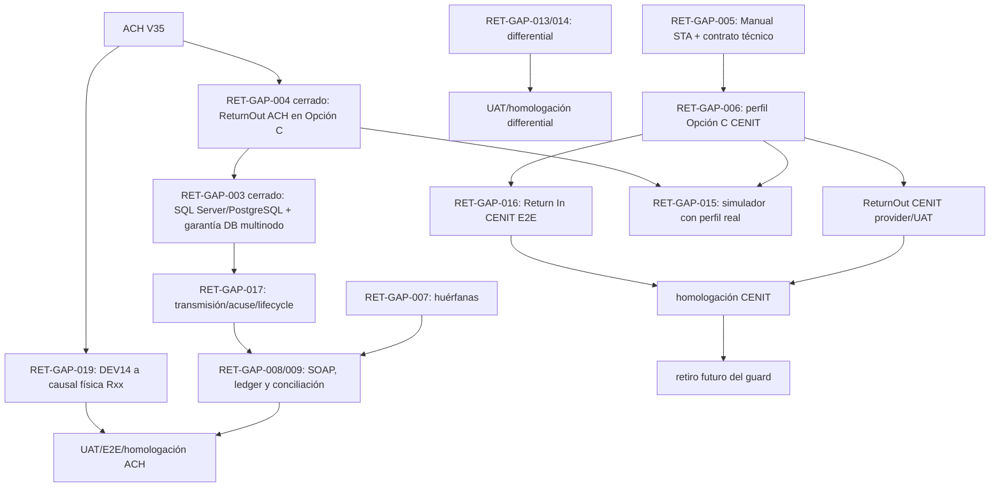

# Mapa maestro residual de brechas de devoluciones

## 1. HEAD y alcance analizado

- `BASE_HEAD`: `033948fd035257ee64aab60606fb66481e830a0d`.
- Fecha del análisis: 2026-08-07.
- Alcance: delta residual de Return In, Return Out, respuestas diferenciales, correlación, lifecycle, causalidad, idempotencia, persistencia real y simulación UAT.
- Cambio productivo: ninguno. Este documento no autoriza homologación ni modifica gates.
- Estado inicial del working tree: `?? docs/uat/certificados_pruebas/`, cambio preexistente y preservado.

## 2. Baseline recuperado

El baseline no se reconstruyó desde el prompt. Fue contrastado con el código, el historial y los análisis versionados:

- JOB 2 cerró B1: `AchIncomingReturnIngestionService` e `IncomingNachaPostParseProcessor` convergen en `IAchStateTransitionService`.
- JOB 3.1 cerró B2 con carrera real en SQL Server y PostgreSQL, clave `incoming-return-v2` e índice único `UX_AchTransactionStateEvents_IdempotencyKey`.
- JOB 4 introdujo el lifecycle saliente auditado y el guard CENIT en `84cb1626`.
- JOB 4.CI.2 (`909865ae`) modificó solamente cinco archivos de tests y dejó el baseline `2176 passed / 0 failed / 9 skipped / 2185 total`.
- Los antiguos 14 fallos no son defectos productivos actuales: 12 validaban un contrato CENIT obsoleto y 2 esperaban `Pending` en lugar del contrato vigente `ReturnedByEpr`.
- `Pending -> ReturnedByEpr` es el contrato actual de la generación exitosa demostrada, pero B3 sigue PARCIAL.
- ACH Colombia V35 es la fuente normativa vigente; V32 no se usa como autoridad.
- CENIT ReturnOut físico sigue bloqueado.

No se ejecutó la suite ni tests focalizados en este JOB. La clasificación residual depende de evidencia que los tests existentes no pueden aportar: Manual STA ausente, renderer productivamente aprobado, proveedor real outbound y concurrencia multinodo.

## 3. Decisiones cerradas que no deben reabrirse

| Decisión | Estado | Evidencia |
| --- | --- | --- |
| Aplicación incoming por transición canónica y evento auditable | ✅ CERRADA Y DEMOSTRADA | `AchIncomingReturnIngestionService`, `IncomingNachaPostParseProcessor`, `AchStateTransitionService`; JOB 2 |
| Idempotencia funcional incoming DB-first en SQL Server/PostgreSQL | ✅ CERRADA Y DEMOSTRADA | `docs/analysis/JOB3_IDEMPOTENCIA_DB_FIRST_DEVOLUCIONES.md`; JOB 3.1 |
| `ReturnedByEpr` como estado vigente después de la generación saliente demostrada | ✅ CERRADA Y DEMOSTRADA para el escenario actual | `outbound-return-v1`, payload de lifecycle y JOB 4.CI.2 |
| Guard CENIT | 🔴 BLOQUEADA DELIBERADAMENTE | `RETURN_OUT_CENIT_TECHNICAL_HOMOLOGATION_REQUIRED` |
| ROR participante ACH Colombia | ⚫ NO APLICA / LEGACY | V35 y `docs/analysis/DELTA_DEVOLUCIONES_ACH_COLOMBIA_V35.md` |
| `R96` como causal universal de devolución | ⚫ NO APLICA / LEGACY | Es código de éxito de integración para `Proc_Contrapartidas`/`Proc_Transacciones`; el catálogo vigente lo marca `R96_INTEGRATION_ONLY`, `AppliesToReturn=false` |
| Simulador autoimporta | ⚫ NO APLICA / LEGACY | `GeneratedOnly=true`, `AutoImported=false`, `UploadRequired=true` |

## 4. Normativa consultada

Se usaron ambos proyectos Codebase Memory:

- Proyecto técnico `ACHInterbank` (identificador MCP `C-Users-CHECHO-Documents-proyectos-Interbank-ACHInterbank`): 49.173 nodos y 171.084 aristas.
- Proyecto documental `ACHInterbank-normativa`: 1.633 nodos y 1.631 aristas.

El índice principal recuperó símbolos y cambios presentes en HEAD, incluido el guard y las instrucciones vigentes de `AGENTS.md`; no hubo evidencia de staleness y no se reindexó.

### ACH Colombia

En `ACH-Colombia-V35.md` se verificaron:

- sección 6.6 y estructura 1/5/6/7/8/9 para devoluciones ordinarias;
- Addenda 99, una devolución por transacción, nueva secuencia y referencia al detalle original;
- inversión correcta de roles DFI, monto original y monto cero para prenotificación;
- máximo de cuatro ciclos;
- naming `RRRRTTT.ZZZ.1`, con `ZZZ` consistente con el registro tipo 1;
- D28 como devolución de devolución de operador, no como ROR participante;
- D29 y D33 según V35.

Estas reglas están **vigentes en V35**. No se promovió ninguna regla exclusiva de V32. La presencia de `.RET` no se generalizó más allá de los casos expresamente demostrados.

### CENIT

La ruta solicitada `docs/normativa/md/ceos/_dsp/_152_MAY_27_2022.md` no existe en HEAD. La fuente real, versionada y recuperada es:

`docs/normativa/md/ceos_dsp_152_MAY_27_2022.md`

Consultas documentales relevantes: `ceos_dsp_152_MAY_27_2022`, `campo 6 Número de Registros de Detalle`, `Manual de Especificaciones del Formato para el Servicio de Transferencia de Archivos - STA`, `D04`, `D05`, `secuencia`, `reset` y `nombre del archivo`.

Resultado:

- El reglamento exige que el campo 6 del nombre de rechazo reproduzca el número de registros del original o el número exacto rechazado cuando el rechazo es parcial.
- El propio reglamento remite la especificación integral del nombre/formato al Manual STA.
- `CENIT-Anexo-B-Causales-Rechazo.md` define D04 (duplicidad) y D05 (diferencia entre conteo declarado y registros).
- `CENIT-Anexo-A-Causales-Devolucion.md` aporta causales y plazos, incluidas R60-R74 para devolución de devolución CENIT.
- El corpus no demuestra layout físico ReturnOut completo, DFI, correlación física integral, naming STA completo ni política de secuencia/reset.

Conclusión normativa: el catálogo causal CENIT está parcialmente demostrado; la homologación física no. No se infiere simetría con ACH Colombia.

## 5. Arquitectura y trazas E2E

La arquitectura oficial es Opción C (`nacha-config profiles`): perfiles/variantes/campos, `NachaConfigOfficialProfilesSeeder`, provider de configuración, renderer fixed-width y validación por cámara/flujo.

### R1 — Return In

```text
Archivo
 -> Ingestion/Parser
 -> Batch/EntryDetail/Addenda
 -> clasificación por cámara
 -> linker determinístico (traza + contexto)
 -> causal por ClearingHouse
 -> IAchStateTransitionService
 -> ReturnedByEpr
 -> AchTransactionStateEvent + processing evidence
```

- ACHCOL: ruta implementada, auditada e idempotente en ambos proveedores para la aplicación incoming demostrada.
- CENIT: reutiliza el pipeline seguro y catálogos por cámara, pero carece de evidencia E2E provider-specific y homologación de muestras CENIT reales suficiente para declarar soporte integral.

### R2 — Return Out

```text
Transacción recibida
 -> elegibilidad/causal/ciclo
 -> configuración ReturnOut
 -> BuildType1/5/6/7/8/9 internos
 -> validación
 -> naming policy
 -> AchReturnGenerated + transición ReturnedByEpr
 -> archivo
```

- ACHCOL: el flujo existe, pero el render físico no recorre el renderer oficial Opción C. `AchReturnsService` usa métodos `BuildType*`, `Pad*` y `Ensure106`; `NachaRecordConfigProvider.BuildCurrentLayoutConfig` es hardcoded y declara `IsProductiveApproved=false`.
- CENIT: el guard ocurre antes del lock/generación. No entra en el generador ni produce side effects exitosos.

### R3 — Diferencial

```text
Resultado/evento
 -> correlación con prenotificación Pending + EntryDetail + cámara + identidad
 -> readiness de mappings
 -> guard MovesMoney=false
 -> transición canónica + trace
 -> semántica RegistrarRespuestaTransaccion
```

No hay conexión demostrada entre este flujo y un sustituto de ReturnOut. `RegistrarRespuestaTransaccion` permanece no monetario.

## 6. Return In — ACH Colombia

**Estado: ✅ CERRADA Y DEMOSTRADA — perfil/admisión física y resolución operativa integrados por flujo normal.**

Implementado y demostrado:

- parser, lote, detalle y Addenda;
- causal por cámara;
- correlación segura sin first-match;
- transición auditada;
- replay funcional DB-first y carrera real SQL Server/PostgreSQL;
- preservación de archivo, hash, detalle, traza, causal y eventos.
- consulta, investigación, selección explícita y resolución manual de huérfanas con autorización `CanManageAch`;
- aplicación posterior mediante el mismo `IncomingNachaPostParseProcessor`, causal catalogada, evento de estado y auditoría del operador;
- idempotencia de replay y claim relacional concurrente demostrados en SQL Server/PostgreSQL;
- SPA Angular Material y escenario Playwright LIVE sobre API, SPA y SQL Server reales.
- perfil publicado/homologado `OFFICIAL_ACH_ENTRADA_DEVOLUCION_V1_0`, declarativo y respaldado por V35 6.6/6.7;
- certificados reales administrados por SPA, sobre digital original `.003` descifrado en memoria, parser genérico y persistencia física de una Return R04 huérfana;
- reupload del mismo sobre rechazado como duplicado, con una sola ingesta canónica y una sola Return funcional.

`RET-GAP-007` quedó cerrado por dos evidencias complementarias. El sobre certificado histórico `.003` conserva su R04 y produce una huérfana segura cuando su transacción histórica no existe. El escenario `RET.SIMULATOR.RETURN.E2E.1` crea una `AchTransaction` por `/transactions/create`, toma su rastreo oficial, genera mediante Opción C una devolución desde contraparte externa, no autoimporta, carga manualmente por `/transactions/nacha-upload` y demuestra parser, Addenda 99, causal catalogada, correlación exacta `Original Trace + ciclo resuelto`, lifecycle, evento, auditoría y replay sin segunda aplicación. No se usaron SQL para crear la transacción, override de rastreo ni relajación de correlación. La matriz return-to-SOAP/ledger/conciliación permanece separada en RET-GAP-008/009. No corresponde reabrir B1/B2.

## 7. Return Out — ACH Colombia

**Estado: 🟡 PARCIAL — residual identificado.**

Implementado:

- elegibilidad, causal, máximo de cuatro ciclos, DFI invertido, monto/prenote, Addenda 99, controles y naming policy V35 `RRRRTTT.ZZZ.1`;
- perfil explícito `OFFICIAL_ACH_SALIDA_DEVOLUCION_V35_1_0` para `ACH + DEVOLUCION + SALIDA`;
- resolución de records, variants, fields, sources y reglas ejecutables mediante Opción C, con records 1/5/6/7/8/9 de 106 caracteres y padding por bloques de diez;
- falla cerrada si el perfil falta, es ambiguo, no está publicado o no declara V35; no existe fallback hacia `NachaRecordConfigProvider`;
- `AchReturnGenerated` y transición `Pending -> ReturnedByEpr` en una transacción relacional;
- idempotency key `outbound-return-v1:{transactionId}` e índice único de archivo generado.

Residual crítico:

1. No existe prueba SQL Server ReturnOut equivalente y la UAT PostgreSQL sigue siendo condicional; no constituye evidencia provider-specific vigente.
2. El lock es `ConcurrentDictionary<int, SemaphoreSlim>` y solo coordina un proceso.
3. `DEV14` es una solicitud oficial externa de devolución de una transacción débito ACH no consentida (V35 2.7.6 y Anexo 7), no una causal física de Addenda 99. V35 6.6 exige allí una causal de tres caracteres del Anexo 9, pero no define una traducción única desde `DEV14`: `R07`, `R10`, `R12` y `R29` describen hechos/contextos diferentes que la intención general de no consentimiento no permite distinguir. Opción C lo rechaza sin truncar. `RET-GAP-019` permanece bloqueada hasta obtener una regla primaria ACH Colombia que determine la causal física a partir del contexto requerido.
4. Falta evidencia multinodo, aceptación externa, transmisión, acuse y conciliación.

RET-GAP-004 queda cerrado técnicamente. El perfil es canónico y ejecutable dentro del aplicativo, pero `IsHomologated=false`: las pruebas internas no constituyen homologación externa con ACH Colombia.

## 8. Return In — CENIT

**Estado: 🟠 IMPLEMENTADA SIN EVIDENCIA SUFICIENTE.**

El pipeline genérico soporta cámara, causal, traza, clasificación y bloqueo seguro. Los anexos CENIT aportan causales. No se demostró, sin embargo, un E2E provider-specific con archivos CENIT homologados que cubra parser, correlación, causal, lifecycle, huérfana, replay y operación. Los fixtures semirreales no son certificación.

## 9. Return Out — CENIT

**Estado: 🔴 BLOQUEADA DELIBERADAMENTE.**

`RETURN_OUT_CENIT_TECHNICAL_HOMOLOGATION_REQUIRED` es un control de seguridad. Los perfiles/goldens provisionales históricos no son autorización productiva y no pueden convertirse en layout oficial por analogía.

Falta, como mínimo: Manual STA vigente, layout/dirección, campos DFI, correlación, naming integral, secuencia/reset, ciclos, controles, fixture certificado, UAT por proveedor y homologación firmada.

## 10. Respuestas diferenciales y matriz semántica

El processor actual solo procesa respuestas de prenotificación; otras respuestas se omiten. Exige prenotificación `Pending`, cruce NACHA desagregado, misma cámara e identidad consistente. Es idempotente por `ach-response:{responseId}` y falla si `RegistrarRespuestaTransaccion` aparece como monetario.

| Concepto | Momento | Monetario | Estado | Causal | NACHA-M | SOAP | Evidencia |
| --- | --- | ---: | --- | --- | --- | --- | --- |
| rechazo | Antes/durante aceptación o validación del archivo | No por sí mismo | No mutar una transacción arbitraria | Dxx/Ixx por cámara | Archivo/reporte de rechazo según contrato propio | Ninguno salvo contrato explícito | CENIT Annex B; classifier |
| devolución | Después de una transacción original; generación/aplicación de retorno | La compensación puede tener efecto financiero, pero generar/parsear no mueve dinero | `ReturnedByEpr` en escenarios demostrados | Rxx/DEVxx por cámara y flujo | Return In/Out 1/5/6/7/8/9 | Solo la operación expresamente homologada; no inferida | returns services, V35, anexos CENIT |
| respuesta diferencial | Después de un resultado externo asociado | No | `Certified`, `ReturnedByEpr` o `ReturnedByOperator` para la prenotificación según route | código externo homologado | Contexto NACHA desagregado; no sustituye ReturnOut | `RegistrarRespuestaTransaccion` | differential processor y arquitectura de respuestas |
| error técnico | En transporte, parseo, mapping o persistencia | No | Sin transición funcional automática | código técnico, no causal universal | Evidencia técnica; no devolución fabricada | Retry solo por policy técnica | integration execution/readiness |
| prenotificación rechazada | Respuesta posterior sobre prenotificación pendiente | No | `ReturnedByEpr`/`ReturnedByOperator` según causal/ruta | causal homologada | Respuesta diferencial cuando el perfil lo permita | `RegistrarRespuestaTransaccion` | differential processor |

**Differential Unblock: NO-GO.** La implementación local no reemplaza la homologación normativa, perfil, fixture y E2E por cámara.

## 11. Correlación

La correlación incoming usa traza original/actual y dimensiones operativas; limita el resultado a dos candidatos y bloquea `NotFound`/`Ambiguous`. `IncomingNachaDispatchEligibilityPolicy` rechaza cualquier link no final o en `EligibilityStatus.Bloqueada`/`RevisionManual`.

No se encontró first-match, match parcial o actualización especulativa. La evidencia preserva archivo, hash, `EntryDetail`, Addenda, candidatos y causal. Residual: no existe un read-model único que reconstruya de forma operativa toda la cadena por `EntryDetail`, y la resolución manual no aplica posteriormente el lifecycle.

## 12. Huérfanas

**Estado: 🟡 PARCIAL — residual identificado.**

Una devolución no correlacionada conserva ingestion/file/hash, cámara/ciclo, detalle/Addenda, traza/causal, candidatos, timestamps y eventos. `IncomingNachaOrphanManualResolutionService` permite `Ignored`, `Resolved` o `Linked`, registra actor, comentario y evidencia, y evita doble resolución.

La resolución es expresamente operacional: `stateChanged=false`, `applied=false`, `achTransactionStateEventCreated=false`. Incluso `LinkToTransaction` no demuestra un reproceso/apply posterior atómico. Esto evita afectar una transacción arbitraria, pero no cierra B6 E2E.

## 13. Lifecycle

### B3 — PARCIAL

Contrato actual demostrado:

```text
generación ReturnOut ACH exitosa
 -> AchReturnGenerated
 -> IAchStateTransitionService
 -> Pending -> ReturnedByEpr
 -> causal + originalTrace + payload + state event
```

No está completamente cerrado porque faltan carrera provider-specific outbound, multinodo y lifecycle posterior a transmisión/acuse/conciliación. CENIT no participa del escenario exitoso por el guard.

## 14. Causalidad y trazabilidad por EntryDetail

`AchReturnCodes` se resuelve por `ClearingHouseId`, flujo, naturaleza, prenotificación y vigencia. Por el pipeline pueden reconstruirse archivo, lote, detalle, Addenda, traza, cámara, clasificación, link, causal y eventos; la consulta transversal sigue fragmentada entre entidades/read-models.

`R96` no es causal universal ni evidencia normativa de devolución. Es éxito de integración para `Proc_Contrapartidas`/`Proc_Transacciones`; el hardening posterior lo desactiva del catálogo de returns mediante `R96_INTEGRATION_ONLY` y `AppliesToReturn=false`.

## 15. Idempotencia

| Nivel | Incoming | Outbound |
| --- | --- | --- |
| Mismo archivo | hash + tamaño evita duplicidad técnica | no es la identidad funcional de generación |
| Misma devolución/EntryDetail | `incoming-return-v2` + índice único | `AchReturnGenerated` + `outbound-return-v1` |
| SQLite relacional | demostrado | demostrado con dos contextos/instancias |
| SQL Server | demostrado para incoming | índice existe; carrera ReturnOut no demostrada |
| PostgreSQL | demostrado para incoming | harness condicional/stale; no evidencia vigente |
| Multinodo | garantizado por unicidad DB para la aplicación incoming demostrada | no demostrado; lock solo local |

El filename normativo no debe reemplazar las identidades funcionales anteriores.

## 16. Atomicidad y persistencia real

Incoming B2 está cerrado en SQL Server/PostgreSQL. Outbound agrupa `AchReturnGenerated` y transición/evento en una transacción relacional y dispone del índice único `UX_AchReturnGenerated_OriginalTransaction_Reason_Cycle`, pero la evidencia de carrera real se limita a SQLite.

La clase `AchReturnsPostgresUatEndToEndTests` retorna sin ejecutar si el harness no está habilitado e incluye un caso CENIT hoy bloqueado. Su contrato ACH ya preserva `Pending -> ReturnedByEpr`, pero no existe ejecución PostgreSQL obligatoria ni `AchReturnsSqlServer...`. Por tanto, no puede elevarse la evidencia outbound a provider-specific ni multinodo.

## 17. Naming

Se mantienen separados:

- **Idempotencia técnica:** hash + tamaño y claves funcionales persistidas.
- **Nombre externo:** cumplimiento normativo por cámara/flujo.

ACH Colombia V35 demuestra `RRRRTTT.ZZZ.1` y la relación de `ZZZ` con el tipo 1. ReturnOut usa `IExternalFileNamePolicy`; el policy reserva la secuencia, resuelve el `FileIdModifier`, valida su correlación con el registro 1 y el servicio vuelve a renderizar el artefacto final mediante el mismo perfil Opción C. CENIT solo demuestra la regla de conteo en el campo 6 de rechazo y remite el resto al Manual STA; naming, secuencia y reset siguen no determinables.

## 18. SOAP, ledger y conciliación

Semántica preservada:

- `Proc_Contrapartidas`: débitos monetarios originados por CFA.
- `Proc_Transacciones`: créditos monetarios originados por otra entidad.
- `RegistrarRespuestaTransaccion`: respuesta diferencial, `MovesMoney=false`.

El parser de return tiene caracterización de ausencia de movimiento monetario y el diferencial incluye guard no monetario. Sin embargo, `NachaOperationalReadStore` proyecta clases de devolución/rechazo hacia `RegistrarRespuestaTransaccion` y no existe una matriz normativa cerrada de devolución -> SOAP -> retry -> ledger -> conciliación. Tampoco existe ledger de devolución explícitamente separado.

Conclusión: no usar `RegistrarRespuestaTransaccion` como sustituto de ReturnOut ni autorizar reverso monetario por inferencia.

## 19. Simulador UAT

`/uat/nacha-inbound-simulator` tiene modos para entradas y respuestas diferenciales, exige cámara, ciclo, entidad originadora/destino, causal/referencias cuando corresponda y preserva metadata/evidencia.

Invariante demostrado:

```text
GeneratedOnly=true
AutoImported=false
UploadRequired=true
ExternalTransmission=false
```

El usuario debe cargar el archivo en `/transactions/nacha-upload`. Para devoluciones ACH Colombia, el simulador usa `INachaFileBuilder` y el perfil Opción C V35, deriva `Original Trace` de `AchTransaction.TraceNumber`, obtiene causal/ciclo/entidades desde catálogos persistidos y genera únicamente el artefacto físico. Éxito y rechazo conservan el comportamiento existente; la respuesta diferencial no-return continúa bloqueada por `DIFFERENTIAL_GENERATOR_NOT_HOMOLOGATED` y no se presenta como homologada. CENIT Return Out permanece bloqueado.

## 20. UX, operación manual y observabilidad

- Motor backend: más avanzado que la homologación y la UX.
- Operación manual: existe servicio de resolución de huérfanas, pero no apply/reprocess E2E.
- SPA: existen gestión de devoluciones, ROR, configuración NACHA y simulador.
- Dashboard: expone decisiones/estado operativo, pero no demuestra conciliación ReturnOut ni cierre de huérfanas.
- Simulador: genera evidencia y archivo; no importa ni transmite.
- Simulador de devoluciones: Angular Material en español, selección de transacción/catálogo/ciclo, resumen humano, estados accesibles y cobertura Playwright desktop/móvil.

Una deficiencia de pantalla no invalida el motor; tampoco una pantalla existente prueba homologación.

## 21. Cobertura y evidencia ejecutable

- JOB 4: 13 pruebas focalizadas de lifecycle/generación.
- JOB 4.CI.2: 2176 passed, 0 failed, 9 skipped, 2185 total.
- RET.ACH.OUT.OPTIONC.1: contract V35 Opción C 4/4; servicio/lifecycle/CENIT 38/38; caracterización ampliada 45/45; naming V35 45/45; suite backend final 2180 passed, 0 failed, 9 skipped, 2189 total.
- RET.SIMULATOR.RETURN.E2E.1: Playwright runtime 1/1; creación UI → simulador → archivo → carga manual → correlación/lifecycle → replay.
- RET.OUT.PROVIDERS.1: categoría `OutboundReturnMultiDb` 4/4 sobre SQL Server y PostgreSQL reales; cada provider ejecuta RACE A-H, rollback de claim/lifecycle, batch solapado, retry, prenotificación y migración UP/DOWN, además del hard-fail con duplicados históricos conservados. Suite backend CI final: 2181 passed, 0 failed, 9 skipped, 2190 total.
- Incoming B2: carreras reales SQL Server/PostgreSQL documentadas en JOB 3.1.
- Outbound: garantía DB multinodo demostrada con locks in-memory neutralizados, contexts/scopes/servicios independientes, claim único por transacción y reserva relacional del trace diario por participante.
- CENIT físico: tests vigentes prueban el guard y cero side effects, no generación.
- Differential: tests de processor/use case, sin homologación E2E por cámara.
- Simulador: evidencia sintética; no certificación.

La suite final se ejecutó con el filtro CI canónico y `RunConfiguration.MaxCpuCount=1`; el TRX quedó en `TestResults/dotnet-tests.trx`.

## 21.1. Fundación canónica de Cuadre Operativo por cámara y ciclo

`RET.RECONCILIATION.CYCLE.FOUNDATION.1` implementó una verdad persistente y versionada por cámara, fecha operacional y ciclo. El snapshot separa métricas internas de evidencia externa, conserva revisiones por fingerprint, clasifica devoluciones de participante y de operador, aplica `recibidas = aplicadas + devueltas por participante` para ACH Colombia V35 2.6.2 y falla cerrado como `PendingExternalEvidence` cuando falta evidencia completa. Las diferencias conservan categoría, valor interno, valor externo, delta y fuente.

La unicidad relacional protege identidad+revisión e identidad+fingerprint; la carrera concurrente reutiliza la revisión ganadora. SQL Server y PostgreSQL aplicaron sus migraciones y ejecutaron el mismo escenario funcional en bases/esquemas aislados. El servicio no depende de ledger, posting, SOAP, transporte ni respuesta diferencial. El read model dejó de presentar Return/ROR persistidos como conciliados externamente y ahora los identifica como pendientes de evidencia.

Este cierre es parcial respecto de `RET-GAP-009`: existe la fundación operativa de conciliación, pero no existe contrato contable, ledger/posting, parser de planilla oficial ni homologación externa por cámara.

## 22. RET-GAP — mapa maestro residual

| ID | Brecha previa | Cámara | Dirección | Capacidad | Estado demostrado | Evidencia | Brecha RESIDUAL | Riesgo | Severidad | Dependencia | Próximo JOB |
| --- | --- | --- | --- | --- | --- | --- | --- | --- | --- | --- | --- |
| RET-GAP-001 | B1 | Ambas | In | Convergencia de aplicación/auditoría | ✅ CERRADA Y DEMOSTRADA | JOB 2 + transición canónica | Ninguna dentro de B1 | — | — | — | No reabrir |
| RET-GAP-002 | B2 | Ambas | In | Idempotencia DB-first | ✅ CERRADA Y DEMOSTRADA | JOB 3.1 SQL Server/PostgreSQL | Ninguna para aplicación incoming correlacionada | — | — | — | No reabrir |
| RET-GAP-003 | B3 | ACHCOL | Out | Lifecycle `ReturnedByEpr`, atomicidad y concurrencia DB | ✅ CERRADA Y DEMOSTRADA | JOB 4/4.CI.2 + RET.OUT.PROVIDERS.1: SQL Server/PostgreSQL, RACE A-H, DB-first claim, trace sequence relacional, migration UP/DOWN | Ninguna dentro de generación/persistencia ReturnOut; transmisión/acuse permanece en RET-GAP-017 | — | — | RET-GAP-004 cerrada | No reabrir |
| RET-GAP-004 | B4/B5 | ACHCOL | Out | Perfil/render físico V35 | ✅ CERRADA Y DEMOSTRADA | `OFFICIAL_ACH_SALIDA_DEVOLUCION_V35_1_0`, Opción C, contract tests V35, naming `RRRRTTT.ZZZ.1`, no-fallback | Ninguna dentro de la canonicalización física; homologación externa continúa separada | — | — | — | No reabrir |
| RET-GAP-005 | B4/B5 | CENIT | Out | Contrato técnico STA | 🔴 BLOQUEADA DELIBERADAMENTE | Reglamento/Annex A/B; guard | Manual STA, layout, DFI, correlación, naming, secuencia/reset | levantar guard sin norma | CRÍTICA | Evidencia externa STA | CENIT.STA.HOMOLOGATION |
| RET-GAP-006 | B5 | CENIT | Out | Perfil/parser/generator soportado | ⚪ NO IMPLEMENTADA | guard antes del generador | Implementación Opción C solo después de RET-GAP-005 | generación inválida | CRÍTICA | RET-GAP-005 | CENIT.RETURNOUT.OPTIONC |
| RET-GAP-007 | B6 | ACHCOL demostrado aguas abajo; CENIT no homologado | In | Huérfanas/manual + happy path integrado | ✅ CERRADA Y DEMOSTRADA | Escenario A: `.003` original → R04 → huérfana segura; escenario B `RET.SIMULATOR.RETURN.E2E.1`: alta UI legítima + Opción C + carga manual + correlación exacta + lifecycle/causal/evento/auditoría + replay | Ninguna dentro del alcance ACH Colombia Return In correlacionado; transporte/ledger permanecen separados | sembrar por SQL, relajar rastreo, modificar `.003` o autoimportar | — | — | No reabrir |
| RET-GAP-008 | B7 | Ambas | In/Out | Matriz return-SOAP-retry-conciliación | ❓ NO DETERMINABLE | guard no monetario, dispatch/readiness | Política normativa y E2E por escenario | doble/no movimiento | CRÍTICA | RET-GAP-009 + norma | RET.RECONCILIATION |
| RET-GAP-009 | B8 | Ambas | In/Out | Ledger/conciliación separado | 🟡 PARCIAL — fundación operativa demostrada | snapshot canónico por cámara/fecha/ciclo, diferencias auditables, fail-closed, idempotencia/concurrencia y SQL Server/PostgreSQL | contrato de evidencia externa oficial y contrato contable; ledger/posting fuera de alcance | descuadre financiero si se confunde cuadre operativo con contabilidad | CRÍTICA | contratos externo y contable | RET.RECONCILIATION.EXTERNAL.EVIDENCE.CONTRACT.1 |
| RET-GAP-010 | B9 | Ambas | Ambas | Taxonomía rechazo/return/differential/técnico | 🟡 PARCIAL — residual identificado | classifiers, catalogs, response processor | Read-model/event contract unificado | operación confusa | MEDIA | RET-GAP-008 | RET.TAXONOMY |
| RET-GAP-011 | B10 | ACHCOL | ROR | ROR participante | ⚫ NO APLICA / LEGACY | V35 delta | Mantener capability provisional fuera de GO | falsa habilitación | MEDIA | V35 | Retirar/aislar en JOB propio |
| RET-GAP-012 | B10 | CENIT | ROR | ROR R60-R74 | 🔴 BLOQUEADA DELIBERADAMENTE | Annex A; artefactos provisionales | Perfil físico/UAT/homologación CENIT | archivo inválido | CRÍTICA | RET-GAP-005/006 | Después de ReturnOut CENIT |
| RET-GAP-013 | Diferencial | ACHCOL | Respuesta | Prenote differential | 🟠 IMPLEMENTADA SIN EVIDENCIA SUFICIENTE | processor/tests, `MovesMoney=false` | norma/perfil/fixture/E2E externo | transición incorrecta | ALTA | homologación diferencial | DIFF.ACH.HOMOLOGATION |
| RET-GAP-014 | Diferencial | CENIT | Respuesta | Differential por cámara | ❓ NO DETERMINABLE | processor genérico, sin contrato CENIT demostrado | normativa, perfil, mapping, fixture, E2E | inferencia entre cámaras | ALTA | norma CENIT | DIFF.CENIT.ANALYSIS |
| RET-GAP-015 | Simulador | Ambas | In | normal/return/differential | 🟡 PARCIAL — Return ACHCOL demostrado | generate-only + metadata; devolución ACHCOL con Opción C y E2E físico | diferencial no-return y CENIT continúan sin generador homologado | falsa confianza si se extrapola el happy path | MEDIA | perfiles aprobados por escenario | UAT.SIM.PROFILES |
| RET-GAP-016 | B4 | CENIT | In | Return In integral | 🟠 IMPLEMENTADA SIN EVIDENCIA SUFICIENTE | pipeline genérico + causas | E2E provider-specific con fixture homologado | retorno perdido/mal causalizado | ALTA | fixture/norma | CENIT.RETURNIN.E2E |
| RET-GAP-017 | B5 | ACHCOL | Out | transmisión/acuse/conciliación | 🔴 ABIERTA — CONTRATO DE TRANSPORTE NO DETERMINABLE | `RET.OUTBOUND.ACCEPTANCE.1`: V35 2.4.2 demuestra SFTP/MFT/GoAnywhere a nivel ACH, pero el repositorio no contiene port, adapter, configuración ni decisión versionada que vincule ACHInterbank con el SFTP administrado por CFA; tampoco existe ACK correlacionable | obtener contrato aplicativo-canal, ownership del depósito, identidad del artefacto `.RET.env`, resultado de transporte, idempotencia/correlación y manejo de resultado desconocido; ACK/aceptación permanece bloqueado hasta contrato externo explícito | inventar canal o confundir entrega con aceptación | ALTA | RET-GAP-004/003 cerradas + evidencia externa del canal | RET.OUTBOUND.TRANSPORT.CONTRACT.1 |
| RET-GAP-018 | Operación | Ambas | Ambas | dashboard/read-model por EntryDetail | 🟡 PARCIAL — residual identificado | read store y command center | reconstrucción unificada y alertas | investigación lenta | MEDIA | taxonomía | RET.OPS.OBSERVABILITY |
| RET-GAP-019 | Causalidad V35 | ACHCOL | Out | Solicitud `DEV14` frente a causal física Addenda 99 | 🔴 ABIERTA — BLOQUEADA POR DECISIÓN NORMATIVA | V35 2.7.6/6.6/Anexos 7 y 9; `DEV14` externo demostrado; ausencia de mapping único; falla cerrada Opción C | Fuente primaria ACH Colombia que vincule `DEV14` con una causal física o defina los atributos y la matriz determinística de resolución | devolución no generable o causal incorrecta | ALTA | evidencia normativa externa | RET.ACH.OUT.CAUSAL.V35.EVIDENCE |

## 23. Grafo de dependencias



Con RET-GAP-003 y RET-GAP-004 cerrados, RET-GAP-019 queda bloqueada por evidencia normativa externa: V35 no enlaza `DEV14` con una única causal física Rxx ni declara una matriz determinística de contexto. El siguiente JOB debe obtener esa evidencia antes del UAT integral de no consentimiento. RET-GAP-017 permanece posterior y fuera de este cierre. La primera dependencia externa para CENIT continúa siendo RET-GAP-005.

## 24. CENIT RETURN UNBLOCK GATE

Leyenda: ✅ demostrado; 🟡 parcial; 🔴 ausente/bloqueado; ❓ no determinable con el corpus.

| Elemento | Estado | Evidencia/residual |
| --- | --- | --- |
| normativa general | 🟡 | reglamento + anexos |
| Manual STA vigente | ❓ | referenciado, no disponible |
| estructura física | ❓ | no demostrada integralmente |
| dirección | 🟡 | semántica general, contrato físico incompleto |
| causal | ✅ | Annex A |
| códigos | ✅ | Annex A/B |
| perfil | 🔴 | no existe perfil productivamente aprobado |
| parser | 🟡 | pipeline genérico, fixture homologado ausente |
| generator | 🔴 | bloqueado deliberadamente |
| EntryDetail | 🟡 | modelo genérico, mapping CENIT no homologado |
| TraceNumber | 🟡 | modelo/catálogo, correlación física incompleta |
| batch | 🟡 | motor genérico, reglas STA incompletas |
| FileControl | 🟡 | motor genérico, reglas STA incompletas |
| filename | ❓ | solo regla campo 6 de rechazo; Manual STA ausente |
| secuencia/reset | ❓ | no encontrada |
| ciclo | 🟡 | causales/plazos parciales; operación integral ausente |
| correlación | 🟡 | linker seguro, contrato CENIT no homologado |
| lifecycle | 🟡 | modelo canónico, no ReturnOut CENIT exitoso |
| auditoría | 🟡 | infraestructura genérica, sin E2E físico |
| idempotencia | 🟡 | incoming genérico; outbound CENIT no existe |
| atomicidad SQL Server | 🔴 | no ReturnOut CENIT |
| atomicidad PostgreSQL | 🔴 | no ReturnOut CENIT |
| concurrencia | 🔴 | no provider/multinode CENIT |
| fixtures | 🟡 | semirreales/provisionales, no oficiales |
| tests | 🟡 | prueban guard, no generación física |
| UAT | 🔴 | no UAT homologada |
| homologación | 🔴 | no existe evidencia firmada |

**UNBLOCK AUTORIZABLE: NO.**

Evidencia concreta requerida para un retiro futuro: Manual STA vigente y aplicable; matriz normativa firmada de layout/DFI/traza/batch/control/naming/secuencia/reset/ciclos; perfil Opción C aprobado; fixtures certificados; parser/generator contractuales; correlación/lifecycle/auditoría; idempotencia y atomicidad en SQL Server/PostgreSQL; carrera multinodo; UAT y aceptación CENIT. Hasta entonces, `RETURN_OUT_CENIT_TECHNICAL_HOMOLOGATION_REQUIRED` permanece vigente.

## 25. DIFFERENTIAL RESPONSE UNBLOCK GATE

| Elemento | ACHCOL | CENIT |
| --- | --- | --- |
| normativa | 🟡 comportamiento local, homologación externa pendiente | ❓ no demostrada |
| perfil | 🟡 contexto NACHA existente, no perfil differential homologado | 🔴 |
| parser | 🟡 processor de prenote | 🔴 |
| generator | 🟡 simulador sintético, deshabilitable | 🔴 |
| correlación | ✅ prenote + EntryDetail + cámara + identidad | ❓ |
| original | ✅ exige prenote Pending | ❓ |
| causal/estado | 🟡 rutas implementadas, homologación pendiente | ❓ |
| `RegistrarRespuestaTransaccion` | ✅ operación separada | ❓ |
| no movimiento monetario | ✅ guard `MovesMoney=false` | ✅ invariante arquitectónico, no E2E CENIT |
| tests/fixture | 🟡 unit/local | 🔴 |
| simulador | 🟡 generate-only/hardcoded | 🔴 perfil real ausente |
| E2E | 🔴 externo no demostrado | 🔴 |
| homologación | 🔴 | 🔴 |

**ACHCOL: NO-GO. CENIT: NO-GO.** Returns y differential tienen gates independientes.

## 26. Secuencia recomendada de JOBs

1. `RET.OUT.PROVIDERS.1`: ✅ completado; evidencia outbound real SQL Server/PostgreSQL y garantía DB multinodo.
2. `RET.ACH.OUT.CAUSAL.V35.EVIDENCE`: obtener de ACH Colombia la regla primaria que vincule `DEV14` con la causal física Rxx o la matriz contextual determinística; no implementar mientras falte.
3. `RET.OUTBOUND.ACCEPTANCE.1`: ✅ characterization completada; `TRANSPORT_GATE=NO-GO` y `ACK_GATE=NO-GO`, sin implementación por falta de contrato aplicativo-canal.
4. `RET.OUTBOUND.TRANSPORT.CONTRACT.1`: obtener la decisión técnica versionada y el contrato operativo del canal ReturnOut ACH Colombia antes de implementar dispatch.
5. `RET.PROFILE.ACHCOL.INBOUND.RETURN.1` + `RET.SIMULATOR.RETURN.E2E.1`: ✅ perfil V35, `.003` huérfana segura y happy path con transacción legítima, carga manual, correlación exacta, lifecycle e idempotencia demostrados.
6. `RET.RECONCILIATION.CYCLE.FOUNDATION.1`: ✅ snapshot operativo canónico, persistente, versionado, fail-closed y multi-proveedor; no cierra ledger ni RET-GAP-009 completo.
7. `RET.RECONCILIATION.EXTERNAL.EVIDENCE.CONTRACT.1`: versionar el contrato de planilla/evidencia oficial por cámara antes de implementar parser o ingestión.
8. `CENIT.STA.HOMOLOGATION.1`: adquirir/validar Manual STA y contrato técnico; sin implementación por analogía.
9. Solo después: perfil, provider tests, UAT y homologación CENIT.
10. Differential se trabaja en una secuencia independiente por cámara.

### Evaluación de JOB 4.1

**COMPLETADO COMO `RET.OUT.PROVIDERS.1`.** SQL Server y PostgreSQL reales demostraron la garantía DB-first de concurrencia sin depender del semaphore local. RET-GAP-003 queda cerrado dentro de generación/persistencia; no incluye transmisión, acuse ni conciliación.

## 27. Próximo JOB único

### RET.RECONCILIATION.EXTERNAL.EVIDENCE.CONTRACT.1

- **Objetivo único:** obtener y versionar el contrato de evidencia externa oficial por cámara —identidad de planilla, fecha/ciclo, conteos, valores, posición neta, correcciones y procedencia— sin implementar parser para layouts todavía no aprobados.
- **Motivo:** la fundación canónica ya calcula y persiste el estado interno; el siguiente bloqueo demostrable es cómo incorporar evidencia oficial sin fabricarla ni confundir `CenitNetPosition` con planilla externa.
- **Fuera de alcance:** ledger/posting, SOAP, transporte Return Out, RET-GAP-008 y respuesta diferencial.
- **Resultado esperado:** contrato versionado y decisión explícita por ACH Colombia/CENIT que habilite un JOB posterior de ingestión idempotente.
- **Modelo recomendado:** `gpt-5.6-sol`.
- **Reasoning recomendado:** `medium`.

Este mapa no homologa devoluciones. El soporte productivamente seguro permanece condicionado a los gates por cámara y dirección descritos arriba.
