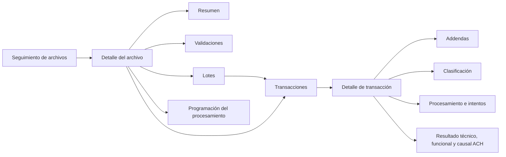

# Vista operativa integral NACHA-M

## Objetivo y usuarios

La vista permite a Operaciones ACH, soporte y auditoría reconstruir la trazabilidad de un archivo NACHA-M entrante sin conocer entidades, enumeraciones ni nombres de servicios internos. Es una consulta de monitoreo: no reprocesa, no cambia estados y no ejecuta acciones manuales sobre la cola.

Ruta canónica:

```text
/incoming-nacha-command-center
```

La ruta histórica `/ach/nacha/operational-dashboard` redirige a la ruta canónica para evitar dos centros de control. El detalle usa `/incoming-nacha-command-center/files/{id}` y conserva en la URL la sección elegida y la dirección de retorno con filtros.

## Navegación



## Arquitectura de componentes

- `NachaOperationalDashboardComponent`: contenedor del listado, formulario reactivo, parámetros de URL, paginación y ordenamiento.
- `NachaOperationalFileDetailComponent`: contenedor del archivo, carga progresiva de secciones y detalle de transacción.
- `IncomingNachaCommandCenterService`: cliente tipado, construcción de parámetros y consumo REST.
- `incoming-nacha-command-center.models.ts`: contratos TypeScript con nulabilidad explícita.
- `incoming-nacha-presentation.ts`: semántica visual, nombres funcionales de servicios, mensajes técnicos controlados e identificadores abreviados.
- `CurrencyColPipe` y `DateFormatPipe`: formato `es-CO`, pesos colombianos y zona `America/Bogota`.

Los componentes no determinan si un código ACH es exitoso o rechazado. `businessOutcomeText`, `resultCode` y `resultDescription` provienen del backend y se presentan como dimensiones independientes.

## Contratos consumidos

```http
GET /incoming-nacha-command-center/observability/summary
GET /incoming-nacha-command-center/ingestions
GET /incoming-nacha-command-center/ingestions/{id}
GET /incoming-nacha-command-center/ingestions/{id}/validations
GET /incoming-nacha-command-center/ingestions/{id}/batches
GET /incoming-nacha-command-center/ingestions/{id}/transactions
GET /incoming-nacha-command-center/ingestions/{id}/transactions/{entryDetailId}/addendas
GET /incoming-nacha-command-center/queue/{queueId}
```

El ajuste backend es aditivo y limitado a DTO y consultas del centro de control: agrega filtros, ordenamiento, agregados del listado, usuario/cámara, información enmascarada y descripción del catálogo de códigos de transacción. No cambia entidades, esquema, migraciones, persistencia ni reglas financieras.

## Filtros, paginación y cancelación

El listado permite filtrar por cámara, fecha operativa, rango de carga, ciclo, estado, resultado funcional, nombre, código ACH, novedades y errores técnicos. Las transacciones permiten filtrar por lote, rastreo/receptor, código de transacción, estado técnico, resultado funcional, código ACH, addenda y error técnico.

Archivos, lotes y transacciones usan página, tamaño, columna y dirección enviados al servidor. Los parámetros del listado se sincronizan con la URL. `switchMap` cancela consultas de archivos, lotes o transacciones reemplazadas por una solicitud posterior. No se ordenan páginas localmente ni se descarga el conjunto completo.

## Estados y causales

La interfaz separa siempre:

1. Estado técnico del procesamiento.
2. Resultado funcional.
3. Código y descripción ACH.

Ejemplos esperados desde contrato:

- `Procesado / Exitoso / R96 — Operación procesada correctamente`.
- `Procesado / Rechazado / R16 — Cuenta congelada`.
- `Procesado / Devuelto / R17 — descripción homologada por la cámara`.
- `Error técnico / No procesado / Código ACH no disponible`.

Un error de comunicación se explica en lenguaje operativo; su código técnico aparece sólo dentro de “Información para soporte”. Las direcciones físicas SOAP y los mensajes de excepción no se muestran.

## Idioma y humanización

Los textos visibles son españoles. Se conservaron únicamente siglas necesarias (`NACHA-M`, `ACH`, `SOAP`, `CENIT`). Los nombres internos `EntryDetail`, `DispatchQueue`, `BusinessOutcome` y equivalentes no se exponen. Las rutas administrativas antiguas de cola todavía existentes quedan fuera de esta vista y pueden modernizarse en una fase separada.

## Formato monetario y fechas

- Moneda: pesos colombianos mediante `Intl.NumberFormat('es-CO', { currency: 'COP' })`, con dos decimales.
- Valores: permanecen numéricos en el modelo.
- Fecha operativa: sólo fecha.
- Eventos: fecha y hora en `America/Bogota`.
- No existen compensaciones horarias manuales.

## Responsive y accesibilidad

- Escritorio: tabla Material con encabezados, ordenamiento y paginador.
- Tableta: filtros en dos columnas y contenido progresivo.
- Móvil: tarjetas compactas, filtros plegables y detalle en una columna.
- Resoluciones verificadas: 1440 × 900, 1024 × 768, 768 × 1024 y 390 × 844.
- Los estados incluyen texto además de color.
- Botones de detalle incluyen el nombre del archivo o número de rastreo en su etiqueta accesible.
- Calendarios y paginadores exponen nombres y acciones en español.
- El panel de transacción mueve el foco a su encabezado.
- El foco visible, encabezados semánticos y orden DOM siguen el flujo de lectura.

## Seguridad

- Cuentas, instituciones, nombres y rastreos originales se reciben enmascarados desde backend.
- El contenido libre de addenda se sanitiza en backend.
- No se almacenan filtros financieros en `localStorage`; se usan parámetros de URL no sensibles.
- No se muestran XML, URL SOAP, secretos, certificados, credenciales ni trazas de excepción.
- La vista no incorpora acciones de reproceso, cancelación, aprobación o cambio de estado.

## Pruebas y evidencia

Pruebas unitarias:

- Construcción y limpieza de filtros.
- Parámetros HTTP, paginación y ordenamiento.
- Error recuperable y estado vacío.
- Formato monetario.
- Humanización de servicios y error técnico.
- Selección de archivo, lote y transacción.
- Carga de validaciones, lotes, transacciones, addendas e intentos.
- Resultado técnico sin código ACH ficticio.
- Enmascaramiento y filtros server-side en backend.

Playwright focalizado:

- Recorrido integral de escritorio.
- R96 exitoso, R16 rechazado, R17 devuelto y error técnico sin causal.
- Archivo rechazado y archivo sin transacciones.
- Transacción sin addendas.
- Filtros, paginación y conservación de URL.
- Error recuperable y estado vacío.
- Vistas de 1440 × 900, 1024 × 768, 768 × 1024 y 390 × 844.
- Detección de errores de consola; el error HTTP 500 del caso recuperable se verifica como evidencia esperada y delimitada.

Las capturas se generan en `web/ach-interbank-ui/test-results/nacha-operational-dashboard-*` durante la ejecución Playwright. Incluyen listado, detalle, validaciones, lotes, transacciones, procesamiento, detalle de transacción y vistas móviles.

## Validación ejecutada el 1 de agosto de 2026

- `npm ci`: completado; el auditor de dependencias reportó 4 vulnerabilidades ya presentes en el árbol resuelto (3 moderadas y 1 alta).
- `npm run build`: completado sin errores; paquete inicial de 2,85 MB y módulo diferido del centro de control de 178,78 kB.
- Pruebas unitarias focalizadas: 21 aprobadas, 0 fallidas, 0 omitidas.
- Pruebas unitarias completas del SPA: 662 aprobadas, 0 fallidas, 0 omitidas.
- `npx tsc -p tsconfig.app.json --noEmit`: completado sin errores.
- `npx ng lint`: no ejecutable porque el proyecto no define un objetivo de lint; no se agregó una dependencia nueva para suplirlo.
- Playwright focalizado: 5 aprobadas, 0 fallidas, 0 omitidas.
- `dotnet build ACHInterbank.sln -c Release --no-restore`: completado con 0 advertencias y 0 errores.
- Pruebas backend focalizadas `IncomingNachaCommandCenterServiceTests`: 15 aprobadas, 0 fallidas, 0 omitidas.
- Regresión backend completa: dos intentos no finalizaron dentro de 6 y 15 minutos, sin producir resumen ni fallo; se conserva como limitación de validación, no como resultado aprobado.
- `git diff --check`: completado sin errores de espacios; Git sólo informa la conversión futura LF/CRLF configurada para el repositorio.

## Cierre de endurecimiento del Prompt 3

### Nulabilidad y advertencia CS8601

La advertencia de CI se reprodujo en la proyección de transacciones de `IncomingNachaCommandCenterService`. El catálogo permite que `TransactionCodeCatalog.Description` sea nulo en ambos proveedores, por lo que el diccionario resultante tiene valores `string?`. `GetValueOrDefault` podía devolver `null` cuando la clave existía con descripción nula, aunque se proporcionara un valor alternativo, y ese resultado se asignaba al DTO no nullable `TransactionCodeDescription`.

Se centralizó la resolución de la descripción: conserva la descripción real cuando existe y usa `Código de transacción NACHA-M` para código ausente, entrada de catálogo ausente o descripción nula/vacía. La ausencia de una descripción de catálogo es válida; la propiedad del DTO sigue siendo no nullable porque la interfaz necesita siempre una etiqueta operativa. No se usaron `!`, supresiones de advertencias ni cambios globales de nulabilidad.

La prueba `GetTransactionsAsync_ShouldAlwaysExposeANonNullableTransactionCodeDescription` cubre valor presente, descripción nula, catálogo sin coincidencia y código nulo. Las 16 pruebas focalizadas del servicio aprobaron. La compilación Release posterior produjo 0 advertencias y 0 errores.

### Playwright con SPA, API y PostgreSQL reales

Se agregó `e2e/incoming-nacha-command-center-postgres.spec.ts` al gate `test:e2e:job6`. El escenario usa inicio de sesión real y recorre:

```text
/login
→ /incoming-nacha-command-center
→ /incoming-nacha-command-center/files/{id}
→ Validaciones
→ Lotes
→ navegación directa al detalle por URL
```

El fixture es sintético, fijo, idempotente y aislado. Se prepara en la base PostgreSQL E2E mediante el cliente `pg`, contiene una ingesta, resultado, encabezado y lote sin transacciones ni cola, y se elimina antes y después del escenario. No crea datos demo productivos, no usa certificados, no contacta una cámara y no ejecuta SOAP ni operaciones monetarias.

El escenario real no llama `page.route` y no intercepta resumen, listado, detalle, validaciones, lotes ni transacciones. Comprueba respuestas HTTP, serialización, contenido visible, errores de consola, fallos de página y navegación directa. Los cinco escenarios excepcionales existentes conservan interceptaciones delimitadas para R96, R16, R17, error técnico, rechazo de validación, vacíos y error recuperable.

La configuración Nginx del contenedor SPA se ajustó porque la ruta API `/incoming-nacha-command-center/...` caía en el `index.html`. El proxy se limita a `observability`, `ingestions` y `queue`; las rutas SPA canónicas y de detalle siguen resolviéndose por Angular. El escenario real aprobó 1/1 en 8,3 segundos y los escenarios determinísticos aprobaron 5/5, incluido el viewport móvil. Evidencias:

- `web/ach-interbank-ui/test-results/incoming-nacha-command-cen-da8f7-ceptar-el-centro-de-control-chromium/listado-postgresql-real.png`.
- `web/ach-interbank-ui/test-results/incoming-nacha-command-cen-da8f7-ceptar-el-centro-de-control-chromium/detalle-postgresql-real.png`.
- Reporte HTML: `web/ach-interbank-ui/playwright-report/index.html`.

### Regresión backend y multimotor

La regresión equivalente a CI, sin `ClearingHouseMultiDb` y con un solo procesador, finalizó con 2071 pruebas: 2064 aprobadas, 0 fallidas y 7 omitidas, en 18 minutos 23 segundos. El resultado verificable está en `TestResults/dotnet-tests.trx`.

Las categorías con infraestructura real se ejecutaron aparte contra SQL Server y PostgreSQL:

- `FinancialIntegrity`: 8 aprobadas, 0 fallidas, 0 omitidas, 57 segundos; `TestResults/FinancialIntegrity/financial-integrity-multidb.trx`.
- `IncomingNachaTraceabilityMigration`: 2 aprobadas, 0 fallidas, 0 omitidas, 48 segundos; `TestResults/IncomingNachaTraceabilityMigration/incoming-nacha-traceability-migration.trx`.
- `ClearingHouseMultiDb`: 2 aprobadas, 0 fallidas, 0 omitidas, 1 minuto 44 segundos; `TestResults/ClearingHouses/clearing-houses-multidb.trx`.

`SoapArchitectureDiagnosticTests` continúa omitida de forma intencional: su atributo indica que documenta contaminación arquitectural previa a un refactor futuro, y `docs/architecture/INCOMING_NACHA_TRACEABILITY_CORE.md` la clasifica como diagnóstico, no como validación funcional o productiva. La funcionalidad cubierta por esta fase está validada por las pruebas focalizadas, la regresión y los jobs multimotor.

### Dependencias npm y riesgo residual

El auditor inicial encontró cuatro vulnerabilidades, todas en desarrollo y ninguna en el paquete desplegado:

| Paquete | Origen | Severidad inicial | Alcance y riesgo | Corrección aplicada |
|---|---|---:|---|---|
| `brace-expansion` 1.1.16 | `karma` → `minimatch` | Alta | Expansión no acotada durante herramientas de prueba; no se distribuye en producción. | Actualización transitiva compatible a 1.1.18. |
| `@hono/node-server` 1.19.15 | Angular CLI → SDK MCP | Moderada | Recorrido de ruta codificada en servidor estático de desarrollo sobre Windows; el SPA desplegado no lo usa. | Actualización transitiva a 2.0.12, admitida por el SDK actualizado. |
| `@modelcontextprotocol/sdk` 1.29.0 | Angular CLI | Moderada | Alerta compuesta por la dependencia Hono; sólo herramientas de desarrollo. | Actualización transitiva compatible a 1.30.0. |
| `@angular/cli` 21.2.19 | Directa de desarrollo | Moderada | Alerta compuesta por SDK MCP/Hono; no afecta dependencias de producción. | Se conservó Angular CLI 21.2.19; la corrección transitiva eliminó la alerta. |

Se ejecutó `npm audit fix --ignore-scripts`, sin `--force`, sin cambio mayor de Angular y sin modificar versiones directas de Angular, Material o Playwright. Después de una nueva instalación limpia, `npm audit --json` y `npm audit --omit=dev` reportaron 0 vulnerabilidades. No queda riesgo de seguridad conocido por `npm audit`; `npm outdated` mantiene actualizaciones funcionales futuras que deben tratarse en fases planificadas y no como parte de este cierre.

### Ausencia de lint y controles estáticos

`angular.json` sólo define `build`, `serve` y `test`; no existen archivos ESLint/TSLint ni configuración parcial. `npx ng lint` confirma `Cannot find "lint" target`. No se agregó ESLint ni dependencias para simular el control. Su adopción queda como deuda técnica separada: crear una fase de migración a `angular-eslint`, fijar reglas compatibles con Angular 21, establecer una línea base y activar el gate de CI sin mezclar cambios funcionales.

Los controles alternativos ejecutados fueron `npx tsc -p tsconfig.app.json --noEmit`, `npm run build`, 21 pruebas unitarias focalizadas y las 662 pruebas unitarias completas; todos aprobaron. `npm ci` terminó con 0 vulnerabilidades. La vista conserva español, humanización, separación técnica/funcional, enmascaramiento, formato `es-CO`, responsive y accesibilidad; no se cambiaron entidades, migraciones, reglas financieras ni códigos ACH.

## Cierre correctivo final: menú, runtime y estabilidad CI

### Navegación dinámica

La ausencia de la opción se debía a que la ruta existía en Angular, pero no había un registro equivalente en el bootstrap oficial ni en la tabla `MenuItems`. Se agregó `IncomingNachaCommandCenterMenuSeeder`, un `IDbSeeder` con orden 3, que resuelve el padre por la ruta estable `/transactions`, crea o actualiza la opción canónica, desactiva equivalentes técnicos y normaliza sus relaciones. No se agregaron tablas ni migraciones.

Datos persistidos:

| Campo | Valor |
|---|---|
| Etiqueta | Seguimiento de archivos NACHA-M |
| Ruta | `/incoming-nacha-command-center` |
| Icono | `manage_search` |
| Padre | Transacciones (`/transactions`) |
| Orden | 7 |
| Coincidencia exacta | Sí |
| Activa y visible | Sí |
| Permiso | `CanReadAch` |
| Roles | `Admin`, `ACH.Operator` |

El esquema real no posee columnas independientes de título, descripción o visibilidad: la etiqueta del menú es el título de navegación, `IsActive` controla su exposición y la descripción funcional está en los metadatos y encabezado de la ruta. No se alteró el esquema para duplicar esos conceptos.

La primera ejecución automática del bootstrap creó la opción y la segunda ejecución mediante `POST /Maintenance/seed` conservó un único registro. Las pruebas cubren creación, actualización de una etiqueta técnica, desactivación de duplicados, segunda ejecución, rol administrador, rol operador y usuario sin `CanReadAch`. El repositorio de navegación consulta la base directamente; no existe una caché backend que invalidar. Una sesión nueva vuelve a solicitar el menú.

El proveedor activo fue SQL Server y la base local `ACHInterbank`. La verificación final usó esta consulta, sin incluir credenciales:

```sql
SELECT mi.Id, mi.Label, mi.Route, mi.Icon, mi.[Order], mi.Exact, mi.IsActive,
       parent.Label AS ParentLabel, parent.Route AS ParentRoute,
       (SELECT COUNT(*) FROM MenuItemPermissions p WHERE p.MenuItemId = mi.Id) AS PermissionLinks,
       (SELECT COUNT(*) FROM MenuItemRoles r WHERE r.MenuItemId = mi.Id) AS RoleLinks
FROM MenuItems mi
LEFT JOIN MenuItems parent ON parent.Id = mi.ParentId
WHERE mi.Route = '/incoming-nacha-command-center';
```

Resultado: identificador 3807, una opción canónica, padre `Transacciones`, orden 7, exacta/activa, un permiso y dos roles; `CanReadAch`, `ACH.Operator` y `Admin`; cero equivalentes técnicos activos. `GET /api/navigation/menu`, con autenticación real, respondió 200 y devolvió exactamente una opción canónica.

### Causa del runtime anterior y artefacto definitivo

La ruta fuente ya cargaba `NachaOperationalDashboardComponent`; no existía un conflicto de lazy loading. El contenedor SPA activo no tenía volúmenes montados y servía una imagen anterior: su bundle contenía `Command Center Inbound NACHA-M` y no contenía el título nuevo. La causa demostrada fue un artefacto Docker obsoleto, no el caché del navegador ni una regla Angular.

Se retiraron los dos componentes técnicos antiguos que estaban sin rutas ni referencias. Las páginas secundarias todavía útiles —observabilidad, programación y detalle de soporte— se conservaron y se humanizaron; ya no muestran como texto principal `AllowedActions`, claves de idempotencia ni términos de programación en inglés. La ruta canónica sigue cargando la vista operativa y los alias históricos conservan sus redirecciones existentes.

La imagen SPA se reconstruyó sin caché y sólo se recreó el servicio `achinterbank-spa`; el volumen de SQL Server permaneció intacto. Evidencia final:

- Imagen: `sha256:2beab4f8709a1943b8979579b5932394b73369371f489709447fd7a876719cbb`.
- Bundle: `main.8b16fcd00d006ef8.js`.
- SHA-256 del bundle servido: `F6977FF22592014D7B9E8C549AC096E81FF18CD6BF05831C4F02449D1FFEC7AC`.
- El bundle contiene `Seguimiento de archivos NACHA-M` y no contiene `Command Center Inbound NACHA-M`.
- `/incoming-nacha-command-center` y `/incoming-nacha-command-center/files/1` respondieron con el `index.html` de la SPA.
- La ruta API `/incoming-nacha-command-center/ingestions` llegó al backend y respondió 401 sin autenticación, en vez de devolver HTML.
- `nginx -t` aprobó. No hay Service Worker configurado ni caché Nginx adicional.

La configuración Nginx vigente separa los prefijos API `observability`, `ingestions` y `queue` del fallback Angular; no necesitó otro cambio en este cierre.

### Estado vacío, error y revisión visual

El estado de error ahora dice “No fue posible consultar los archivos recibidos”, conserva el contexto y ofrece `Reintentar consulta`. El aviso global redundante se descarta cuando el panel recuperable asume la presentación. Una respuesta correcta sin registros muestra el estado vacío y nunca informa un error ni un total falso. Playwright volvió a comprobar ambos estados después del ajuste.

Se revisaron capturas reales y determinísticas en `web/ach-interbank-ui/test-results`: menú, escritorio, detalle real, filtros/listado, validaciones, lotes, transacciones, resultado técnico, programación, error recuperable, estado vacío y móvil. No se observaron solapamientos, desplazamiento horizontal general, contenido crítico cortado ni términos técnicos prohibidos.

### Prueba temporal del orquestador

`ExecuteAsync_ReleasesWaitingWindowItems_WhenDue` construía sus fechas con `DateTime.UtcNow` y `DateTime.Today`, mientras producción determina el vencimiento con el `TimeProvider` inyectado y la zona `America/Bogota`. En CI, la fecha del fixture podía quedar fuera de la fecha operativa/ventana configurada; por eso no liberaba ningún elemento. La lógica productiva era correcta.

El fixture ahora usa `TestClock`, fecha operativa fija, ventana 08:00–16:00 y tiempos derivados del mismo reloj. Cubre: aún no vencido, vencido, instante exacto, ya liberado, estado no aplicable, ciclos y cámaras diferentes, varios vencidos, idempotencia y segunda ejecución sin repetir SOAP. También se corrigió la preparación del catálogo de prueba para usar la descripción de la empresa del lote base y claves de cámaras explícitas, evitando compartir accidentalmente una clave única en la regresión completa.

La prueba focalizada pasó 20 ejecuciones consecutivas, sin esperas, reintentos de aserción ni dependencia del orden. La clase completa del orquestador terminó con 25 aprobadas.

### Resultados finales del cierre

- `dotnet restore ACHInterbank.sln`: correcto.
- `dotnet build ACHInterbank.sln -c Release --no-restore --maxcpucount:1`: 0 advertencias, 0 errores.
- Regresión backend: 2072 aprobadas, 0 fallidas y 7 omitidas; 2079 totales; 17 min 44 s; `TestResults/dotnet-tests-corrective-final-green.trx`.
- `FinancialIntegrity` multimotor: 8 aprobadas, 0 fallidas, 0 omitidas; `TestResults/FinancialIntegrity/financial-integrity-corrective.trx`. Incluye la trazabilidad/migración entrante en SQL Server y PostgreSQL.
- `ClearingHouseMultiDb`: 2 aprobadas, 0 fallidas, 0 omitidas; `TestResults/ClearingHouses/clearing-houses-corrective.trx`.
- `SoapArchitectureDiagnosticTests`: su única omisión sigue siendo intencional y documenta deuda de separación arquitectural futura; no valida comportamiento productivo.
- `npx tsc -p tsconfig.app.json --noEmit`: correcto.
- `npm run build`: correcto, hash Angular `9787ed62a9fd7ce6`.
- Pruebas Angular: 667 aprobadas, 0 fallidas, 0 omitidas.
- Playwright final: 7 aprobadas, 0 fallidas, 0 omitidas; incluye menú/API/SQL Server reales en escritorio y móvil, más escenarios excepcionales determinísticos.
- `npm audit --json` y `npm audit --omit=dev`: 0 vulnerabilidades después de la corrección transitiva compatible ya documentada; no se usó `--force`.

Los workflows `.NET`, Angular, integridad financiera, multimotor, PostgreSQL y E2E se inspeccionaron. No se excluyeron pruebas, no se redujeron umbrales y el escenario de menú/runtime real se agregó al gate E2E con PostgreSQL. La ausencia de lint continúa como deuda separada con TypeScript, build y pruebas como controles actuales.

No se modificaron migraciones, entidades, reglas financieras, códigos ACH ni `docs/uat/certificados_pruebas`. No se ejecutaron llamadas SOAP, no se crearon commits y no se hizo push. El contenedor PostgreSQL temporal de las pruebas multimotor se eliminó; sólo permanecen los servicios oficiales que ya estaban activos al comenzar.
