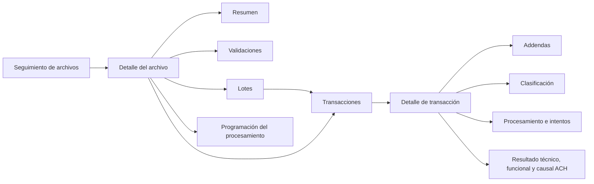

# Vista operativa integral NACHA-M

## Objetivo y usuarios

La vista permite a Operaciones ACH, soporte y auditoría reconstruir la trazabilidad de un archivo NACHA-M entrante sin conocer entidades, enumeraciones ni nombres de servicios internos. Es una consulta de monitoreo: no reprocesa, no cambia estados y no ejecuta acciones manuales sobre la cola.

Ruta canónica:

```text
/incoming-nacha-command-center
```

La ruta histórica `/ach/nacha/operational-dashboard` redirige a la ruta canónica para evitar dos centros de control. El detalle usa `/incoming-nacha-command-center/files/{id}` y conserva en la URL la sección elegida y la dirección de retorno con filtros.

## Navegación



## Arquitectura de componentes

- `NachaOperationalDashboardComponent`: contenedor del listado, formulario reactivo, parámetros de URL, paginación y ordenamiento.
- `NachaOperationalFileDetailComponent`: contenedor del archivo, carga progresiva de secciones y detalle de transacción.
- `IncomingNachaCommandCenterService`: cliente tipado, construcción de parámetros y consumo REST.
- `incoming-nacha-command-center.models.ts`: contratos TypeScript con nulabilidad explícita.
- `incoming-nacha-presentation.ts`: semántica visual, nombres funcionales de servicios, mensajes técnicos controlados e identificadores abreviados.
- `CurrencyColPipe` y `DateFormatPipe`: formato `es-CO`, pesos colombianos y zona `America/Bogota`.

Los componentes no determinan si un código ACH es exitoso o rechazado. `businessOutcomeText`, `resultCode` y `resultDescription` provienen del backend y se presentan como dimensiones independientes.

## Contratos consumidos

```http
GET /incoming-nacha-command-center/observability/summary
GET /incoming-nacha-command-center/ingestions
GET /incoming-nacha-command-center/ingestions/{id}
GET /incoming-nacha-command-center/ingestions/{id}/validations
GET /incoming-nacha-command-center/ingestions/{id}/batches
GET /incoming-nacha-command-center/ingestions/{id}/transactions
GET /incoming-nacha-command-center/ingestions/{id}/transactions/{entryDetailId}/addendas
GET /incoming-nacha-command-center/queue/{queueId}
```

El ajuste backend es aditivo y limitado a DTO y consultas del centro de control: agrega filtros, ordenamiento, agregados del listado, usuario/cámara, información enmascarada y descripción del catálogo de códigos de transacción. No cambia entidades, esquema, migraciones, persistencia ni reglas financieras.

## Filtros, paginación y cancelación

El listado permite filtrar por cámara, fecha operativa, rango de carga, ciclo, estado, resultado funcional, nombre, código ACH, novedades y errores técnicos. Las transacciones permiten filtrar por lote, rastreo/receptor, código de transacción, estado técnico, resultado funcional, código ACH, addenda y error técnico.

Archivos, lotes y transacciones usan página, tamaño, columna y dirección enviados al servidor. Los parámetros del listado se sincronizan con la URL. `switchMap` cancela consultas de archivos, lotes o transacciones reemplazadas por una solicitud posterior. No se ordenan páginas localmente ni se descarga el conjunto completo.

## Estados y causales

La interfaz separa siempre:

1. Estado técnico del procesamiento.
2. Resultado funcional.
3. Código y descripción ACH.

Ejemplos esperados desde contrato:

- `Procesado / Exitoso / R96 — Operación procesada correctamente`.
- `Procesado / Rechazado / R16 — Cuenta congelada`.
- `Procesado / Devuelto / R17 — descripción homologada por la cámara`.
- `Error técnico / No procesado / Código ACH no disponible`.

Un error de comunicación se explica en lenguaje operativo; su código técnico aparece sólo dentro de “Información para soporte”. Las direcciones físicas SOAP y los mensajes de excepción no se muestran.

## Idioma y humanización

Los textos visibles son españoles. Se conservaron únicamente siglas necesarias (`NACHA-M`, `ACH`, `SOAP`, `CENIT`). Los nombres internos `EntryDetail`, `DispatchQueue`, `BusinessOutcome` y equivalentes no se exponen. Las rutas administrativas antiguas de cola todavía existentes quedan fuera de esta vista y pueden modernizarse en una fase separada.

## Formato monetario y fechas

- Moneda: pesos colombianos mediante `Intl.NumberFormat('es-CO', { currency: 'COP' })`, con dos decimales.
- Valores: permanecen numéricos en el modelo.
- Fecha operativa: sólo fecha.
- Eventos: fecha y hora en `America/Bogota`.
- No existen compensaciones horarias manuales.

## Responsive y accesibilidad

- Escritorio: tabla Material con encabezados, ordenamiento y paginador.
- Tableta: filtros en dos columnas y contenido progresivo.
- Móvil: tarjetas compactas, filtros plegables y detalle en una columna.
- Resoluciones verificadas: 1440 × 900, 1024 × 768, 768 × 1024 y 390 × 844.
- Los estados incluyen texto además de color.
- Botones de detalle incluyen el nombre del archivo o número de rastreo en su etiqueta accesible.
- Calendarios y paginadores exponen nombres y acciones en español.
- El panel de transacción mueve el foco a su encabezado.
- El foco visible, encabezados semánticos y orden DOM siguen el flujo de lectura.

## Seguridad

- Cuentas, instituciones, nombres y rastreos originales se reciben enmascarados desde backend.
- El contenido libre de addenda se sanitiza en backend.
- No se almacenan filtros financieros en `localStorage`; se usan parámetros de URL no sensibles.
- No se muestran XML, URL SOAP, secretos, certificados, credenciales ni trazas de excepción.
- La vista no incorpora acciones de reproceso, cancelación, aprobación o cambio de estado.

## Pruebas y evidencia

Pruebas unitarias:

- Construcción y limpieza de filtros.
- Parámetros HTTP, paginación y ordenamiento.
- Error recuperable y estado vacío.
- Formato monetario.
- Humanización de servicios y error técnico.
- Selección de archivo, lote y transacción.
- Carga de validaciones, lotes, transacciones, addendas e intentos.
- Resultado técnico sin código ACH ficticio.
- Enmascaramiento y filtros server-side en backend.

Playwright focalizado:

- Recorrido integral de escritorio.
- R96 exitoso, R16 rechazado, R17 devuelto y error técnico sin causal.
- Archivo rechazado y archivo sin transacciones.
- Transacción sin addendas.
- Filtros, paginación y conservación de URL.
- Error recuperable y estado vacío.
- Vistas de 1440 × 900, 1024 × 768, 768 × 1024 y 390 × 844.
- Detección de errores de consola; el error HTTP 500 del caso recuperable se verifica como evidencia esperada y delimitada.

Las capturas se generan en `web/ach-interbank-ui/test-results/nacha-operational-dashboard-*` durante la ejecución Playwright. Incluyen listado, detalle, validaciones, lotes, transacciones, procesamiento, detalle de transacción y vistas móviles.

## Validación ejecutada el 1 de agosto de 2026

- `npm ci`: completado; el auditor de dependencias reportó 4 vulnerabilidades ya presentes en el árbol resuelto (3 moderadas y 1 alta).
- `npm run build`: completado sin errores; paquete inicial de 2,85 MB y módulo diferido del centro de control de 178,78 kB.
- Pruebas unitarias focalizadas: 21 aprobadas, 0 fallidas, 0 omitidas.
- Pruebas unitarias completas del SPA: 662 aprobadas, 0 fallidas, 0 omitidas.
- `npx tsc -p tsconfig.app.json --noEmit`: completado sin errores.
- `npx ng lint`: no ejecutable porque el proyecto no define un objetivo de lint; no se agregó una dependencia nueva para suplirlo.
- Playwright focalizado: 5 aprobadas, 0 fallidas, 0 omitidas.
- `dotnet build ACHInterbank.sln -c Release --no-restore`: completado con 0 advertencias y 0 errores.
- Pruebas backend focalizadas `IncomingNachaCommandCenterServiceTests`: 15 aprobadas, 0 fallidas, 0 omitidas.
- Regresión backend completa: dos intentos no finalizaron dentro de 6 y 15 minutos, sin producir resumen ni fallo; se conserva como limitación de validación, no como resultado aprobado.
- `git diff --check`: completado sin errores de espacios; Git sólo informa la conversión futura LF/CRLF configurada para el repositorio.
